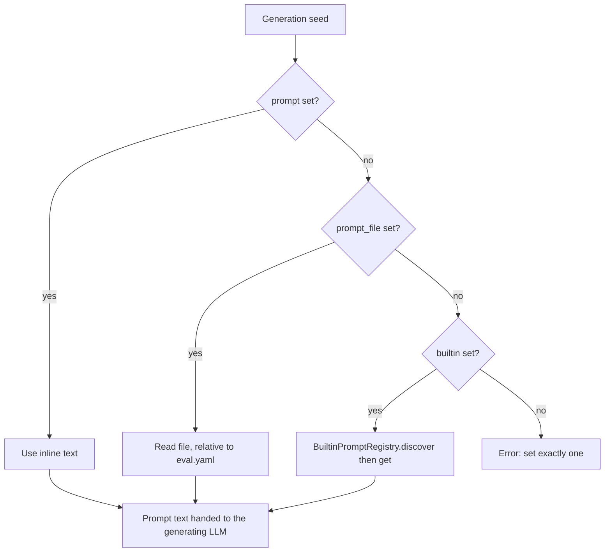

# Built-in generation prompts

Generation prompts are **LLM instruction files** used by `/eval-dataset` to author
test cases during [synthetic generation](../reference/config/generation.md). Each one
tells the model how to produce a *category* of cases from repository context — it is
a prompt, not an interpolated template.

They mirror the [builtin judges](builtin-judges.md) model: builtins ship in the
harness under `agent_eval/prompts/<category>/`, are auto-discovered by
`BuiltinPromptRegistry`, and are referenced from a generation seed with
`builtin: <category>/<name>`.

## Available builtins

All shipped builtins target **agentic documentation testing** — verifying that an
agent can use your `CLAUDE.md` / `ai-docs/` effectively.

| Reference | Verifies the agent can… |
| --- | --- |
| `docs/navigation` | Find and navigate to relevant agentic documentation (`CLAUDE.md`, `ai-docs/`, etc.) |
| `docs/anti-pattern` | Reject approaches that violate documented constraints |
| `docs/authoring` | Create content following documented patterns and templates |
| `docs/component-usage` | Explain how to use an API/component with correct examples |
| `docs/architecture` | Explain system design and component interactions |

!!! tip "Discover them from the CLI"
    The list is generated from the registry, so it never drifts from what ships:

    ```bash
    python3 skills/eval-dataset/scripts/list_prompts.py
    ```

    Each line prints the fully-qualified `category/name` plus the first `**Purpose**`
    line of the prompt file as a short description.

## Referencing a prompt

Generation lives in a top-level `generation:` block. Each entry in `seeds` picks
exactly one prompt via a discriminator — mirroring judges: inline `prompt`,
project-local `prompt_file`, or `builtin`.

```yaml title="eval.yaml"
generation:
  strategy: synthetic
  context:                       # repository knowledge injected into every prompt
    documentation_structure:
      entry_point: CLAUDE.md
      areas:
        - path: ai-docs/workflows/
          topics: [enhancement-process, testing-workflow]
    constraints: [...]
    apis: [...]
  seeds:
    - category: navigation
      builtin: docs/navigation                        # a shipped builtin
      count: 10
    - category: internal-apis
      prompt_file: ./eval/prompts/internal-api.md      # project-local, relative to eval.yaml
      count: 8
    - category: adhoc
      prompt: |                                        # inline, no separate file
        Generate a case where the agent must reject a request that violates ...
      count: 3
```

Each seed's `category` is stamped onto every generated case as
`annotations.category`, so the category list is *derived* from the cases — never
declared separately.

!!! warning "One discriminator per seed"
    A seed must set **exactly one** of `builtin` / `prompt_file` / `prompt` (enforced
    at config load). Resolution order when the harness reads a seed is inline
    `prompt` → `prompt_file` → `builtin`.

### Resolution flow



## Prompt-file structure

Every prompt is a markdown file with a consistent shape. When you author your own
`prompt_file` or contribute a builtin, follow the same sections so the generating LLM
knows what to produce.

| Section | What it holds |
| --- | --- |
| **Purpose** | One line stating what the category verifies (also used by `list_prompts.py`) |
| **Input Schema** | The `input.yaml` / `annotations.yaml` shape each generated case must have |
| **Generation Instructions** | Step-by-step authoring guidance, referencing `context.<subfield>` |
| **Example** | A worked case: sample generation context → resulting `input.yaml` + `annotations.yaml` |
| **Validation Criteria** | Constraints the generated case must satisfy |

Here is the `docs/navigation` builtin's `Input Schema` and `Validation Criteria`
verbatim, to show the level of concreteness expected:

```yaml
# input.yaml
prompt: "User question requiring documentation lookup"
```

```yaml
# annotations.yaml
category: navigation
expected_files:
  - path/to/doc1.md
  - path/to/doc2.md
expected_mentions:
  - keyword1
  - keyword2
```

> **Validation Criteria**
>
> - `prompt` must be a natural question (not a direct command)
> - `expected_files` must reference real files from the repository
> - At least one expected_file should contain the answer
> - `expected_mentions` should be 2-5 keywords

## How discovery works

`BuiltinPromptRegistry.discover()` walks `agent_eval/prompts/`, treating each
subdirectory as a **category** and each `.md` inside it as a prompt (`README.md` and
files/directories starting with `_` are skipped). The naming rules are worth knowing:

- **Reference form is `category/name`** — e.g. `docs/navigation` (category `docs`,
  file `navigation.md`).
- **Names are globally unique across categories.** The registry raises a
  `Builtin prompt name collision` error at discovery if two categories contain a file
  with the same stem, so you can also reference a prompt by its bare `name`.
- Passing a `category/name` whose category doesn't match where the file actually lives
  is rejected with an `Unknown builtin prompt` error listing the valid references.

## Adding a builtin

Drop a `<name>.md` into a category subdirectory (e.g. `docs/`) following the structure
above and the registry discovers it automatically — no registration code.

!!! note "Reserve builtins for cross-project patterns"
    Builtins are for patterns proven across several projects. Project-specific prompts
    belong in your own repo, referenced with a seed's `prompt_file:` (path relative to
    `eval.yaml`).

## See also

<div class="grid cards" markdown>

- [**generation** config](config/generation.md) — `strategy`, `context`, and `seeds`
- [**Datasets**](../concepts/datasets.md) — where generated cases live and their shape
- [**Agentic docs walkthrough**](../get-started/agentic-docs.md) — end-to-end prompt-mode eval
- [**Built-in judges**](builtin-judges.md) — the sibling registry for scoring

</div>
