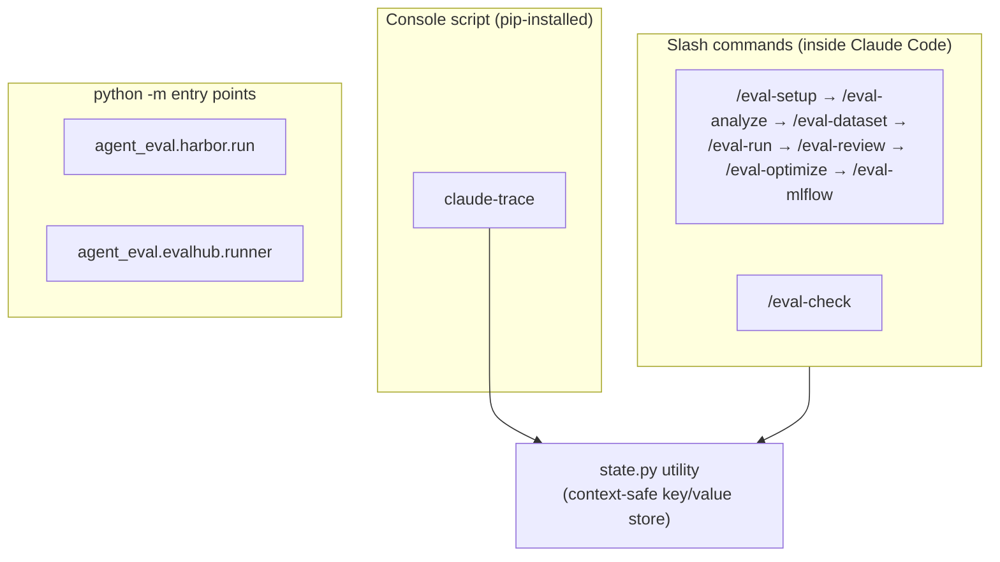

# CLI & entry points

The harness has three kinds of interface: **slash commands** you run inside Claude
Code (the day-to-day authoring and run pipeline), a single installed **console
script** (`claude-trace`), and a few **`python -m` module entry points** used by the
containerized and platform backends. This page is the map of all of them.

!!! warning "`agent-eval run` is not a real command"
    The deployment docs and some diagrams show `agent-eval run --config eval.yaml` as
    a local entry point. **No such console script is registered.** The only
    `[project.scripts]` entry in
    [`pyproject.toml`](https://github.com/opendatahub-io/agent-eval-harness/blob/main/pyproject.toml)
    is `claude-trace`. Run evals locally with the **`/eval-run`** slash command; use
    the `python -m` modules below for the Harbor and EvalHub backends.

## The surface at a glance



## Slash commands

Eight skills ship as slash commands. Each one is a stage in the pipeline; run them in
order for a first eval, or invoke individually.

| Command | Purpose | Guide |
| --- | --- | --- |
| `/eval-setup` | Preflight environment: dependencies, MLflow, API keys, run dirs | [Installation](../get-started/installation.md) |
| `/eval-analyze` | Analyze a skill or docs, generate `eval.yaml` + `eval.md` | [eval-analyze](../guides/eval-analyze.md) |
| `/eval-dataset` | Generate or expand test cases (and Harbor task packages) | [eval-dataset](../guides/eval-dataset.md) |
| `/eval-run` | Execute the suite, collect artifacts, score, report | [eval-run](../guides/eval-run.md) |
| `/eval-review` | Interactive human review of a run; propose config changes | [eval-review](../guides/eval-review.md) |
| `/eval-optimize` | Automated refinement loop (composes with `/eval-run`) | [eval-optimize](../guides/eval-optimize.md) |
| `/eval-mlflow` | Dataset sync, result logging, trace feedback | [eval-mlflow](../guides/eval-mlflow.md) |
| `/eval-check` | Full-harness config health check across all skills | [eval-check](../guides/eval-check.md) |

!!! tip "See the whole flow"
    The [pipeline guide](../guides/pipeline.md) shows how these stages hand off to each
    other, and the [get-started walkthrough](../get-started/first-eval.md) runs the
    core four end to end.

## `claude-trace` (console script)

`claude-trace` is the one command installed on your `PATH` by `pip install`. It's a
drop-in replacement for `claude --print` that captures the stream-json output and
builds a hierarchical MLflow trace (tool calls, subagent spans, execution metrics).
Use it to trace a skill run **standalone**, outside the eval pipeline.

=== "Pipe a prompt via stdin"

    ```bash
    echo "/rfe.speedrun --input batch.yaml --headless" | \
      claude-trace --model opus
    ```

=== "Prompt as an argument"

    ```bash
    claude-trace --model opus -p "/rfe.create 'GPU autoscaling'"
    ```

=== "Capture only, no MLflow push"

    ```bash
    claude-trace --model opus --no-mlflow --trace-dir /tmp/my-run
    ```

It forces `--output-format stream-json`, `--print`, and `--verbose`; every other flag
passes straight through to `claude`.

| Flag | Effect |
| --- | --- |
| `-p <prompt>` | Prompt to run (otherwise read from stdin) |
| `--model <name>` | Model passed through to `claude` |
| `--experiment <name>` | MLflow experiment (else `MLFLOW_EXPERIMENT_NAME`, else `Default`) |
| `--trace-dir <path>` | Where to write artifacts (default `tmp/trace-runs/<timestamp>`) |
| `--no-mlflow` | Capture artifacts only; skip the trace push |
| `--help` | Print usage and exit |

Each run writes `stdout.log`, `stderr.log`, and `run_result.json` into the trace dir.

!!! note "Environment"
    `MLFLOW_TRACKING_URI` sets the MLflow server (default `http://127.0.0.1:5000`);
    `--experiment` overrides `MLFLOW_EXPERIMENT_NAME`. If `mlflow` isn't installed the
    push is skipped with a warning — artifacts are still saved. See
    [tracing](../concepts/tracing.md) and
    [environment variables](environment-variables.md).

## `python -m` module entry points

The containerized and platform backends aren't console scripts — they're modules you
invoke with `python -m`. `/eval-run --runner harbor` and `--runner evalhub` call these
for you; run them directly for CI or debugging.

### `agent_eval.harbor.run` — the Harbor backend

Generates (or reuses) Harbor task packages, runs one `harbor run` job over them, then
maps the per-case verifier output back into the harness `run_result.json` +
`summary.yaml` + `report.html` shape.

```bash
python -m agent_eval.harbor.run \
  --config eval.yaml \
  --model opus \
  --output eval/runs/my-run \
  --tasks-dir eval/harbor/tasks \
  --jobs-dir eval/harbor/jobs \
  --env kubernetes
```

| Flag | Purpose |
| --- | --- |
| `--config` | Path to `eval.yaml` (required) |
| `--model` | Model for the agent under test (required) |
| `--output` | Harness run dir to write (required) |
| `--tasks-dir` | Where task packages live / are generated (required) |
| `--jobs-dir` | Where Harbor writes its job output (required) |
| `--image` | Task image — required **only** when generating tasks |
| `--agent` | Harbor agent name (default: derived from `runner.type`) |
| `--env` | `podman` \| `kubernetes` \| `k8s` \| `openshift` (default `kubernetes`) |
| `--environment-import-path` | Custom Harbor environment path (overrides `--env`) |
| `--n-concurrent` | Concurrent trials (default `1`) |
| `--cases` | Restrict to specific case IDs |
| `--regenerate` | Rebuild task packages even if `--tasks-dir` already has them |

!!! note "Tasks are reused if present"
    If `--tasks-dir` already holds packages (e.g. emitted by `/eval-dataset`), they're
    used as-is and `--image` isn't needed. Pass `--regenerate` to force a rebuild. The
    process exits non-zero if regression [thresholds](config/thresholds.md) are
    violated. Requires the `harbor` extra (`pip install 'agent-eval-harness[harbor]'`,
    Python ≥ 3.12). See the [Harbor guide](../guides/harbor.md).

### `agent_eval.evalhub.runner` — the EvalHub backend

Submits a job to an EvalHub server, polls to completion, and maps the platform's
`BenchmarkResult.metrics` back into the same `summary.yaml` + `report.html`.

```bash
python -m agent_eval.evalhub.runner \
  --config eval.yaml \
  --model opus \
  --output eval/runs/my-run \
  --evalhub-url https://evalhub.example.com
```

| Flag | Purpose |
| --- | --- |
| `--config` | Path to `eval.yaml` (required) |
| `--model` | Model for the agent under test (required) |
| `--output` | Harness run dir to write (required) |
| `--evalhub-url` / `--evalhub-token` | Server URL and auth token |
| `--namespace` | Kubernetes namespace for the Job |
| `--provider-id` | EvalHub provider id (default `agent-eval`) |
| `--benchmark-id` | Benchmark id to submit under |
| `--project-dir` | Project directory to package into ConfigMaps |
| `--timeout` / `--poll-interval` | Job wait timeout and poll cadence (default `10.0s`) |

!!! note "In-process on the platform"
    Requires the `evalhub` extra (`pip install 'agent-eval-harness[evalhub]'`). The
    adapter runs **in-process** inside the EvalHub-created Job pod — no sub-pods, no
    Harbor. See the [EvalHub guide](../guides/evalhub.md) and
    [backends](../concepts/backends.md).

## `state.py` — the context-safe state store

`agent_eval/state.py` is a small YAML/JSON key-value utility the skills use to persist
pipeline state (run ids, config paths, flags) so it survives context compression
between skill steps. It isn't installed on your `PATH`; the skills call it by absolute
path, e.g. `python3 ${CLAUDE_SKILL_DIR}/scripts/state.py`.

| Subcommand | Effect |
| --- | --- |
| `init <path> key=value ...` | Create a state file with the given keys |
| `set <path> key=value ...` | Merge keys into an existing file |
| `read <path>` | Print the state (JSON pretty-printed for `.json`) |
| `write-ids <path> ID ...` | Write a de-duplicated id list, one per line |
| `read-ids <path>` | Print the id list space-separated |
| `clean` | Remove the `tmp/` directory |
| `timestamp` | Print a UTC ISO-8601 timestamp |

Values `true`/`false`/`null`/`none` are parsed to their typed equivalents; everything
else stays a string.

## Related

<div class="grid cards" markdown>

- [**Runs directory**](runs-directory.md) — what `/eval-run` and the backends write
- [**Environment variables**](environment-variables.md) — every var the CLIs read
- [**Container images**](container-images.md) — images the Harbor / EvalHub paths use
- [**Python API**](python-api.md) — importable modules behind these entry points

</div>
