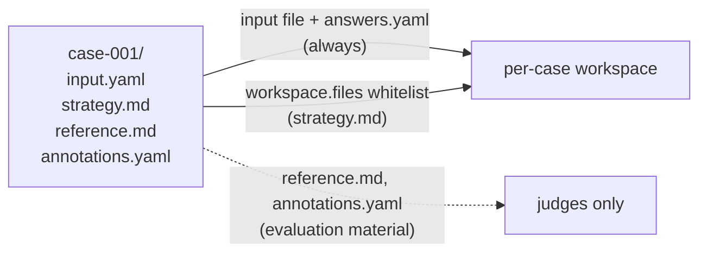

# dataset

The `dataset` block tells the harness **where test cases live** and **what a case
contains**. Cases are plain directories on disk — one per scenario — that
`/eval-dataset` generates and `/eval-run` reads.

```yaml
dataset:
  path: eval/dataset/cases
  schema: |
    Each case has an input.yaml with a 'prompt' field and an optional
    annotations.yaml with expected-outcome metadata for judges.
  workspace:
    files:            # optional — companion files copied into the workspace
      - src/
      - strategy.md
```

## Fields

| Field | Type | Default | Purpose |
| --- | --- | --- | --- |
| `path` | string | `""` | Directory holding the case sub-directories. Relative to the `eval.yaml` file, or absolute. |
| `schema` | string | `""` | Natural-language description of a case's structure. Documentation for the LLM agents and judges — not a parsed spec. |
| `workspace.files` | list of strings | `[]` | Whitelist of per-case files/dirs to copy into the agent workspace. **Ignored in batch mode.** |

## `path`

Points at the directory of case sub-directories.

- **Relative** paths resolve against the directory containing `eval.yaml` (via
  `EvalConfig.resolve_path`), not the current working directory.
- **Absolute** paths are allowed and passed through unchanged — useful for a
  dataset shared across several eval configs.
- Parent traversal (`..`) is rejected at load time.

```yaml
dataset:
  path: eval/dataset/cases        # relative to eval.yaml
  # path: /shared/datasets/rfe    # absolute, shared across configs
```

A generated dataset looks like this:

```text
eval/dataset/cases/
├── case-001-simple/
│   ├── input.yaml          # what the agent sees
│   └── answers.yaml        # optional: guidance for AskUserQuestion answering
├── case-002-complex/
│   ├── input.yaml
│   └── annotations.yaml    # optional: metadata judges read
└── case-003-edge/
    ├── input.yaml
    └── reference.md        # optional: gold output for judges
```

## `schema`

Free-form prose that documents what each case directory holds. Scripts operate on
file *paths* from `eval.yaml` directly — there is no extraction spec and no
hardcoded field names, so the schema is purely for the LLM agents (`/eval-dataset`
authoring cases) and LLM judges (interpreting them).

```yaml
dataset:
  schema: |
    Each case has:
      - input.yaml   — a 'prompt' field and an optional 'priority' field
      - reference.md — the gold-standard output (used by the quality judge)
      - annotations.yaml — 'dedup_is_duplicate' (bool) for outcome-aware judges
```

!!! tip "Match the schema to your `arguments` and judges"
    Fields you reference in `execution.arguments` (e.g. `{{ input.priority }}`) and
    fields your judges read from `outputs["annotations"]` should both be spelled out
    in the schema, so `/eval-dataset` generates cases that actually exercise them.

## `workspace.files`

By default, `/eval-run` copies only the **input file** (`input.yaml` / `input.json`)
and `answers.yaml` from each case directory into the isolated per-case workspace.
Everything else — `annotations.yaml`, `reference.*`, gold outputs — is *evaluation
material* that stays behind so the agent never sees it.

`workspace.files` is the explicit whitelist for **companion files the skill needs at
runtime** (source code to modify, a `strategy.md` or `adr.md` the skill reads, etc.).

```yaml
dataset:
  path: eval/dataset/cases
  workspace:
    files:
      - src/            # directory — copied recursively
      - config.yaml     # single file
      - strategy.md
```

Behavior (`workspace_files._copy_input_files`):

| Entry kind | Effect |
| --- | --- |
| Directory | Copied recursively, preserving relative structure. |
| File | Copied as a single file at its relative path. |
| Symlink | **Skipped** (prevents escaping the case directory). |
| Path outside the case dir | Skipped. |
| Not listed | Left behind (never reaches the workspace). |

Paths are relative to each case directory; a trailing `/` is stripped, and `..` is
rejected at load time.



!!! warning "Ignored in batch mode"
    `workspace.files` is per-case, but `execution.mode: batch` uses a **single shared
    workspace** for all cases — so the whitelist is ignored and `/eval-run` prints a
    warning. If your skill needs companion files present on disk, use
    `execution.mode: case`.

!!! note "Companion files must exist in every case"
    If a skill reads a file at runtime, list it in `workspace.files` **and** make sure
    `/eval-dataset` generates it for each case, or the skill will fail to find it.

## Related

<div class="grid cards" markdown>

- [**generation**](generation.md) — how `/eval-dataset` sources cases (skill, synthetic, from-traces)
- [**execution**](execution.md) — `mode: case` vs `batch`, and the `arguments` template
- [**outputs**](outputs.md) — the artifacts collected back out of the workspace
- [**judges**](judges.md) — how cases (and their `annotations`) are scored
- [Datasets concept](../../concepts/datasets.md) — the case → workspace → scoring flow

</div>
