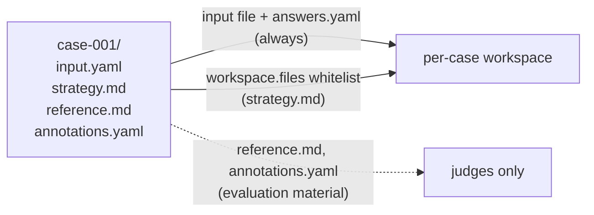

# dataset

The `dataset` block tells the harness **where test cases live** and **what a case
contains**. Cases are plain directories on disk — one per scenario — that
`/eval-dataset` generates and `/eval-run` reads.

```yaml
dataset:
  path: eval/dataset/cases
  schema: |
    Each case has an input.yaml with a 'prompt' field and an optional
    annotations.yaml with expected-outcome metadata for judges.
  workspace:
    files:            # optional — companion files copied into the workspace
      - src/
      - strategy.md
```

## Fields

| Field | Type | Default | Purpose |
| --- | --- | --- | --- |
| `path` | string | `""` | Directory holding the case sub-directories. Relative to the `eval.yaml` file, or absolute. |
| `schema` | string | `""` | Natural-language description of a case's structure. Documentation for the LLM agents and judges — not a parsed spec. |
| `workspace.files` | list of strings or `{dest, source}` maps | `[]` | Whitelist of files/dirs copied into the agent workspace: per-case paths (strings) and/or shared project/plugin resources (`{dest, source}`). **Ignored in batch mode.** |

## `path`

Points at the directory of case sub-directories.

- **Relative** paths resolve against the directory containing `eval.yaml` (via
  `EvalConfig.resolve_path`), not the current working directory.
- **Absolute** paths are allowed and passed through unchanged — useful for a
  dataset shared across several eval configs.
- Parent traversal (`..`) is rejected at load time.

```yaml
dataset:
  path: eval/dataset/cases        # relative to eval.yaml
  # path: /shared/datasets/rfe    # absolute, shared across configs
```

A generated dataset looks like this:

```text
eval/dataset/cases/
├── case-001-simple/
│   ├── input.yaml          # what the agent sees
│   └── answers.yaml        # optional: guidance for AskUserQuestion answering
├── case-002-complex/
│   ├── input.yaml
│   └── annotations.yaml    # optional: metadata judges read
└── case-003-edge/
    ├── input.yaml
    └── reference.md        # optional: gold output for judges
```

## `schema`

Free-form prose that documents what each case directory holds. Scripts operate on
file *paths* from `eval.yaml` directly — there is no extraction spec and no
hardcoded field names, so the schema is purely for the LLM agents (`/eval-dataset`
authoring cases) and LLM judges (interpreting them).

```yaml
dataset:
  schema: |
    Each case has:
      - input.yaml   — a 'prompt' field and an optional 'priority' field
      - reference.md — the gold-standard output (used by the quality judge)
      - annotations.yaml — 'dedup_is_duplicate' (bool) for outcome-aware judges
```

!!! tip "Match the schema to your `arguments` and judges"
    Fields you reference in `execution.arguments` (e.g. `{{ input.priority }}`) and
    fields your judges read from `outputs["annotations"]` should both be spelled out
    in the schema, so `/eval-dataset` generates cases that actually exercise them.

## `workspace.files`

By default, `/eval-run` copies only the **input file** (`input.yaml` / `input.json`)
and `answers.yaml` from each case directory into the isolated per-case workspace.
Everything else — `annotations.yaml`, `reference.*`, gold outputs — is *evaluation
material* that stays behind so the agent never sees it.

`workspace.files` is the explicit whitelist for **companion files the skill needs at
runtime** (source code to modify, a `strategy.md` or `adr.md` the skill reads, etc.).
Each entry is either a **per-case path** (a string, relative to the case directory) or
a **shared `{dest, source}` mapping** (a project/plugin resource copied into every
case).

```yaml
dataset:
  path: eval/dataset/cases
  workspace:
    files:
      - src/            # per-case directory — copied recursively
      - config.yaml     # per-case single file
      - strategy.md
      # shared: a live SKILL.md copied into every case as triage-skill.md
      - dest: triage-skill.md
        source: skills/address-ci-failures/SKILL.md
```

Behavior (`workspace_files._copy_input_files` + `workspace_provisioning.materialize_shared_files`):

| Entry kind | Effect |
| --- | --- |
| String — directory | Copied recursively from the case dir, preserving relative structure. Nested symlinks are skipped. |
| String — file | Copied as a single file at its relative path. |
| String — listed file symlink | Materialized as a regular file when the resolved target is in the current case, a configured `runner.plugin_dirs` entry, or a project companion path outside the sibling-case dataset directory; otherwise skipped with a warning (CWE-59). |
| String — listed directory symlink | Skipped with a warning (not walked). |
| String — path resolving outside allowed roots | Skipped with a warning. |
| `{dest, source}` — shared | `source` is resolved (symlinks followed) against the project root or a configured `runner.plugin_dirs` entry, then **copied** into every case workspace at `dest`. Directory sources copy recursively, dropping nested symlinks. |
| `{dest, source}` — source outside project/plugin roots, missing, or dangling | Skipped with a warning (never pulls a host file in — CWE-59). |
| `{dest, source}` — `dest` colliding with a reserved name (`input.yaml`, `answers.yaml`, `annotations.yaml`, `batch.yaml`, `.claude`, …), or empty/`.`/`/`, absolute, or parent-traversing | Skipped with a warning. |
| `{dest, source}` — `dest` resolving inside the `source` directory | Skipped with a warning (would recurse). |
| Not listed | Left behind (never reaches the workspace). |

String paths are relative to each case directory; a trailing `/` is stripped, and `..`
is rejected at load time. A `{dest, source}` `dest` must be a **named relative path**:
empty, `.`, `/`, absolute, and parent-traversing (`..`) destinations are rejected at
load and defensively skipped with a warning at materialization. `source`, by contrast,
may be relative (to the project root) or absolute — its trust boundary (project root or a
`runner.plugin_dirs` entry) is enforced at materialization time, not at load.

### Shared files vs. committed symlinks

A `{dest, source}` entry replaces the pattern of committing a *symlink* into a case
that points at a live SKILL.md. Because the result is always a **real file, never a
symlink**, the same entry ports unchanged across every execution substrate:

- **Local `/eval-run`** — materialized into each per-case workspace.
- **Harbor** — materialized from the local checkout into each task package's
  `environment/` (which Harbor uploads into the workspace).
- **S3 / EvalHub** — materialized into each per-case directory by the export step
  (`skills/eval-dataset/scripts/export_s3.py`) before upload, since a pod loaded from
  S3 has no project/plugin files to resolve `source` against at run time.

A committed **file** symlink is now materialized locally when its target is in an approved
root (see the table above), but it is still **ignored by Harbor** and does not round-trip
through object storage; committed **directory** symlinks and out-of-root targets are skipped
everywhere. The `{dest, source}` form is the one that ports across all three substrates.


```mermaid
flowchart LR
    C["case-001/<br/>input.yaml<br/>strategy.md<br/>reference.md<br/>annotations.yaml"]
    C -->|"input file + answers.yaml<br/>(always)"| W["per-case workspace"]
    C -->|"workspace.files whitelist<br/>(strategy.md)"| W
    C -.->|"reference.md, annotations.yaml<br/>(evaluation material)"| J["judges only"]
```

!!! warning "Ignored in batch mode"
    `workspace.files` is per-case, but `execution.mode: batch` uses a **single shared
    workspace** for all cases — so the whitelist is ignored and `/eval-run` prints a
    warning. If your skill needs companion files present on disk, use
    `execution.mode: case`.

!!! note "Per-case companion files must exist in every case"
    This applies to **string** entries only: if a skill reads a per-case file at runtime,
    list it in `workspace.files` **and** make sure `/eval-dataset` generates it for each
    case, or the skill will fail to find it. A shared `{dest, source}` entry needs no
    per-case file — the harness materializes it into every case from the single `source`.

## Related

<div class="grid cards" markdown>

- [**generation**](generation.md) — how `/eval-dataset` sources cases (skill, synthetic, from-traces)
- [**execution**](execution.md) — `mode: case` vs `batch`, and the `arguments` template
- [**outputs**](outputs.md) — the artifacts collected back out of the workspace
- [**judges**](judges.md) — how cases (and their `annotations`) are scored
- [Datasets concept](../../concepts/datasets.md) — the case → workspace → scoring flow

</div>
