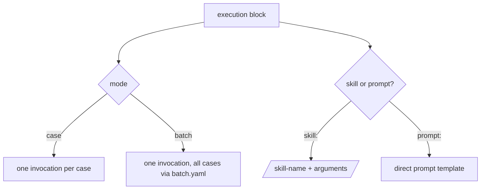

# execution

The `execution` block describes **what** to run and **how** cases are processed —
independent of the [runner](runner.md) (which agent runtime) and the backend (Local,
Harbor, EvalHub — always a `--runner` CLI flag). It separates *how many invocations*
(`mode`) from *what to execute* (`skill` **or** `prompt`).

```yaml title="eval.yaml (excerpt)"
execution:
  mode: case              # per-case (default) or batch
  skill: my-skill-name    # skill to test  (mutually exclusive with prompt)
  arguments: "{prompt}"   # resolved per case from input.yaml fields
  # timeout: 3600         # per-invocation wall-clock seconds
  # max_budget_usd: 5.0   # per-invocation cost cap
  # parallelism: 4        # concurrent cases (case mode only)
  # env:
  #   JIRA_TOKEN: $JIRA_TOKEN   # $VAR resolved from the caller's environment
```

## Fields

| Field | Type | Default | Notes |
| --- | --- | --- | --- |
| `mode` | `case` \| `batch` | `case` | One invocation per case, or one invocation for all cases. |
| `skill` | string | `""` | Skill name to invoke (`/skill-name`). Mutually exclusive with `prompt`. |
| `prompt` | string | `""` | Direct prompt template — no skill wrapper. Mutually exclusive with `skill`. |
| `arguments` | string | `""` | Template resolved per case from `input.yaml`. See [Templating](#argument-templating). |
| `timeout` | int \| null | `null` → **3600** | Per-invocation wall-clock timeout in seconds. |
| `max_budget_usd` | float \| null | `null` → **100.0** | Per-invocation cost cap. |
| `parallelism` | int \| null | `null` → **1** | Max concurrent case executions (case mode only). |
| `env` | map | `{}` | Env vars injected into each workspace's `.claude/settings.json`. See [env](#injecting-environment-variables). |

!!! note "Nulls become harness defaults"
    `timeout`, `max_budget_usd`, and `parallelism` are optional in the config (`None`).
    They only acquire their effective values (3600 s, $100, sequential) at run time.
    Explicit checks preserve `0` — set `max_budget_usd: 0` and you get a $0 cap, not
    the default.

## Choosing what to execute



`mode` (how many invocations) and `skill`/`prompt` (what to execute) are orthogonal —
any of the four combinations is valid. See
[the execution model](../../concepts/execution-model.md) for the conceptual overview
and [skill vs prompt](../../guides/skill-vs-prompt.md) for when to use each.

=== "Skill mode (case)"

    One invocation per case; `arguments` is resolved from each case's `input.yaml`.

    ```yaml
    execution:
      mode: case
      skill: rfe.create
      arguments: '--priority {{ input.priority }} "{{ input.prompt }}"'
    ```

=== "Skill mode (batch)"

    One invocation processes all cases; the skill loops internally over `batch.yaml`.

    ```yaml
    execution:
      mode: batch
      skill: rfe.speedrun
      arguments: '--input batch.yaml --headless'
    ```

=== "Prompt mode (case)"

    No skill wrapper — the agent receives the prompt directly. Leave `arguments` empty;
    `prompt` acts as the per-case template.

    ```yaml
    execution:
      mode: case
      prompt: "{{ input.prompt }}"
    ```

## Argument templating

`arguments` (skill mode) and `prompt` (prompt mode) support **two mutually exclusive**
placeholder styles. The style is **auto-detected**: if the template contains `{{` or
`{%`, it is rendered as Jinja2; otherwise brace substitution is used.

=== "Jinja2 — `{{ input.field }}`"

    Rendered with `input` bound to the case's `input.yaml`. Uses `StrictUndefined`, so a
    **missing field raises an error** rather than rendering empty.

    ```yaml
    arguments: '--priority {{ input.priority }} "{{ input.prompt }}"'
    ```

    For genuinely optional fields, guard them explicitly:

    ```yaml
    arguments: '{{ input.get("flags", "") }} {{ input.title | default("") }}'
    ```

=== "Brace — `{field}` / `{field?}`"

    Simple regex substitution against `input.yaml` keys.

    - `{field}` — **required**; a missing (or empty) value raises an error.
    - `{field?}` — **optional**; omitted when the field is missing or empty.

    ```yaml
    arguments: '--title "{title}" {extra_flags?}'
    ```

!!! tip "The `{prompt}` shortcut"
    `{prompt}` is the conventional single-field template — `/eval-analyze` generates it
    by default. In **batch** mode a bare `{prompt}` is filled from the first entry of the
    workspace `batch.yaml`.

!!! warning "Don't mix the two styles"
    A template with any `{{ … }}` is treated as Jinja2 in full — bare `{field}` braces in
    the same string are **not** substituted. Pick one style per template.

## Injecting environment variables

`execution.env` writes variables into each case workspace's `.claude/settings.json`, so
they are visible to both the skill and its [hooks](hooks.md). Values beginning with `$`
are resolved from the **caller's** environment; a `$VAR` that is unset is **silently
omitted**. Literal values pass through unchanged.

```yaml
execution:
  env:
    JIRA_SERVER: http://localhost:8080   # literal
    JIRA_TOKEN: $JIRA_TOKEN              # resolved from os.environ["JIRA_TOKEN"]
```

!!! note "`execution.env` vs `runner.env`"
    `execution.env` targets the **workspace** (available to the skill and its hooks).
    [`runner.env`](runner.md) targets the **runner subprocess** itself. Both support the
    `$VAR` syntax.

## Precedence

CLI flags on `/eval-run` (and `execute.py`) always override the config:

| Config field | CLI override | Falls back to |
| --- | --- | --- |
| `execution.timeout` | `--timeout` | 3600 s |
| `execution.max_budget_usd` | `--max-budget` | $100.0 |
| `execution.parallelism` | `--parallelism` | sequential (1) |
| `execution.arguments` / `prompt` | `--skill-args` | config value |
| `models.skill` | `--model` | *(required)* |

## Validation

These errors are raised at **config load time** (`EvalConfig.from_yaml`), not mid-run:

| Condition | Error |
| --- | --- |
| `mode` not in `case`/`batch` | `execution.mode must be one of ['case', 'batch']` |
| Both `skill` and `prompt` set | `execution.skill and execution.prompt are mutually exclusive` |
| Required template field missing at run time | `Missing required field in template: …` |

!!! note "Deprecated top-level `skill:`"
    A top-level `skill:` (outside the `execution` block) still works but is
    auto-normalized into `execution.skill` with a deprecation warning. Author new configs
    with `execution.skill`.

## Gotchas

- **`parallelism` is case-mode only.** Batch mode is a single invocation, so there is
  nothing to parallelize. With [`runner.workspace_mode: repo`](runner.md) parallelism is
  forced to `1` (all cases share the repo checkout).
- **Per-case hooks need case/prompt mode.** `hooks.before_each` / `after_each` are
  ignored in batch mode (a warning is emitted); use `before_all` / `after_all` there. See
  [hooks](hooks.md).
- **`timeout` and `max_budget_usd` are per invocation**, not per run. In case mode they
  apply to each case; the run's total budget is their sum.

## See also

<div class="grid cards" markdown>

- [**eval.yaml reference**](../eval-yaml.md) — all top-level keys
- [**runner**](runner.md) — the agent runtime and `runner.env` / `workspace_mode`
- [**models**](models.md) — model-per-role precedence
- [**Execution model**](../../concepts/execution-model.md) — case vs batch, skill vs prompt
- [**CLI**](../cli.md) — `--model`, `--timeout`, `--parallelism`, and other flags

</div>
