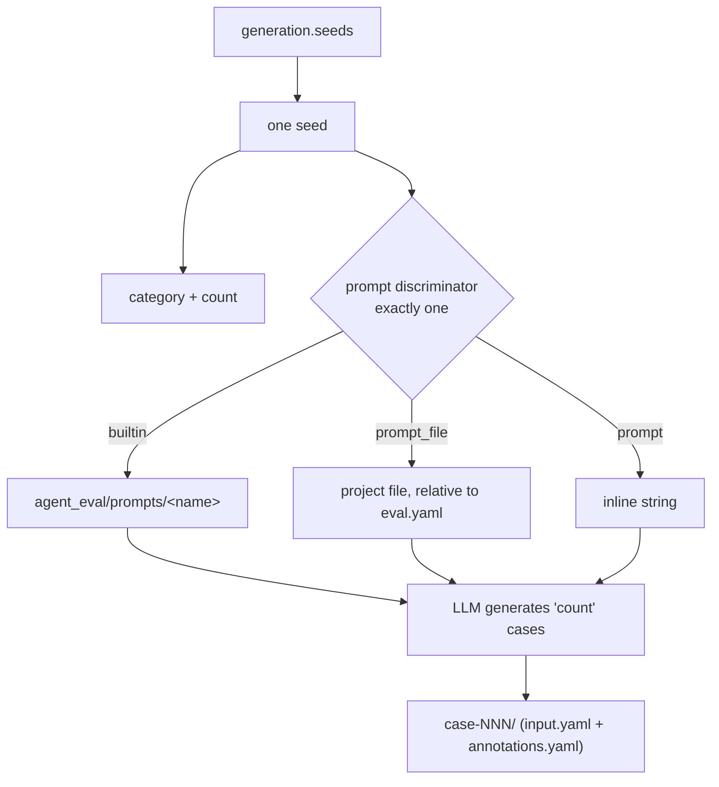

# generation

The optional `generation` block tells `/eval-dataset` **where test cases come from**.
It picks a `strategy` (case provenance) and, for synthetic generation, supplies the
repository `context` and the `seeds` that drive an LLM to author cases.

!!! note "Optional block"
    Omitting `generation` entirely is equivalent to `strategy: skill` — the agent
    authors cases from skill analysis. You only need this block for `synthetic` (which
    requires `seeds`) or to declare `from-traces` explicitly.

## Fields

| Key | Type | Applies to | Purpose |
| --- | --- | --- | --- |
| `strategy` | `skill` \| `synthetic` \| `from-traces` | all | Case provenance. Defaults to `skill`. |
| `context` | string or mapping | `synthetic` | Repository knowledge injected into every generation prompt. |
| `seeds` | list of [seed](#seeds) | `synthetic` | What categories to generate and which prompt drives each. |

### strategy

`strategy` selects how `/eval-dataset` sources cases:

| Value | Provenance | Needs |
| --- | --- | --- |
| `skill` *(default)* | The agent authors cases from skill analysis (coverage-oriented set). | Nothing — no `generation` block required. |
| `synthetic` | An LLM generates cases from `seeds` + `context`. | At least one `seed`. |
| `from-traces` | Cases extracted from MLflow production traces. | An `mlflow` block / trace source. |

!!! warning "Validation is strict at load time"
    `EvalConfig.from_yaml` rejects the following combinations before any run starts:

    - an unknown `strategy` (not one of `skill` / `synthetic` / `from-traces`),
    - `strategy: synthetic` with an empty `seeds` list, and
    - any `seeds` present while `strategy` is not `synthetic`.

### context

`context` holds repository-specific knowledge — documentation structure, constraints,
APIs — that is serialized to YAML and injected into *every* seed's generation prompt.
It can be a free-form string or a structured mapping; generation prompts reference its
subfields (e.g. `context.documentation_structure`).

```yaml
generation:
  strategy: synthetic
  context:
    documentation_structure:
      entry_point: CLAUDE.md
      areas: [config, runners, judges]
    constraints:
      - "Skills must never write outside the workspace."
    apis:
      - EvalConfig.from_yaml
```

`context` applies only to `synthetic`; it is ignored by the other strategies.

## seeds

Each entry in `seeds` produces `count` test cases of one `category` from a single
generation prompt. The prompt is chosen by **exactly one** discriminator — mirroring
the way judges select their prompt source.

| Field | Required | Notes |
| --- | --- | --- |
| `category` | yes | Non-empty string. Stamped onto every case as `annotations.category`. |
| `count` | yes | Integer ≥ 1. No default — a missing/mistyped `count` fails load. |
| `builtin` | one-of | A [builtin generation prompt](../../reference/builtin-prompts.md), e.g. `docs/navigation`. |
| `prompt_file` | one-of | A project file path, resolved relative to the eval config. |
| `prompt` | one-of | An inline prompt string. |
| `description` | no | Human-readable note about the seed. |

!!! warning "Exactly one prompt discriminator"
    A seed must set **exactly one** of `builtin` / `prompt_file` / `prompt`. Setting
    zero or more than one raises a `ValueError` at load time naming the offending seed.



### Example

```yaml title="eval.yaml"
generation:
  strategy: synthetic
  context:                                # injected into every prompt
    documentation_structure: { entry_point: CLAUDE.md, areas: [config, judges] }
    constraints: ["No writes outside the workspace."]
  seeds:
    - category: navigation
      builtin: docs/navigation            # a builtin prompt
      count: 10
    - category: internal-apis
      prompt_file: ./eval/prompts/internal-api.md   # project file, relative to eval.yaml
      count: 8
    - category: adhoc
      count: 3
      prompt: |                           # inline, no separate file
        Generate a case where the agent must reject a request that
        violates a documented constraint.
```

List the available builtins with:

```bash
python3 skills/eval-dataset/scripts/list_prompts.py
```

## annotations.category is derived, never declared

There is no separate "categories" list in `eval.yaml`. When `/eval-dataset` runs the
synthetic generator, each seed's `category` is **always** written onto every case it
produces as `annotations.category` — overriding whatever the LLM emitted. The category
list is therefore derived from the generated dataset itself.

```text
eval/dataset/cases/
├── case-001/
│   ├── input.yaml          # what the agent sees (typically just 'prompt')
│   └── annotations.yaml    # includes category: navigation (+ any scoring metadata)
└── case-002/
    ├── input.yaml
    └── annotations.yaml    # category: internal-apis
```

!!! tip "Category-scoped judges"
    Because `category` lands in `annotations`, judges can filter per category with an
    `if` condition:

    ```yaml
    judges:
      - name: found_the_docs
        builtin: consulted_docs
        if: "annotations.get('category') == 'navigation'"
    ```

    The generator also keeps `input` and `annotations` separate: it moves misplaced
    `expected_*` / metadata fields out of `input` and into `annotations` automatically,
    so judges read scoring criteria while the agent only ever sees `input`.

## Related

<div class="grid cards" markdown>

- [**dataset**](../../reference/config/dataset.md) — where cases live and their schema
- [**judges**](../../reference/config/judges.md) — scoring, including `if` conditions on annotations
- [**Builtin prompts**](../../reference/builtin-prompts.md) — the `docs/*` generation prompts
- [**/eval-dataset guide**](../../guides/eval-dataset.md) — running generation end to end

</div>
