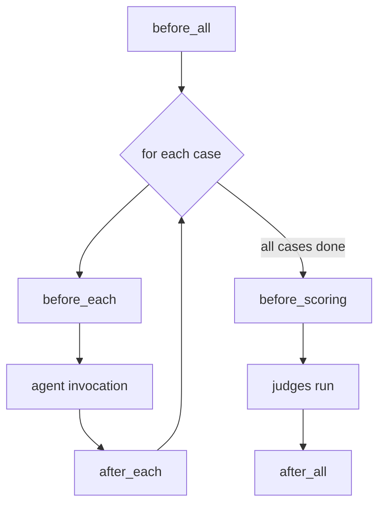

# hooks

The `hooks` block runs your own shell commands at fixed points in the eval
pipeline — to seed fixtures, mint tokens, stand up a fake API, or clean up
afterwards. Each phase is a list of hook entries executed in order.

!!! info "Not the same as tool interception"
    These lifecycle hooks are **shell commands the harness runs around
    execution and scoring**. They are unrelated to the `PreToolUse` hook the
    harness installs for [tool interception](inputs-tools.md) (`inputs.tools`),
    which rewrites tool calls *inside* the agent. Two different mechanisms — this
    page is only about the pipeline lifecycle hooks.

## The five phases



| Phase | When it runs | Working directory | On failure |
| --- | --- | --- | --- |
| `before_all` | Once, before any case executes | Project root | Aborts the run |
| `before_each` | Before each case invocation | Case workspace | Aborts the run |
| `after_each` | After each case (guaranteed, even on error) | Case workspace | Always continues |
| `before_scoring` | Once, after all cases, before judges | Project root | Aborts scoring |
| `after_all` | Once, after everything (guaranteed) | Project root | Always continues |

!!! note "Guaranteed cleanup phases"
    `after_each` and `after_all` run inside a `finally` block, so they fire even
    when the agent invocation or an earlier hook raised. They always use
    *continue* semantics — a failing cleanup hook is logged but never aborts the
    run — so `on_failure` has no effect on them.

## Hook entry fields

Each entry in a phase list is a mapping:

| Field | Type | Default | Meaning |
| --- | --- | --- | --- |
| `command` | string | `""` | Shell command, run via `bash -c` |
| `timeout` | int (seconds) | `120` | Must be a positive integer; on timeout the whole process group is killed |
| `description` | string | `""` | Label shown in logs (falls back to the command's first line) |
| `on_failure` | `fail` \| `continue` | `fail` | `fail` aborts the run; `continue` logs and proceeds |
| `condition` | string | `""` | Guard command; the hook runs only if it exits `0` |

```yaml title="eval.yaml"
hooks:
  before_all:
    - description: Start a fake API server
      command: ./eval/scripts/start_fake_api.sh
      timeout: 30

  before_each:
    - description: Reset fixture state for this case
      command: ./eval/scripts/reset_fixtures.sh "$CASE_ID"

  after_each:
    - description: Best-effort per-case cleanup
      command: ./eval/scripts/cleanup_case.sh "$CASE_ID"
      on_failure: continue   # redundant here — after_each always continues

  after_all:
    - description: Tear down the fake API server
      command: ./eval/scripts/stop_fake_api.sh
```

!!! warning "Per-case hooks are ignored in batch mode"
    `before_each` / `after_each` only fire in **case** (and prompt) mode, where
    the harness loops over cases. In `execution.mode: batch` — one invocation for
    all cases — they are dropped, and the config loader emits a warning:

    ```text
    hooks.before_each, after_each ignored in batch mode
    (per-case hooks only run in case/prompt mode)
    ```

    In batch mode use `before_all` / `after_all` instead. Per-case hooks are also
    skipped in `runner.workspace_mode: repo` (in-repo) execution.

## Environment variables

Every hook inherits the caller's environment plus these harness-injected
variables:

| Variable | Available in | Value |
| --- | --- | --- |
| `AGENT_EVAL_WORKSPACE` | all phases | Workspace root |
| `AGENT_EVAL_RUN_ID` | all phases | Run identifier |
| `AGENT_EVAL_CONFIG` | all phases | Absolute path to `eval.yaml` |
| `AGENT_EVAL_PROJECT_ROOT` | all phases | Project root (`cwd`) |
| `AGENT_EVAL_MODEL` | all phases | Skill model for the run |
| `CASE_ID` | `before_each` / `after_each` | The case identifier |
| `CASE_WORKSPACE` | `before_each` / `after_each` | Absolute path to this case's workspace |
| `CASE_SOURCE_DIR` | `before_each` / `after_each` | The case's source directory under `dataset.path` |
| `CASE_INPUT` | `before_each` / `after_each` | Absolute path to the case's `input.yaml` |

`condition` commands receive the same environment, so you can guard a hook on a
case:

```yaml
hooks:
  before_each:
    - description: Only seed cases tagged for the DB
      condition: test -f "$CASE_SOURCE_DIR/needs_db"
      command: ./eval/scripts/seed_db.sh "$CASE_ID"
```

## Hook outputs

A `before_all` or `before_each` hook can hand data back to the harness by
writing a `.hook-outputs.yaml` (or `.hook-outputs.json`) file with `env` and/or
`data` keys. The file is read and then deleted.

- **`env`** — merged into the environment of the **agent invocation** for that
  case (or all cases, for `before_all`). Use it to pass a freshly minted token or
  a dynamically assigned port to the skill under test.
- **`data`** — persisted to `hook_outputs.yaml` in the run directory and exposed
  to [judges](judges.md) as `outputs["hook_outputs"]`.

=== "before_all (workspace root)"

    ```bash
    # Emit to the workspace root so the harness collects it
    cat > "$AGENT_EVAL_WORKSPACE/.hook-outputs.yaml" <<EOF
    env:
      FAKE_API_URL: http://localhost:8099
    data:
      server_started_at: "$(date -u +%FT%TZ)"
    EOF
    ```

=== "before_each (case workspace)"

    ```bash
    # before_each runs in the case workspace, so cwd works too
    cat > "$CASE_WORKSPACE/.hook-outputs.yaml" <<EOF
    env:
      CASE_TOKEN: $(./mint_token.sh "$CASE_ID")
    data:
      seeded_rows: 42
    EOF
    ```

!!! tip "Where to write the file"
    Outputs are collected from the **workspace** (`before_all`) or the **case
    workspace** (`before_each`). Write to `$AGENT_EVAL_WORKSPACE` /
    `$CASE_WORKSPACE` respectively. Outputs from `after_each`, `before_scoring`,
    and `after_all` are **not** collected — those phases are for side effects and
    cleanup only.

## Failure, timeout, and logs

- Hooks in a phase run **sequentially**. In an aborting phase (`before_all`,
  `before_each`, `before_scoring`), the first hook with `on_failure: fail` that
  exits non-zero or times out stops the pipeline.
- Each hook runs in its own process session; on `timeout` the harness sends
  `SIGTERM` (then `SIGKILL`) to the whole process group, so background children
  are cleaned up too.
- Every hook's combined stdout/stderr is written to a log file under the run's
  `hooks/` directory:

  ```text
  eval/runs/<run-id>/hooks/before_all.0.log
  eval/runs/<run-id>/hooks/before_each.case-001.0.log
  eval/runs/<run-id>/hooks/after_all.0.log
  ```

## See also

<div class="grid cards" markdown>

- [**Lifecycle hooks concept**](../../concepts/lifecycle-hooks.md) — when and why to use each phase
- [**inputs.tools**](inputs-tools.md) — the separate PreToolUse tool-interception mechanism
- [**execution**](execution.md) — `mode: case` vs `batch` and `env` injection
- [**judges**](judges.md) — reading `outputs["hook_outputs"]` in a judge

</div>
