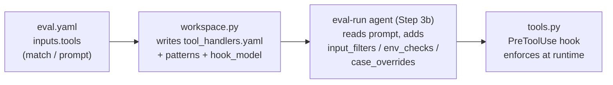

# inputs.tools

`inputs.tools` declares **tool interception handlers** for headless runs — how the
harness answers `AskUserQuestion` prompts and gates or blocks tool calls (MCP tools,
Bash scripts touching external services) while the skill or agent executes
unattended. You author intent in natural language; the harness resolves it into
concrete runtime checks.

!!! info "Only for headless execution"
    Interception matters when the agent runs non-interactively (`/eval-run`, Harbor,
    EvalHub) and can't ask a human. See the concept page,
    [tool interception](../../concepts/tool-interception.md), for the bigger picture.

## What you author

Each entry in `inputs.tools` is a handler with **at most three user-authored keys**:

| Key | Type | Purpose |
| --- | --- | --- |
| `match` | string | Natural-language description of *what* to intercept (which tools, scripts, or APIs). |
| `prompt` | string | Natural-language instruction for *how* to handle it. |
| `prompt_file` | string | External file (path relative to the eval config) holding a longer instruction, as an alternative to inline `prompt`. |

That is the complete authoring surface — the `ToolInputConfig` dataclass in
[`config.py`](https://github.com/opendatahub-io/agent-eval-harness/blob/main/agent_eval/config.py)
parses only `match`, `prompt`, and `prompt_file`. Everything else in the runtime
artifact is **derived**, not declared.

```yaml title="eval.yaml"
inputs:
  tools:
    # Auto-answer interactive questions during the run
    - match: Questions asked to the user via AskUserQuestion.
      prompt: |
        Answer based on the test case context. Default to "yes"
        for confirmations, "Normal" for priority.

    # Gate external service access to test instances only
    - match: |
        Any interaction with Jira — whether via MCP tools
        (mcp__atlassian__*) or Bash scripts calling the Jira API.
      prompt: |
        Only allow if the target is a test Jira instance or emulator.
        Block any requests to production Jira servers.
```

!!! tip "Describe intent, not regexes"
    You never write tool-name globs or env-var checks in `eval.yaml`. Say *what* and
    *how* in `match`/`prompt`; the pipeline turns that into patterns and checks.

## How a handler is resolved

Handlers pass through three stages before they run. Each stage adds derived fields.



1. **`workspace.py`** extracts basic tool-name `patterns` from the `match` text, writes
   `tool_handlers.yaml`, and stamps in `hook_model` from [`models.hook`](models.md).
2. **The eval-run agent** reads each handler's `prompt` and resolves it into concrete
   runtime checks (`input_filters`, `env_checks`, and any `case_overrides`).
3. **`tools.py`** (the `PreToolUse` hook) executes those checks on every tool call.

## The generated `tool_handlers.yaml`

The resolved artifact lives in each case workspace. This is what the runtime hook
consumes — you don't hand-write it, but understanding its schema explains how your
`match`/`prompt` are interpreted.

```yaml title="tool_handlers.yaml"
handlers:
  - match: "Questions asked to the user via AskUserQuestion."
    patterns: ["AskUserQuestion"]
    prompt: |
      Answer based on the test case context in input.yaml and answers.yaml.
      Default: pick the first option or answer "yes" for confirmations.

  - match: "Any Jira interaction via MCP tools or scripts."
    patterns: ["Bash", "mcp__atlassian__*"]
    input_filters: ["jira", "JIRA_SERVER", "jira-python"]
    env_checks:
      JIRA_SERVER:
        must_contain: ["localhost", "emulator", "127.0.0.1", "test"]
    prompt: "Only allow if JIRA_SERVER points to a test instance."

# Model for LLM-based AskUserQuestion answering (from models.hook)
hook_model: claude-haiku-4-5-20251001

# Per-case exact-match answer overrides (optional)
case_overrides:
  "What priority should this have?": "Normal"
```

### Field reference (set-by / used-by)

| Field | Set by | Used by | Purpose |
| --- | --- | --- | --- |
| `match` | workspace.py (from eval.yaml) | eval-run agent | Natural-language description of what to intercept. |
| `prompt` | workspace.py (from eval.yaml) | eval-run agent, tools.py | Instruction the agent reads to generate checks; also passed to the LLM answerer as context. |
| `patterns` | workspace.py (heuristic extraction) | tools.py | Tool-name patterns for matching (exact or glob). |
| `input_filters` | eval-run agent (Step 3b) | tools.py | Regex patterns matched against Bash command content. With `"Bash"` in `patterns`, **both** must match. |
| `env_checks` | eval-run agent (Step 3b) | tools.py | Env-var validation. Each key is a var name; `must_contain` lists required substrings. **All** must pass to allow. |
| `hook_model` | workspace.py (from `models.hook`) | tools.py | Model ID for LLM-based `AskUserQuestion` answering. Defaults to `claude-haiku-4-5-20251001`. |
| `case_overrides` | eval-run agent (optional) | tools.py | Question → answer map for `AskUserQuestion`; exact-match tier checked before the LLM and fallback. |

## Runtime behavior by tool type

=== "AskUserQuestion"

    A 3-tier resolution picks the answer:

    1. **Exact match** — look up the question text in `case_overrides`.
    2. **LLM call** — if no exact match and options exist, call `hook_model` with the
       question, options, handler `prompt`, and case context (`input.yaml` +
       `answers.yaml` from the workspace). The model picks the best option.
    3. **Fallback** — pick the first option, or `"yes"`.

    The hook returns `permissionDecision: "allow"` with the answers in `updatedInput`.

    !!! warning "Case files are sent to the model"
        In tier 2, `input.yaml` and `answers.yaml` are sent to the model API. **Do not
        put secrets, credentials, or PII** in those files.

=== "MCP tools"

    A pattern like `mcp__atlassian__*` matches any tool whose name starts with that
    prefix.

    - With `env_checks`: validate each var; **all pass → allow**, **any fails → deny**
      with a reason.
    - Without `env_checks`: **deny by default** (matched but no check defined).

=== "Bash commands"

    Matching requires **both**: `"Bash"` in `patterns` **and** the command matching at
    least one `input_filters` regex (case-insensitive).

    - `input_filters: ["jira", "JIRA_SERVER"]` → the command must contain `jira` or
      `JIRA_SERVER`. A plain `ls -la` won't match even though `Bash` is in `patterns`.
    - If matched and `env_checks` are present, the same env validation as MCP applies.

=== "Unmatched tools"

    Any tool with no matching handler **passes through** — exit 0, no interception.

## Gotchas

!!! warning "`Bash` without `input_filters` is misconfigured"
    A handler with `Bash` in `patterns` but no `input_filters` is treated as
    misconfigured: `tools.py` logs a stderr warning and skips it (pass-through).
    Without filters, every Bash call would otherwise hit the default-deny and the skill
    could not run.

!!! note "Blocking needs no extra fields"
    If your `prompt` says to *block* or *deny*, the default deny-when-matched behavior
    is sufficient — just make sure `match` produces the right `patterns`.

## Related

<div class="grid cards" markdown>

- [**tool interception (concept)**](../../concepts/tool-interception.md) — the model and rationale
- [**models**](models.md) — `models.hook` supplies `hook_model`
- [**permissions**](permissions.md) — coarse allow/deny that runs alongside interception
- [**judges**](judges.md) — how judges read captured `tool_calls`
- [**outputs**](outputs.md) — capturing tool calls via `outputs[].tool`

</div>
