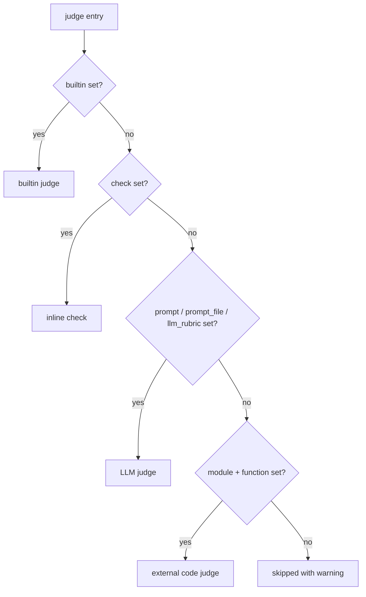

# judges

`judges` is a list of scorers applied to every case. Each judge is one of **four
types** — determined by which field you set — and returns either a boolean
(pass/fail) or a number (a score). The harness aggregates results into pass rates
and means, which [thresholds](thresholds.md) gate on and [reward](reward.md)
composes from.

```yaml
judges:
  - name: budget_check
    builtin: cost_budget
    arguments:
      max_cost_usd: 5.0

  - name: has_content
    check: |
      content = outputs.get("main_content", "")
      if len(content.strip()) < 100:
          return False, f"Output too short ({len(content.strip())} chars)"
      return True, "OK"

  - name: output_quality
    prompt: "Score 1-5 for completeness, clarity, and accuracy.\n\n{{ outputs }}"
```

## The four judge types

A judge's type is inferred from which field is populated. There is no `type:` key.

| Type | Set this field | Returns | Runs where |
| --- | --- | --- | --- |
| **builtin** | `builtin:` | bool or score | reusable judge from the harness library |
| **check** | `check:` | `(bool\|number, str)` | inline Python, in-process |
| **LLM** | `prompt:` / `prompt_file:` / `llm_rubric:` | bool or score | Anthropic API call |
| **code** | `module:` + `function:` | judge's return | your Python module |

!!! info "Type precedence"
    When more than one discriminator is present, the loader resolves the type in a
    fixed order: **`builtin` → `check` → LLM (`prompt`/`prompt_file`/`llm_rubric`) →
    `module`+`function`**. A judge with none of these is skipped with a warning. To
    avoid ambiguity, `builtin` is validated as *mutually exclusive* with `check`,
    `prompt`, `prompt_file`, `module`, and `function` — combining them fails at load.



## Field reference

| Field | Type | Applies to | Description |
| --- | --- | --- | --- |
| `name` | string | all | Judge identifier. Must be unique across judges (except the reserved `pairwise`). |
| `description` | string | all | What the judge checks. Context for LLM judges; documentation for the rest. |
| `builtin` | string | builtin | Registered judge name from `agent_eval/judges/<category>/` (e.g. `cost_budget`). |
| `check` | string | check | Python snippet receiving `outputs`, `arguments`; returns `(value, rationale)`. |
| `llm_rubric` | string | LLM | Concise criteria. Auto-wrapped with `{{ conversation }}` if absent. |
| `prompt` | string | LLM | Full Jinja2 template with manual control over structure. |
| `prompt_file` | string | LLM | Path to a prompt file (absolute or relative to project root). |
| `context` | list of paths | LLM | Files appended to the prompt as `## Context: <name>` sections. |
| `module` | string | code | Importable module holding the judge function. |
| `function` | string | code | Callable in `module`; receives `outputs=` plus any `arguments`. |
| `arguments` | mapping | all | `**kwargs` for Python judges; `{{ arguments }}` for LLM judges. |
| `if` | string | all | Python expression over `annotations`/`outputs`; skip the case when false. |
| `feedback_type` | string | LLM | `bool` for pass/fail; anything else scores 1-5. Inferred if omitted. |
| `model` | string | LLM | Per-judge model override (highest precedence). |
| `samples` | int | LLM | Run N times per case and reduce (median/majority). Default `1`. |
| `score_range` | `[min, max]` | numeric | Value scale for report coloring. Default `[1, 5]` for LLM, `[0, 1]` otherwise. |

!!! note "Boolean vs numeric aggregation"
    A judge whose values are all booleans aggregates into a **pass rate**; all-numeric
    values aggregate into a **mean**. Mixed or unparseable values yield neither. Gate
    boolean judges with `min_pass_rate` and numeric ones with `min_mean` in
    [thresholds](thresholds.md).

## LLM judges

The three LLM discriminators all compile to one internal prompt, then render through
Jinja2 with the case record. Priority when more than one is set: **`llm_rubric` →
`prompt` → `prompt_file`**.

=== "llm_rubric (sugar)"

    ```yaml
    - name: cited_sources
      llm_rubric: "Agent cited relevant documentation sources."
    ```

    `llm_rubric` is appended with `# Agent Response to Evaluate\n\n{{ conversation }}`
    automatically — unless you already reference `{{ conversation }}` yourself.

=== "prompt (full template)"

    ```yaml
    - name: output_quality
      description: Completeness and accuracy versus the reference.
      prompt: |
        Score 1-5 for completeness, clarity, and accuracy.

        {{ outputs }}
        {{ conversation }}
      score_range: [1, 5]
    ```

=== "prompt_file + context"

    ```yaml
    - name: quality
      prompt_file: eval/prompts/quality-judge.md
      arguments:
        strictness: high
      context:
        - eval/prompts/domain-guidelines.md
    ```

### Template variables

LLM prompts (and `context` files) are rendered with these variables:

| Variable | Contents |
| --- | --- |
| `{{ outputs }}` | File artifacts and modified files rendered as markdown. Also supports structured access: `{{ outputs.files }}`, `{{ outputs.events }}`. |
| `{{ conversation }}` | Root-level assistant text (excludes subagent text and tool calls). |
| `{{ tool_trace }}` | Chronological trace of tool calls (Read, Bash, Agent, …). |
| `{{ inputs }}` | The case's `input.yaml` rendered as `**key**: value` per field. |
| `{{ evidence }}` | Summary of tool activity (turns, cost, tools, files read/written). Lazily derived and cached. |
| `{{ annotations }}` | Dataset annotations. Renders as text, or `{{ annotations.get('category') }}`. |
| `{{ arguments }}` | This judge's `arguments` dict. |

!!! warning "Use the bare variable names"
    Write `{{ conversation }}`, not `{{ outputs.conversation }}` or `{{ outputs.response }}` —
    the latter do not exist and render empty. A judge assessing **behavior**
    (navigation, tool usage) must use `{{ tool_trace }}`; `{{ conversation }}` alone
    will make the agent look like it did nothing.

### Model resolution

LLM (and pairwise) judges need a model, resolved in this order:

```text
per-judge model:  >  models.judge  >  EVAL_JUDGE_MODEL env var
```

If none resolves to a non-empty value, the judge raises at run time.

## check judges

Inline Python that validates structure deterministically. The snippet receives
`outputs` and `arguments` dicts and returns a `(value, rationale)` tuple.

```yaml
- name: has_frontmatter
  check: |
    content = outputs.get("main_content", "")
    if not content.startswith("---"):
        return False, "Missing YAML frontmatter"
    return True, "Frontmatter present"
```

!!! tip "Read files from `outputs`, never the filesystem"
    Check judges run in the project root, not the per-case directory. Always access
    artifacts via the `outputs` dict (`outputs["files"]`, `outputs["conversation"]`,
    `outputs["events"]`, `outputs.get("annotations", {})`) — never `os.listdir()` or
    hardcoded paths. Use `.get()` with defaults so a failed case returns a clean
    `(False, "reason")` instead of raising.

## builtin and code judges

`builtin` names a judge shipped with the harness — see the
[builtin judges reference](../builtin-judges.md). `module`/`function` points at your
own callable for validation the built-ins don't cover (see the
[custom judges recipe](../../cookbook/custom-judges.md)). Both accept `arguments`,
passed as `**kwargs`.

```yaml
- name: docs_consultation
  builtin: consulted_docs
  arguments:
    min_coverage: 0.8

- name: schema_valid
  module: eval.judges.my_checker
  function: check_quality
  arguments:
    threshold: 0.8
```

## Conditional judges (`if`)

An `if` expression skips the judge for cases where it evaluates false — the case is
**not** counted in that judge's pass rate or mean. The expression sees `annotations`
and `outputs` directly (no `.get()` needed for `annotations` here).

```yaml
- name: navigation_quality
  if: "annotations.get('category') == 'navigation'"
  prompt: "Did the agent navigate to the right files?\n\n{{ tool_trace }}"
```

## Sampling (`samples`)

Set `samples: N` to run a stochastic (LLM) judge N times per case and reduce the
results — **median** for numeric scores, **majority vote** for booleans. It is
ignored (with a warning) for deterministic `check`, `builtin` Python, and `code`
judges. The report records the spread and flags unstable cases. See
[pairwise & sampling](../../concepts/pairwise-and-sampling.md).

```yaml
- name: output_quality
  prompt: "Score 1-5 for accuracy.\n\n{{ outputs }}"
  samples: 5
```

## The reserved `pairwise` judge

A judge named `pairwise` is not scored per case — it configures the A/B comparison
used by `/eval-run --baseline <run-id>`. It takes `prompt`/`prompt_file` and an
optional `model`; the harness swaps output positions to control for order bias.

```yaml
- name: pairwise
  description: Compare two runs and pick the better output.
  prompt_file: eval/prompts/comparison-judge.md
```

## Validation at load time

The config fails fast rather than mid-run when:

- two judges share a `name` (except `pairwise`);
- `builtin` is combined with `check`, `prompt`, `prompt_file`, `module`, or `function`;
- `builtin` or `arguments` have the wrong type (must be string / mapping);
- `score_range` is not a two-element increasing numeric `[min, max]` list.

## Related

<div class="grid cards" markdown>

- [**Judges concept**](../../concepts/judges.md) — how scoring fits the pipeline
- [**Builtin judges**](../builtin-judges.md) — the library you can reference by name
- [**Custom judges recipe**](../../cookbook/custom-judges.md) — write your own `module`/`function`
- [**Pairwise & sampling**](../../concepts/pairwise-and-sampling.md) — A/B comparison and stability
- [**thresholds**](thresholds.md) — turn judge results into regression gates
- [**reward**](reward.md) — collapse judges into an RL reward scalar

</div>
