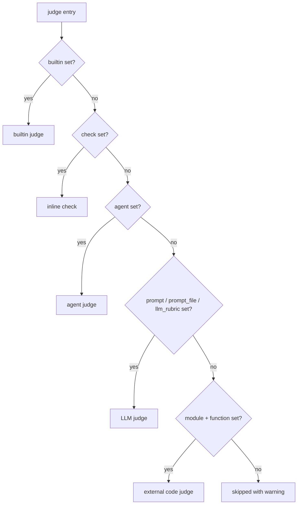

# judges

`judges` is a list of scorers applied to every case. Each judge is one of **five
types** — determined by which field you set — and returns either a boolean
(pass/fail) or a number (a score). The harness aggregates results into pass rates
and means, which [thresholds](thresholds.md) gate on and [reward](reward.md)
composes from.

```yaml
judges:
  - name: budget_check
    builtin: cost_budget
    arguments:
      max_cost_usd: 5.0

  - name: has_content
    check: |
      content = outputs.get("main_content", "")
      if len(content.strip()) < 100:
          return False, f"Output too short ({len(content.strip())} chars)"
      return True, "OK"

  - name: output_quality
    prompt: "Score 1-5 for completeness, clarity, and accuracy.\n\n{{ outputs }}"
    score_range: [1, 5]      # declare the scale — omitting it warns at config load
```

## The five judge types

A judge's type is inferred from which field is populated. There is no `type:` key.

| Type | Set this field | Returns | Runs where |
| --- | --- | --- | --- |
| **builtin** | `builtin:` | bool or score | reusable judge from the harness library |
| **check** | `check:` | `(bool\|number, str)` | inline Python, in-process |
| **agent** | `agent:` (+ `prompt`/`prompt_file`/`llm_rubric`) | bool or score | tool-using judge run through the runner abstraction against a staged workspace |
| **LLM** | `prompt:` / `prompt_file:` / `llm_rubric:` | bool or score | Anthropic API call |
| **code** | `module:` + `function:` | judge's return | your Python module |

!!! info "Type precedence"
    When more than one discriminator is present, the loader resolves the type in a
    fixed order: **`builtin` → `check` → `agent` → LLM (`prompt`/`prompt_file`/`llm_rubric`)
    → `module`+`function`**. `agent` is checked before the plain-LLM branch, so an
    `agent:` block upgrades an otherwise-LLM judge into a tool-using run (see
    [Agent judges](#agent-judges)). A judge with none of these is skipped with a warning. To
    avoid ambiguity, `builtin` is validated as *mutually exclusive* with `check`,
    `prompt`, `prompt_file`, `agent`, `module`, and `function` — combining them fails
    at load (so `builtin` + `agent` is rejected; `agent` otherwise coexists with the
    prompt fields, which supply its instructions).


```mermaid
flowchart TD
    A[judge entry] --> B{builtin set?}
    B -- yes --> BUILTIN[builtin judge]
    B -- no --> C{check set?}
    C -- yes --> CHECK[inline check]
    C -- no --> AG{agent set?}
    AG -- yes --> AGENT[agent judge]
    AG -- no --> D{prompt / prompt_file / llm_rubric set?}
    D -- yes --> LLM[LLM judge]
    D -- no --> E{module + function set?}
    E -- yes --> CODE[external code judge]
    E -- no --> SKIP[skipped with warning]
```

## Field reference

| Field | Type | Applies to | Description |
| --- | --- | --- | --- |
| `name` | string | all | Judge identifier. Must be unique across judges (except the reserved `pairwise`). |
| `description` | string | all | What the judge checks. Context for LLM judges; documentation for the rest. |
| `builtin` | string | builtin | Registered judge name from `agent_eval/judges/<category>/` (e.g. `cost_budget`). |
| `check` | string | check | Python snippet receiving `outputs`, `arguments`; returns `(value, rationale)`. |
| `agent` | mapping | agent | Runs the judge as a tool-using agent; see [Agent judges](#agent-judges) below. |
| `llm_rubric` | string | LLM, agent | Concise criteria. LLM judges auto-wrap it with `{{ conversation }}` if absent; agent judges use it as-is (they read the staged workspace, not an inlined conversation). |
| `prompt` | string | LLM, agent | Full Jinja2 template with manual control over structure. |
| `prompt_file` | string | LLM, agent | Path to a prompt file (absolute or relative to project root). |
| `context` | list of paths | LLM, agent | Files appended to the prompt as `## Context: <name>` sections. Distinct from `agent.context`, which stages dirs/files into the judge workspace for the agent to read. |
| `module` | string | code | Importable module holding the judge function. |
| `function` | string | code | Callable in `module`; receives `outputs=` plus any `arguments`. |
| `arguments` | mapping | all | `**kwargs` for Python judges; `{{ arguments }}` for LLM judges. |
| `if` | string | all | Python expression over `annotations`/`outputs`; skip the case when false. |
| `feedback_type` | string | LLM, agent (validated on every judge) | `bool` selects a `passed` verdict; anything else — **including omitting it** — selects a numeric `score` on `score_range`. **Never inferred** from the rubric text. `int`/`float` force integer/continuous scoring; when omitted, integer-ness follows the bounds: whole bounds score as an integer, fractional bounds (e.g. `[0, 2.5]`) as a number. `bool` + `score_range`, and `int` + fractional bounds, are rejected at load on any judge type. |
| `model` | string | LLM, agent | Per-judge model override (highest precedence). |
| `samples` | int | LLM, agent | Run N times per case and reduce (median/majority). Default `1`. |
| `score_range` | `[min, max]` | all numeric judges | The judge's scale. **Declared:** stated in the LLM judge's system prompt and `submit_score` schema (and in the agent judge's `score.json` contract), colors per-case report cells, normalizes the judge in every [reward](reward.md#precedence) composition that normalizes it — a `reward.score_range` only covers judges that declare none, and a judge the reward clamps as-is (`reward.raw`, or a single `reward.judge` without `normalize`) consults no range — and is **enforced for every judge type** — including `check`, `module`/`function` and Python `builtin` judges: an off-scale (or non-finite) value becomes an error sample, not a clamped one (see [Validation](#validation-at-load-time)). **Omitted:** LLM/agent judges are told `[1, 5]` but nothing is checked, and the cell renders neutral (uncolored). Bounds may be negative (`[-1, 1]`) or fractional (`[0, 2.5]`); fractional bounds also select a non-rounded `number` verdict. |

!!! note "Boolean vs numeric aggregation"
    A judge whose values are all booleans aggregates into a **pass rate**; all-numeric
    values aggregate into a **mean**. Mixed or unparseable values yield neither. Gate
    boolean judges with `min_pass_rate` and numeric ones with `min_mean` in
    [thresholds](thresholds.md).

## LLM judges

The three LLM discriminators all compile to one internal prompt, then render through
Jinja2 with the case record. Priority when more than one is set: **`llm_rubric` →
`prompt` → `prompt_file`**.

=== "llm_rubric (sugar)"

    ```yaml
    - name: cited_sources
      llm_rubric: "Agent cited relevant documentation sources."
    ```

    `llm_rubric` is appended with `# Agent Response to Evaluate\n\n{{ conversation }}`
    automatically — unless you already reference `{{ conversation }}` yourself.

=== "prompt (full template)"

    ```yaml
    - name: output_quality
      description: Completeness and accuracy versus the reference.
      prompt: |
        Score 1-5 for completeness, clarity, and accuracy.

        {{ outputs }}
        {{ conversation }}
      score_range: [1, 5]
    ```

=== "prompt_file + context"

    ```yaml
    - name: quality
      prompt_file: eval/prompts/quality-judge.md
      arguments:
        strictness: high
      context:
        - eval/prompts/domain-guidelines.md
    ```

### Template variables

LLM prompts (and `context` files) are rendered with these variables:

| Variable | Contents |
| --- | --- |
| `{{ outputs }}` | File artifacts and modified files rendered as markdown. Also supports structured access: `{{ outputs.files }}`, `{{ outputs.events }}`. |
| `{{ conversation }}` | Root-level assistant **visible** text only (excludes subagent text, tool calls, and extended-thinking). |
| `{{ reasoning }}` | Like `{{ conversation }}` but also includes the model's extended-thinking (chain-of-thought) — for reasoning-quality judges. Needs `traces.events: true`. |
| `{{ tool_trace }}` | Chronological trace of tool calls (Read, Bash, Agent, …). |
| `{{ inputs }}` | The case's `input.yaml` rendered as `**key**: value` per field. |
| `{{ evidence }}` | Summary of tool activity (turns, cost, tools, files read/written). Lazily derived and cached. |
| `{{ annotations }}` | Dataset annotations. Renders as text, or `{{ annotations.get('category') }}`. |
| `{{ arguments }}` | This judge's `arguments` dict. |

!!! warning "Use the bare variable names"
    Write `{{ conversation }}`, not `{{ outputs.conversation }}` or `{{ outputs.response }}` —
    the latter do not exist and render empty. A judge assessing **behavior**
    (navigation, tool usage) must use `{{ tool_trace }}`; `{{ conversation }}` alone
    will make the agent look like it did nothing.

### Model resolution

LLM (and pairwise) judges need a model, resolved in this order:

```text
per-judge model:  >  models.judge  >  EVAL_JUDGE_MODEL env var
```

If none resolves to a non-empty value, the judge raises at run time.

## Agent judges

An `agent:` block turns an LLM judge into a **tool-using agent judge**. Instead of a
single stateless model call, the judge runs as an agent *through the runner abstraction*
against an isolated, staged workspace — so it can `Read`/`Grep`/`Glob` the case outputs
and any reference docs to **ground its verdict** (e.g. verify architecture claims against
the real docs) instead of guessing from prompt text. The instructions still come from
`prompt` / `prompt_file` / `llm_rubric`; the `agent:` block is what upgrades the judge.
It reuses `model`, `feedback_type`, `score_range`, `samples`, `if`, and `thresholds`
exactly like an LLM judge.

### The `agent:` block

Every sub-key is optional.

| Field | Type | Default | Description |
| --- | --- | --- | --- |
| `runner` | mapping | `{type: claude-code}` | Per-judge runner block, parsed exactly like the top-level [`runner`](runner.md) (`type`, `effort`, `command`, `env`, …). Lets the judge use a different runner/model stack than the skill-under-test. |
| `allowed_tools` | list | `[Read, Grep, Glob]` | Tool allowlist for the judge. Read-only by default; add `Bash` only under sandboxing (see below). |
| `context` | list of paths | `[]` | Dirs/files staged **read-only** under `./.context/<name>` for the agent to consult. Distinct from the top-level `context:`, which is appended to the prompt text. |
| `inputs` | list | all output dirs | Which collected output dirs (by `outputs[].path` name) to stage as files. Use `[.]` to stage everything. |
| `timeout` | int | `execution.timeout` or `600` | Per-run wall-clock budget in seconds. |
| `max_budget_usd` | number | `2.0` | Per-judge-run cost cap. |

### How it runs

Per case, the harness:

1. **Stages an isolated workspace** in a temp dir — the case's output files (filtered by
   `agent.inputs`; default all of `outputs["files"]`) plus each `agent.context` entry
   symlinked under `./.context/` are **read-only staged inputs**, and a pre-created
   `./output/` dir is **writable** for the verdict.
2. **Instantiates the judge's own runner** (`RUNNERS[agent.runner.type]`, default
   `claude-code`) with `permissions={"allow": agent.allowed_tools}`, so the judge gets its
   own runner and read-only tool policy — independent of the skill-under-test, via a
   shallow `EvalConfig` copy carrying the judge's runner and permissions.
3. **Runs one prompt-mode turn** with the rendered instructions (same template variables
   LLM judges get), reads the verdict, and tears the workspace down. Runner cost/tokens
   are attributed to the judge.

### Output contract

The judge writes `./output/score.json`:

```json
{"rationale": "All three components exist in the arch docs.", "score": 2}
```

or, for a boolean judge:

```json
{"rationale": "Touched tests pass.", "passed": true}
```

The rationale comes first: the contract tells the judge to compose its justification
before committing to the verdict field. `feedback_type` selects `score` vs `passed`;
`score_range` states the scale **inside the
contract handed to the agent** (`{"rationale": …, "score": <integer in [0, 2]>}`, or
`<number …>` on fractional bounds), bands the score in the report, and is enforced — a verdict off the
scale is recorded as an error sample, never clamped. With no `score_range` a numeric
agent judge is told `[1, 5]` and its verdict is not checked. The
harness appends this output contract (plus an untrusted-data guard) to the prompt
automatically, so rubric authors write only the criteria.

!!! note "Fallback and errors"
    If `score.json` is absent, the harness parses the last `{"score"|"passed", …}` JSON
    object from the run's stdout. If neither yields a value, it records an **error
    sample** — never silently passing.

### Security

The judge reads model-generated, **untrusted** case artifacts, so isolation is enforced:

!!! warning "Enable `Bash` only on a sandboxed runner"
    The default `allowed_tools` is read-only (`[Read, Grep, Glob]`). Add `Bash` **only**
    on a runner with OS-level sandboxing — no network, cleaned host credentials, path
    confinement — because the judge executes against untrusted material (CWE-78/CWE-200).

- Untrusted case-file relpaths are **containment-checked**, so a `..`-bearing key cannot
  escape the staged workspace (CWE-22).
- `runner.workspace_mode: repo` is **rejected** for agent judges — they must run in the
  isolated staged workspace, never the real repo tree (CWE-829).

### Example

```yaml
judges:
  - name: architecture_score
    prompt_file: eval/prompts/architecture-agent-judge.md
    model: claude-opus-4-8
    feedback_type: int
    score_range: [0, 2]
    samples: 3
    agent:
      runner: { type: claude-code }              # optional; defaults to claude-code
      allowed_tools: [Read, Grep, Glob]          # read-only default
      context: [.context/architecture-context]   # staged read-only under ./.context/
      inputs: [strat-tasks]                       # which output dirs to stage (default: all)
```

## check judges

Inline Python that validates structure deterministically. The snippet receives
`outputs` and `arguments` dicts and returns a `(value, rationale)` tuple.

```yaml
- name: has_frontmatter
  check: |
    content = outputs.get("main_content", "")
    if not content.startswith("---"):
        return False, "Missing YAML frontmatter"
    return True, "Frontmatter present"
```

!!! tip "Read files from `outputs`, never the filesystem"
    Check judges run in the project root, not the per-case directory. Always access
    artifacts via the `outputs` dict (`outputs["files"]`, `outputs["conversation"]`,
    `outputs["events"]`, `outputs.get("annotations", {})`) — never `os.listdir()` or
    hardcoded paths. Use `.get()` with defaults so a failed case returns a clean
    `(False, "reason")` instead of raising.

## builtin and code judges

`builtin` names a judge shipped with the harness — see the
[builtin judges reference](../builtin-judges.md). `module`/`function` points at your
own callable for validation the built-ins don't cover (see the
[custom judges recipe](../../cookbook/custom-judges.md)). Both accept `arguments`,
passed as `**kwargs`.

```yaml
- name: docs_consultation
  builtin: consulted_docs
  arguments:
    min_coverage: 0.8

- name: schema_valid
  module: eval.judges.my_checker
  function: check_quality
  arguments:
    threshold: 0.8
```

## Conditional judges (`if`)

An `if` expression skips the judge for cases where it evaluates false — the case is
**not** counted in that judge's pass rate or mean. The expression sees `annotations`
and `outputs` directly (no `.get()` needed for `annotations` here).

```yaml
- name: navigation_quality
  if: "annotations.get('category') == 'navigation'"
  prompt: "Did the agent navigate to the right files?\n\n{{ tool_trace }}"
```

## Sampling (`samples`)

Set `samples: N` to run a stochastic (LLM) judge N times per case and reduce the
results — **median** for numeric scores, **majority vote** for booleans. It is
ignored (with a warning) for deterministic `check`, `builtin` Python, and `code`
judges. The report records the spread and flags unstable cases. See
[pairwise & sampling](../../concepts/pairwise-and-sampling.md).

```yaml
- name: output_quality
  prompt: "Score 1-5 for accuracy.\n\n{{ outputs }}"
  samples: 5
```

## The reserved `pairwise` judge

A judge named `pairwise` is not scored per case — it configures the A/B comparison
used by `/eval-run --baseline <run-id>`. It takes `prompt`/`prompt_file` and an
optional `model`; the harness swaps output positions to control for order bias.

```yaml
- name: pairwise
  description: Compare two runs and pick the better output.
  prompt_file: eval/prompts/comparison-judge.md
```

## Validation at load time

The config fails fast rather than mid-run when:

- two judges share a `name` (except `pairwise`);
- `builtin` names a judge that does not exist (a typo used to load fine and fail
  mid-run) — the error lists every available `category/name`;
- `builtin` is combined with `check`, `prompt`, `prompt_file`, `module`, or `function`;
- `builtin` or `arguments` have the wrong type (must be string / mapping);
- `score_range` is not a two-element increasing numeric `[min, max]` list;
- `feedback_type: bool` is combined with a `score_range` — the verdict is
  pass/fail, so the scale would be ignored;
- `feedback_type: int` declares fractional bounds (use `feedback_type: float`);
- a **builtin LLM** judge declares a `feedback_type` other than `bool`, or any
  `score_range` — those prompts state their own pass/fail contract, so the
  declaration would be dropped. Builtin *Python* judges are unaffected: they
  may be numeric.

A numeric LLM or agent judge that declares no `score_range` **warns** rather
than failing: it is scored on the unenforced `[1, 5]` default — the model is
still told that scale, but the value it returns is not checked. Only that
warning exempts inline `check:` judges — they compute
their own value, so there is no model to bound.

```text
UserWarning: Judge 'output_quality': numeric judge has no 'score_range', so it is
scored on the unenforced [1, 5] default — declare one to have the returned value
checked
```

The warning comes from config load, so it prints on every command that reads
`eval.yaml`, not only `/eval-run`.

A declared `score_range` **is** enforced for every judge type, inline `check:`,
`module`/`function` and builtin Python judges included: a value outside it is
recorded as an error sample rather than counted. The value itself is never
rewritten — enforcement only validates. Rounding happens where a *model's*
answer is parsed, and follows the scale rather than `feedback_type` alone: a
whole-numbered scale rounds to an integer (even with `feedback_type` omitted),
fractional bounds such as `[0, 2.5]` keep the decimal.

A scale breach is the one judge error printed while scoring — every other judge
error is persisted on the result and shown only in the report:

```text
  WARNING: case-003: judge 'quality' returned 4, outside its declared score_range [0, 2]
```

## Related

<div class="grid cards" markdown>

- [**Judges concept**](../../concepts/judges.md) — how scoring fits the pipeline
- [**Builtin judges**](../builtin-judges.md) — the library you can reference by name
- [**Custom judges recipe**](../../cookbook/custom-judges.md) — write your own `module`/`function`
- [**Pairwise & sampling**](../../concepts/pairwise-and-sampling.md) — A/B comparison and stability
- [**thresholds**](thresholds.md) — turn judge results into regression gates
- [**reward**](reward.md) — collapse judges into an RL reward scalar

</div>
