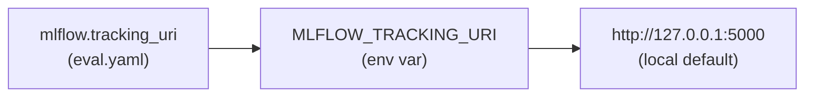

# mlflow

The `mlflow` block points the harness at an [MLflow](https://mlflow.org) tracking
server for experiment tracking, dataset sync, trace capture, and feedback logging.
It is **opt-in by presence**: MLflow integration turns on only when an `mlflow:`
block exists in your `eval.yaml`.

```yaml title="eval.yaml"
mlflow:
  experiment: my-skill-eval               # defaults to top-level `name` if omitted
  # tracking_uri: sqlite:///mlflow.db     # overrides MLFLOW_TRACKING_URI
  # tags: { team: ml, suite: nightly }
```

## Fields

| Key | Type | Default | Purpose |
| --- | --- | --- | --- |
| `experiment` | string | top-level `name` (when the block is present) | MLflow experiment that runs and traces are logged under |
| `tracking_uri` | string | *(unset)* → `MLFLOW_TRACKING_URI` → `http://127.0.0.1:5000` | Tracking server / store URI |
| `tags` | map | `{}` | Tags applied to every run logged for this eval |

## Opt-in by block presence

Whether MLflow is active is derived from the config, not from a flag:

| `eval.yaml` state | `experiment` resolves to | MLflow logging |
| --- | --- | --- |
| No `mlflow:` block | `""` (empty) | Off — no accidental experiment from `name:` |
| `mlflow:` block, `experiment` unset | top-level `name` | On |
| `mlflow:` block with `experiment` | that value | On |

!!! note "Why not default from `name:`?"
    The top-level `name` always exists (it drives the run name), so defaulting the
    experiment from it would make tracing/logging implicit. Requiring the `mlflow:`
    block keeps MLflow strictly opt-in — omit the block and the harness runs fully
    without a server. See the source:
    [`MlflowConfig`](https://github.com/opendatahub-io/agent-eval-harness/blob/main/agent_eval/config.py).

## tracking_uri precedence

When the harness resolves where to send data, it uses the first value that is set:



1. `mlflow.tracking_uri` in `eval.yaml`
2. the `MLFLOW_TRACKING_URI` environment variable
3. the local default `http://127.0.0.1:5000`

!!! tip "Config wins over env"
    Setting `tracking_uri` in `eval.yaml` makes a run **self-contained** — it ignores
    whatever `MLFLOW_TRACKING_URI` is in the caller's shell. Leave it unset to let the
    environment decide (handy for pointing CI vs. a laptop at different servers).

### Remote server vs. local file store

`tracking_uri` accepts any URI MLflow understands.

=== "Remote server"

    ```yaml
    mlflow:
      experiment: my-skill-eval
      tracking_uri: https://mlflow.example.com
    ```

=== "Local SQLite (self-contained)"

    ```yaml
    mlflow:
      experiment: my-skill-eval
      tracking_uri: sqlite:///mlflow.db
    ```

    A SQLite backend store needs no running server — the harness writes directly to
    the `mlflow.db` file, which is ideal for offline or single-machine runs.

## tags

`tags` is a flat map applied to every run logged for this eval, useful for filtering
and grouping in the MLflow UI:

```yaml
mlflow:
  experiment: my-skill-eval
  tags:
    team: ml
    suite: nightly
    owner: platform
```

## Related

<div class="grid cards" markdown>

-   :material-database-sync: **eval-mlflow guide**

    ---

    Sync datasets, log run results, and push/pull trace feedback.

    [:octicons-arrow-right-24: /eval-mlflow](../../guides/eval-mlflow.md)

-   :material-chart-timeline: **Tracing**

    ---

    How executions become hierarchical MLflow traces.

    [:octicons-arrow-right-24: Tracing](../../concepts/tracing.md)

-   :material-variable: **Environment variables**

    ---

    `MLFLOW_TRACKING_URI` and other env vars the harness reads.

    [:octicons-arrow-right-24: Environment variables](../../reference/environment-variables.md)

</div>
