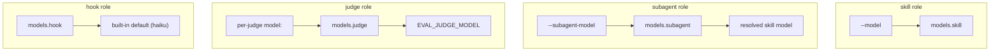

# models

The `models` block sets a default model for each of the four **roles** the harness
invokes: the skill under test, its subagents, the LLM judges, and the tool-interception
hook. Each role has its own precedence chain — a CLI flag or config field usually wins
over the block, and two roles fall back to environment variables.

```yaml title="eval.yaml"
models:
  skill: claude-opus-4-6      # the skill/prompt under test
  subagent: claude-sonnet-4-5 # subagents the skill spawns (optional)
  judge: claude-opus-4-6      # LLM and pairwise judges
  hook: claude-haiku-4-5      # AskUserQuestion auto-answering (optional)
```

All four fields are optional (`ModelsConfig` defaults them to `None`). Omitting the whole
block is valid — as long as each role you actually exercise resolves to a non-empty model
through one of the fallbacks below.

## The four roles

| Role | Field | Drives | Resolution (high → low) |
| --- | --- | --- | --- |
| **skill** | `models.skill` | The skill or prompt being evaluated | `--model` → `models.skill` |
| **subagent** | `models.subagent` | Subagents the skill spawns | `--subagent-model` → `models.subagent` → *skill model* |
| **judge** | `models.judge` | LLM `prompt`/`llm_rubric` and pairwise judges | per-judge `model:` → `models.judge` → `EVAL_JUDGE_MODEL` |
| **hook** | `models.hook` | LLM answering of `AskUserQuestion` during interception | `models.hook` → built-in default (`claude-haiku-4-5`) |



## skill

The model for the target under evaluation (both skill mode and prompt mode).

- **Precedence:** `--model` (on `/eval-run` / `execute.py`) → `models.skill`.
- **Required.** If neither resolves to a value, `eval-run` aborts:
  `ERROR: no model specified. Set --model or models.skill in eval.yaml.`

```bash
/eval-run --model opus          # overrides models.skill for this run
```

!!! tip "Model aliases"
    `--model` accepts whatever the runner CLI accepts — short aliases like `opus` or
    `sonnet` as well as pinned IDs like `claude-opus-4-6`. Pin an exact ID in
    `models.skill` for reproducible runs.

## subagent

The model used by any subagents the skill spawns. Resolved in `execute.py` as
`--subagent-model` → `models.subagent` → the resolved **skill** model, so it is never
empty. The Claude Code runner exports the resolved value as the
`CLAUDE_CODE_SUBAGENT_MODEL` environment variable into the agent subprocess.

```bash
/eval-run --model opus --subagent-model sonnet   # cheaper subagents
```

!!! warning "`CLAUDE_CODE_SUBAGENT_MODEL` from your shell is overridden"
    Because the harness always resolves a subagent model (falling back to the skill
    model) and *sets* `CLAUDE_CODE_SUBAGENT_MODEL` on the subprocess, a value you export
    in your own shell does not take effect for local runs — use `--subagent-model` or
    `models.subagent` instead.

## judge

The model for LLM judges (`prompt`, `prompt_file`, `llm_rubric`) and the pairwise
comparison judge. There is **no CLI flag** for the judge model. Resolution order:

1. the individual judge's `model:` field ([judges](../../reference/config/judges.md)),
2. `models.judge`,
3. the `EVAL_JUDGE_MODEL` environment variable.

If none resolves, LLM and pairwise judges error out asking you to set one of the three.
Deterministic judges (`check`, `builtin`, external `module`/`function`) never consume a
model, so a config with only those judges needs no judge model at all.

```yaml
models:
  judge: claude-opus-4-6

judges:
  - name: output_quality
    prompt: "Score the output 1-5 for completeness and accuracy."
  - name: strict_rubric
    model: claude-opus-4-6   # per-judge override wins over models.judge
    llm_rubric: "Response cites a relevant source."
```

```bash
export EVAL_JUDGE_MODEL=claude-opus-4-6   # last-resort default across runs
```

## hook

The model used to auto-answer `AskUserQuestion` prompts during headless
[tool interception](../../concepts/tool-interception.md). Answering is three-tier: an exact
match in `case_overrides` → an LLM call using the handler prompt plus case context
(`input.yaml` + `answers.yaml`) → the first option as a fallback. `models.hook` selects the
model for the middle (LLM) tier; when unset it defaults to a built-in Haiku model
(`claude-haiku-4-5-20251001`). The value is written into `tool_handlers.yaml` as
`hook_model`.

```yaml
models:
  hook: claude-haiku-4-5   # keep interception answering fast and cheap

inputs:
  tools:
    - match: AskUserQuestion
      prompt: "Answer as a backend engineer prioritizing correctness."
```

## Related environment variables

| Variable | Role | Notes |
| --- | --- | --- |
| `EVAL_JUDGE_MODEL` | judge | Last-resort judge model when no config/flag is set |
| `CLAUDE_CODE_SUBAGENT_MODEL` | subagent | Set *by* the runner from the resolved subagent model; forwarded to the agent subprocess |

See the full list in the [environment variables reference](../../reference/environment-variables.md).

## See also

<div class="grid cards" markdown>

- [**runner**](../../reference/config/runner.md) — the runtime that consumes these models, plus `effort`
- [**judges**](../../reference/config/judges.md) — per-judge `model:` overrides
- [**execution**](../../reference/config/execution.md) — `mode`, skill/prompt, budget, parallelism
- [**environment variables**](../../reference/environment-variables.md) — every variable the harness reads

</div>
