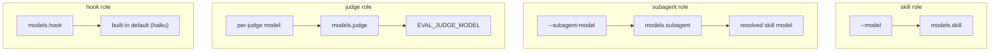

# models

The `models` block sets a default model for each of the four **roles** the harness
invokes: the skill under test, its subagents, the LLM judges, and the tool-interception
hook. Each role has its own precedence chain — a CLI flag or config field usually wins
over the block, and two roles fall back to environment variables.

```yaml title="eval.yaml"
models:
  skill: claude-opus-4-6      # the skill/prompt under test
  subagent: claude-sonnet-4-5 # subagents the skill spawns (optional)
  judge: claude-opus-4-6      # LLM and pairwise judges
  hook: claude-haiku-4-5      # AskUserQuestion auto-answering (optional)
```

All four fields are optional (`ModelsConfig` defaults them to `None`). Omitting the whole
block is valid — as long as each role you actually exercise resolves to a non-empty model
through one of the fallbacks below.

## The four roles

| Role | Field | Drives | Resolution (high → low) |
| --- | --- | --- | --- |
| **skill** | `models.skill` | The skill or prompt being evaluated | `--model` → `models.skill` |
| **subagent** | `models.subagent` | Subagents the skill spawns | `--subagent-model` → `models.subagent` → *skill model* |
| **judge** | `models.judge` | LLM `prompt`/`llm_rubric` and pairwise judges | per-judge `model:` → `models.judge` → `EVAL_JUDGE_MODEL` |
| **hook** | `models.hook` | LLM answering of `AskUserQuestion` during interception | `models.hook` → built-in default (`claude-haiku-4-5`) |


```mermaid
flowchart TD
    subgraph skill["skill role"]
      A["--model"] --> B["models.skill"]
    end
    subgraph subagent["subagent role"]
      C["--subagent-model"] --> D["models.subagent"] --> E["resolved skill model"]
    end
    subgraph judge["judge role"]
      F["per-judge model:"] --> G["models.judge"] --> H["EVAL_JUDGE_MODEL"]
    end
    subgraph hook["hook role"]
      I["models.hook"] --> J["built-in default (haiku)"]
    end
```

## skill

The model for the target under evaluation (both skill mode and prompt mode).

- **Precedence:** `--model` (on `/eval-run` / `execute.py`) → `models.skill`.
- **Required.** If neither resolves to a value, `eval-run` aborts:
  `ERROR: no model specified. Set --model or models.skill in eval.yaml.`

```bash
/eval-run --model opus          # overrides models.skill for this run
```

!!! tip "Model aliases"
    `--model` accepts whatever the runner CLI accepts — short aliases like `opus` or
    `sonnet` as well as pinned IDs like `claude-opus-4-6`. Pin an exact ID in
    `models.skill` for reproducible runs.

## subagent

The model used by any subagents the skill spawns. Resolved in `execute.py` as
`--subagent-model` → `models.subagent` → the resolved **skill** model, so it is never
empty. The Claude Code runner exports the resolved value as the
`CLAUDE_CODE_SUBAGENT_MODEL` environment variable into the agent subprocess.

```bash
/eval-run --model opus --subagent-model sonnet   # cheaper subagents
```

!!! warning "`CLAUDE_CODE_SUBAGENT_MODEL` from your shell is overridden"
    Because the harness always resolves a subagent model (falling back to the skill
    model) and *sets* `CLAUDE_CODE_SUBAGENT_MODEL` on the subprocess, a value you export
    in your own shell does not take effect for local runs — use `--subagent-model` or
    `models.subagent` instead.

## judge

The model for LLM judges (`prompt`, `prompt_file`, `llm_rubric`) and the pairwise
comparison judge. There is **no CLI flag** for the judge model. Resolution order:

1. the individual judge's `model:` field ([judges](../../reference/config/judges.md)),
2. `models.judge`,
3. the `EVAL_JUDGE_MODEL` environment variable.

If none resolves, LLM and pairwise judges error out asking you to set one of the three.
Deterministic judges (`check`, `builtin`, external `module`/`function`) never consume a
model, so a config with only those judges needs no judge model at all.

```yaml
models:
  judge: claude-opus-4-6

judges:
  - name: completeness
    prompt: "Score 1-5 how completely the output covers the request (1 = most requirements missing, 3 = basics with gaps, 5 = complete).\n\nRequest:\n{{ inputs }}\n\nOutput:\n{{ outputs }}"
    score_range: [1, 5]      # declare the scale — omitting it warns at config load
  - name: strict_rubric
    model: claude-opus-4-6   # per-judge override wins over models.judge
    llm_rubric: "Response cites a relevant source."
    feedback_type: bool      # pass/fail verdict — no scale to declare
```

```bash
export EVAL_JUDGE_MODEL=claude-opus-4-6   # last-resort default across runs
```

!!! tip "Judge provider is independent of the runner"
    The judge backend is chosen by the **judge model**, not by `runner.type`, so
    you can grade a Cursor/Codex run with a Claude judge, or a claude-code run
    with an OpenAI judge. Write the model as `provider:/model`:

    - `anthropic:/claude-sonnet-4-5` (or a bare `sonnet`) → Anthropic SDK.
    - `openai:/gpt-4o` (or a bare `gpt-4o`) → OpenAI SDK; set `OPENAI_BASE_URL`
      to reach an OpenAI-compatible gateway (LiteLLM proxy, Azure, local models).
    - `openrouter:/<author>/<slug>[:variant]` → OpenAI SDK through a dedicated
      OpenRouter client (`OPENROUTER_API_KEY`, routing from
      [`models.providers.openrouter`](#providers-openrouter)).
    - `runner:/<model>` → grade through the configured runner (opt-in for models
      only the runner CLI can serve, e.g. Cursor's internal ids).

    An explicit unsupported provider (`gemini:/…`) is rejected at config load
    for a statically-set judge model; an env-only `EVAL_JUDGE_MODEL` is checked
    when the judge is built, and `agent:` judge models route through the runner.
    See [judges → Model providers](../../reference/config/judges.md#model-providers-judge-backend).

## providers (openrouter)

`models.providers` is the registry behind `<provider>:/<model>` URIs. One
provider kind exists, `openrouter`, and the block is optional — an
`openrouter:/…` judge works with the defaults and `OPENROUTER_API_KEY`
exported. A declared block is **inert until a role names it**: the base
`eval.yaml` can hold the shared routing table while its roles stay on
Anthropic, and a [profile](extends.md) flips `models.skill` to
`openrouter:/…` to activate it. Secrets are env-only: `api_key_env` and
`management_key_env` name variables, never values, and those variables may not
appear on any `env:` surface. A top-level `providers:` key is rejected (it
lives under `models`).

```yaml
models:
  skill:    openrouter:/z-ai/glm-5.2:exacto   # the :variant is the only in-request routing control
  subagent: openrouter:/z-ai/glm-5.2          # defaults to the skill model; must share its provider kind
  judge:    openrouter:/z-ai/glm-5.2
  providers:
    openrouter:
      api_key_env: OPENROUTER_API_KEY            # default; the inference key (never the value)
      management_key_env: OPENROUTER_MANAGEMENT_KEY  # read only at enforcement: key-guardrail
      base_url: https://openrouter.ai/api        # default; no /v1 (the harness appends it); https unless loopback
      attribution: { title: agent-eval-harness } # X-OpenRouter-Title (+ HTTP-Referer via `referer`, + x-eval-run-id via `run_id_header: true`)
      background_model: null                    # the haiku slot and the default hook model; null = the model under test
      preflight: strict                          # strict | warn | off — catalog checks before any spend
      cli_budget_inflation: 50                   # execution.max_budget_usd × this → --max-budget-usd (the CLI prices open models 2-60× high)
      budget:
        run_usd: null                            # whole-run real-dollar pool (required, > 0, at key-guardrail)
        dedicated_key: false                     # nothing else spends on the key during the run
      routing:
        defaults: { allow_fallbacks: true }
        models:
          z-ai/glm-5.2: { order: [z-ai, novita], allow_fallbacks: false, quantizations: [fp8] }
        policy: strict                           # strict | warn — what a failed post-hoc audit does to the run
        enforcement: audit                       # audit | key-guardrail (a per-run key with a provider allow-list and limit_usd)
        guardrail:
          key_name: "agent-eval {run_id}"
          providers: pinned                      # pinned (union of the routing keys' pins) | [slug, ...]
          revoke_on_exit: true                   # always true in this release
          settle_s: 20                           # key-usage settle before the run-end read (a shorter value warns)
      judge:
        concurrency: 4        # concurrent OpenRouter judge requests
        max_retries: 3        # 429 (Retry-After), 502/503 and provider-unavailable replies
        timeout_s: 300
        extra_body: {}        # static request additions (merged last)
        inherit_pins: false   # judges send order/only/quantizations only when true
```

`routing` follows OpenRouter's provider-routing fields (`order`, `only`,
`ignore`, `allow_fallbacks`, `require_parameters`, `quantizations`, `sort`,
`data_collection`, `zdr`, `max_price`, plus `fallbacks` for the `models`
array). Entries in `routing.models` are keyed by the bare slug, so one entry
covers every `:variant`. On the **agent path** only `order`, `only`, `ignore`,
`quantizations` and `fallbacks` mean anything — Claude Code cannot put a
`provider` object in its requests, so pins are checked by preflight and audited
after the run; `require_parameters`, `sort`, `data_collection`, `zdr` and
`max_price` on a key an agent role uses raise a load-time warning and are
ignored there (`sort` → the `:nitro`/`:floor` variant). Judges that inherit pins
still receive the full spec. See
[judges → OpenRouter judges](judges.md#openrouter-judges) for what a judge
sends and the `tool_choice` fallback rule.

!!! warning "What the plan owns"
    When `models.skill` is `openrouter:/…` the harness derives the agent's env
    (base URL, bearer key, blanked Vertex/Bedrock variables, the
    `ANTHROPIC_DEFAULT_*` / `CLAUDE_CODE_SUBAGENT_MODEL` aliases, custom
    headers). Those keys are then owned by the plan on every env surface —
    `execution.env`, `runner.env`, `runner.settings.env` and the per-step
    variants: `ANTHROPIC_BASE_URL`, `ANTHROPIC_AUTH_TOKEN` and
    `ANTHROPIC_CUSTOM_HEADERS` are rejected on presence, a static key (the
    Vertex/Bedrock blanks, the aliases) loads only when it equals the plan's
    value, and a non-empty `ANTHROPIC_API_KEY` warns. `subagent` and `hook`
    must share the skill's provider kind (their requests go to OpenRouter too),
    and a bare non-Anthropic id next to a routing entry for it is an error —
    write `openrouter:/<id>` or drop the pins. `runner.type` must be
    `claude-code`.

### How the agent reaches OpenRouter

There is no proxy. When the plan is active the harness derives one env block from the
role URIs and hands it to Claude Code, which then talks to `https://openrouter.ai/api`
directly (`/v1/messages`):

- **Local `claude-code` runner** — the block is merged into a per-run settings overlay
  (`<workspace>/.claude/.eval-overlay.json`, mode 0600, passed via `--settings`, removed
  when the process exits). It is applied last, so it beats `execution.env`,
  `runner.settings.env` and a user-level `~/.claude/settings.json` that forces Vertex;
  subagents and hook children inherit it. Every managed key is also removed from the
  CLI's process environment first, so a host `ANTHROPIC_API_KEY`/`ANTHROPIC_AUTH_TOKEN`
  never reaches the agent. `--model` receives the bare `slug:variants`, and
  `--max-budget-usd` becomes `execution.max_budget_usd × cli_budget_inflation` (the CLI
  enforces that cap on its Anthropic-priced estimate; a cap of 0 omits the flag).
- **Harbor podman** (`--runner harbor --env podman`) — the same block travels as
  value-free `--agent-env` carriers; Harbor merges it last into the agent's environment.
  Host Vertex/Bedrock/Anthropic variables are not forwarded into the container while
  the plan is active. Kubernetes/OpenShift and EvalHub land in a later release.

Before any spend, **preflight** (`preflight: strict | warn | off`) checks every routing
key an agent role uses (skill, subagent, hook, `background_model`) and every
`openrouter:/` judge against the public catalog: the slug exists; each pinned provider
serves it, at a declared quantization when `quantizations` is set, with tools and
`tool_choice: auto` for agent slugs (Claude Code sends `auto`) and `tool_choice: function`
for judges that carry pins (a forced tool call under pins answers 404 otherwise);
endpoints with `status < 0` are degraded and excluded, and a pinned set with no eligible
endpoint left is a failure; `max_completion_tokens` below 32k warns. The key is valid
(`GET /key`) and the account can use the model (`GET /models/user`, the paid-training
filter). A catalog fetch failure degrades to `warn`; the key, slug and eligibility checks
stay strict. The frozen catalog view goes to `provider/routing_snapshot.json`
(`ts`, `routing_sha`, `enforcement`, `key_scope`, per key `pinned_set` /
`eligible` / `excluded` with reasons, `pricing`). The same checks run without a run via

```bash
python3 -m agent_eval.providers.openrouter.preflight --config eval.yaml [--model openrouter:/…] [--run-dir DIR]
```

Cost is **per request**: the `gen-…` ids in Claude Code's own transcript are priced
from `GET /generation` by a background worker as the stream is read, the key-usage
delta cross-checks the sum (agent plus hook spend), and the served provider of every
generation is audited against the pins. See [runs directory → cost provenance](../runs-directory.md#cost-provenance)
for the fields and the `--strict-cost` / `--strict-routing` flags. eval-compare and
eval-anova treat runs whose routing declaration, audit outcome or enforcement level
differ as different factor levels (`allow_unaudited` / `allow_mixed_enforcement`
override).

### Enforcement levels

At **`audit`** (the default) the agent holds the operator key (`key_exposed_to_agent:
true`, `key_scope: operator`; the startup line says so), pins are checked before the
run and audited after it, and `budget.run_usd` is enforced post hoc (`--strict-cost`).

At **`key-guardrail`** the harness provisions a **per-run key** through the management
API before any spend: `POST /api/v1/keys` with `OPENROUTER_MANAGEMENT_KEY` (the variable
named by `management_key_env`; required in the harness environment, never placed
anywhere else), `name` from `guardrail.key_name`, `limit` = `budget.run_usd` (required,
> 0) and an allowed-provider list = the union of the pinned sets of the routing keys the
agent roles use, or the explicit `guardrail.providers`. The key is read back and any
mismatch (a different limit, no echoed allow-list) revokes it and refuses to start, so a
server that does not enforce what was asked never runs the eval. The per-run key is
what the agent, the backfill and the key-usage reads use (`key_scope: per-run`; the
key-usage delta is exact by construction); judges keep the operator key. It is revoked
(`DELETE /api/v1/keys/{hash}`) when the run ends, on every exit path including
Ctrl-C, after the run-end backfill and key-usage settle, with an `atexit` fallback;
`provider/key.json` records the hash, name, limit, providers and `revoked_at` (never
the key). A failed revoke is a stderr ERROR plus a `cost_warnings` entry, and

```bash
python3 -m agent_eval.providers.openrouter.keys revoke <run_dir>
```

retries it. Server-side enforcement means a pin violation cannot happen (an unroutable
request 404s, visible in the agent's error output) and a budget breach is a 402
(`budget.exceeded_reason: limit_usd`).

!!! warning "Guardrail field semantics are documented, not verified"
    The management API's field names for the allow-list and the limit (probe #26 in
    spec 014) have not been exercised against a live management key. They live in
    one function (`agent_eval.providers.openrouter.keys.key_request`), and the
    read-back check fails closed: if the server does not echo the requested limit and
    provider list, the key is revoked and the run does not start. Until the probe
    runs, treat `key-guardrail` as a bounded-exposure mode whose provider
    restriction is verified per run by that read-back, not as an established fact.

## hook

The model used to auto-answer `AskUserQuestion` prompts during headless
[tool interception](../../concepts/tool-interception.md). Answering is three-tier: an exact
match in `case_overrides` → an LLM call using the handler prompt plus case context
(`input.yaml` + `answers.yaml`) → the first option as a fallback. `models.hook` selects the
model for the middle (LLM) tier; when unset it defaults to a built-in Haiku model
(`claude-haiku-4-5-20251001`). The value is written into `tool_handlers.yaml` as
`hook_model`.

```yaml
models:
  hook: claude-haiku-4-5   # keep interception answering fast and cheap

inputs:
  tools:
    - match: AskUserQuestion
      prompt: "Answer as a backend engineer prioritizing correctness."
```

## Related environment variables

| Variable | Role | Notes |
| --- | --- | --- |
| `EVAL_JUDGE_MODEL` | judge | Last-resort judge model when no config/flag is set |
| `CLAUDE_CODE_SUBAGENT_MODEL` | subagent | Set *by* the runner from the resolved subagent model; forwarded to the agent subprocess |

See the full list in the [environment variables reference](../../reference/environment-variables.md).

## See also

<div class="grid cards" markdown>

- [**runner**](../../reference/config/runner.md) — the runtime that consumes these models, plus `effort`
- [**judges**](../../reference/config/judges.md) — per-judge `model:` overrides
- [**execution**](../../reference/config/execution.md) — `mode`, skill/prompt, budget, parallelism
- [**environment variables**](../../reference/environment-variables.md) — every variable the harness reads

</div>
