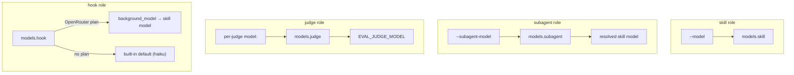

# models

The `models` block sets a default model for each of the four **roles** the harness
invokes: the skill under test, its subagents, the LLM judges, and the tool-interception
hook. Each role has its own precedence chain — a CLI flag or config field usually wins
over the block, and two roles fall back to environment variables. A fifth sub-key,
`providers`, registers how `<provider>:/<model>` ids are served
([models.providers](providers.md)); for what a bare id means on each role and which
role accepts which scheme, read [Model providers](../../concepts/providers.md).

```yaml title="eval.yaml"
models:
  skill: claude-opus-4-6      # the skill/prompt under test
  subagent: claude-sonnet-4-5 # subagents the skill spawns (optional)
  judge: claude-opus-4-6      # LLM and pairwise judges
  hook: claude-haiku-4-5      # AskUserQuestion auto-answering (optional)
```

All four fields are optional (`ModelsConfig` defaults them to `None`). Omitting the whole
block is valid — as long as each role you actually exercise resolves to a non-empty model
through one of the fallbacks below.

## The four roles

| Role | Field | Drives | Resolution (high → low) |
| --- | --- | --- | --- |
| **skill** | `models.skill` | The skill or prompt being evaluated | `--model` → `models.skill` |
| **subagent** | `models.subagent` | Subagents the skill spawns | `--subagent-model` → `models.subagent` → *skill model* |
| **judge** | `models.judge` | LLM `prompt`/`llm_rubric` and pairwise judges | per-judge `model:` → `models.judge` → `EVAL_JUDGE_MODEL` |
| **hook** | `models.hook` | LLM answering of `AskUserQuestion` during interception | `models.hook` → under an OpenRouter plan `models.providers.openrouter.background_model` → *skill model*; otherwise built-in default (`claude-haiku-4-5-20251001`) |


```mermaid
flowchart TD
    subgraph skill["skill role"]
      A["--model"] --> B["models.skill"]
    end
    subgraph subagent["subagent role"]
      C["--subagent-model"] --> D["models.subagent"] --> E["resolved skill model"]
    end
    subgraph judge["judge role"]
      F["per-judge model:"] --> G["models.judge"] --> H["EVAL_JUDGE_MODEL"]
    end
    subgraph hook["hook role"]
      I["models.hook"] -->|OpenRouter plan| J["background_model → skill model"]
      I -->|no plan| K["built-in default (haiku)"]
    end
```

## skill

The model for the target under evaluation (both skill mode and prompt mode).

- **Precedence:** `--model` (on `/eval-run` / `execute.py`) → `models.skill`.
- **Required.** If neither resolves to a value, `eval-run` aborts:
  `ERROR: no model specified. Set --model or models.skill in eval.yaml.`

```bash
/eval-run --model opus          # overrides models.skill for this run
```

!!! note "Accepted forms"
    - A **bare id** — `claude-opus-4-6`, or an alias the CLI resolves such as `opus` —
      names an Anthropic model reached through whatever Claude Code itself is configured
      for: the direct API, a gateway (`ANTHROPIC_BASE_URL`), or Vertex. The harness
      passes it through untouched. Pin an exact id in `models.skill` for reproducible runs.
    - `anthropic:/<id>` passes validation, but the scheme is stripped only while an
      OpenRouter plan is active; without one the value reaches `claude --model` as
      written. Prefer the bare id.
    - `openrouter:/<author>/<slug>[:variant]` activates the harness-managed OpenRouter
      plan. `runner.type` must be `claude-code`, and `subagent` / `hook` must then be
      `openrouter:/` too.
    - Any other scheme fails at load (`Unsupported agent model provider`).

    The matrix for every role is in
    [Model providers → Which role accepts which provider](../../concepts/providers.md#which-role-accepts-which-provider).

## subagent

The model used by any subagents the skill spawns. Resolved in `execute.py` as
`--subagent-model` → `models.subagent` → the resolved **skill** model, so it is never
empty. The Claude Code runner exports the resolved value as the
`CLAUDE_CODE_SUBAGENT_MODEL` environment variable into the agent subprocess.

```bash
/eval-run --model opus --subagent-model sonnet   # cheaper subagents
```

!!! warning "`CLAUDE_CODE_SUBAGENT_MODEL` from your shell is overridden"
    Because the harness always resolves a subagent model (falling back to the skill
    model) and *sets* `CLAUDE_CODE_SUBAGENT_MODEL` on the subprocess, a value you export
    in your own shell does not take effect for local runs — use `--subagent-model` or
    `models.subagent` instead.

## judge

The model for LLM judges (`prompt`, `prompt_file`, `llm_rubric`) and the pairwise
comparison judge. There is **no CLI flag** for the judge model on `/eval-run`
(`execute.py`); the Harbor entry point's `--judge-model` (`python -m
agent_eval.harbor.run`) overrides the in-container judge during task generation only
([CLI reference](../cli.md)). Resolution order:

1. the individual judge's `model:` field ([judges](../../reference/config/judges.md)),
2. `models.judge`,
3. the `EVAL_JUDGE_MODEL` environment variable.

If none resolves, LLM and pairwise judges error out asking you to set one of the three.
Deterministic judges (`check`, `builtin`, external `module`/`function`) never consume a
model, so a config with only those judges needs no judge model at all.

```yaml
models:
  judge: claude-opus-4-6

judges:
  - name: completeness
    prompt: "Score 1-5 how completely the output covers the request (1 = most requirements missing, 3 = basics with gaps, 5 = complete).\n\nRequest:\n{{ inputs }}\n\nOutput:\n{{ outputs }}"
    score_range: [1, 5]      # declare the scale — omitting it warns at config load
  - name: strict_rubric
    model: claude-opus-4-6   # per-judge override wins over models.judge
    llm_rubric: "Response cites a relevant source."
    feedback_type: bool      # pass/fail verdict — no scale to declare
```

```bash
export EVAL_JUDGE_MODEL=claude-opus-4-6   # last-resort default across runs
```

!!! tip "Judge provider is independent of the runner"
    The judge backend is chosen by the **judge model**, not by `runner.type`, so
    you can grade a Cursor/Codex run with a Claude judge, or a claude-code run
    with an OpenAI judge. Write the model as `provider:/model`:

    - `anthropic:/claude-sonnet-4-5` (or a bare `sonnet`) → Anthropic SDK.
    - `openai:/gpt-4o` (or a bare `gpt-4o`) → OpenAI SDK; set `OPENAI_BASE_URL`
      to reach an OpenAI-compatible gateway (LiteLLM proxy, Azure, local models).
    - `openrouter:/<author>/<slug>[:variant]` → OpenAI SDK through a dedicated
      OpenRouter client (`OPENROUTER_API_KEY`, routing from
      [`models.providers.openrouter`](#providers-openrouter)).
    - `runner:/<model>` → grade through the configured runner (opt-in for models
      only the runner CLI can serve, e.g. Cursor's internal ids).

    An explicit unsupported provider (`gemini:/…`) is rejected at config load
    for a statically-set judge model; an env-only `EVAL_JUDGE_MODEL` is checked
    when the judge is built, and `agent:` judge models route through the runner.
    See [judges → Model providers](../../reference/config/judges.md#model-providers-judge-backend).

## providers (openrouter)

`models.providers` is the registry behind `<provider>:/<model>` ids. One provider kind
exists, `openrouter`, and the block is optional: an `openrouter:/…` judge works with the
defaults and `OPENROUTER_API_KEY` exported, and an `openrouter:/<author>/<slug>` skill
model activates the harness-managed plan with the defaults too. A declared block is
**inert until a role names it**, so a base `eval.yaml` can hold the routing table while
its roles stay on Anthropic and a [profile](extends.md) flips `models.skill` — the one
check it keeps is the bare-id footgun ([validation](providers.md#validation)). Secrets are
env-only — `api_key_env` and `management_key_env` name variables, never values — and a
top-level `providers:` key is rejected (the block lives under `models`).

```yaml
models:
  skill: openrouter:/z-ai/glm-5.2:exacto
  providers:
    openrouter:
      routing:
        models:
          z-ai/glm-5.2: { order: [novita], allow_fallbacks: false }
```

- [models.providers](providers.md) — every key of the block with its default, validation,
  the managed-key ownership rule, and where the key goes per backend.
- [Running on OpenRouter](../../guides/openrouter.md) — the direct transport, enforcement
  levels, routing lifecycle, secrets, offline commands and limitations.
- [Model providers](../../concepts/providers.md) — the provider-neutral picture: bare ids
  per role, the role × scheme matrix, credentials per backend, cost provenance.
- [Runs directory → cost provenance](../runs-directory.md#cost-provenance) — the
  `cost_source` / `routing` / `provider` / `budget` fields and the strict flags.

## hook

The model used to auto-answer `AskUserQuestion` prompts during headless
[tool interception](../../concepts/tool-interception.md). Answering is three-tier: an exact
match in `case_overrides` → an LLM call using the handler prompt plus case context
(`input.yaml` + `answers.yaml`) → the first option as a fallback. `models.hook` selects the
model for the middle (LLM) tier; when unset it defaults to a built-in Haiku model
(`claude-haiku-4-5-20251001`). Under an OpenRouter plan an unset hook instead follows
`models.providers.openrouter.background_model`, else the skill model — the hook
subprocess inherits the agent's OpenRouter env, where the Claude default would 404 — and
a hook on a different provider kind than the skill is rejected at load. The bare id
(provider prefix stripped) is written into `tool_handlers.yaml` as `hook_model`.

!!! warning "The hook model is derived from `eval.yaml` alone"
    `hook_model` is computed from the config's roles, not from `--model` /
    `--subagent-model`. A plan activated only by `--model openrouter:/…` over an
    Anthropic `models.skill` leaves an unset hook on the Claude default inside the
    OpenRouter env — set `models.hook` (or `background_model`) in the config, or put the
    `openrouter:/` skill model in a [profile](extends.md).

```yaml
models:
  hook: claude-haiku-4-5   # keep interception answering fast and cheap

inputs:
  tools:
    - match: AskUserQuestion
      prompt: "Answer as a backend engineer prioritizing correctness."
```

## Related environment variables

| Variable | Role | Notes |
| --- | --- | --- |
| `EVAL_JUDGE_MODEL` | judge | Last-resort judge model when no config/flag is set |
| `CLAUDE_CODE_SUBAGENT_MODEL` | subagent | Set *by* the runner from the resolved subagent model; forwarded to the agent subprocess |

See the full list in the [environment variables reference](../../reference/environment-variables.md).

## See also

<div class="grid cards" markdown>

- [**runner**](../../reference/config/runner.md) — the runtime that consumes these models, plus `effort`
- [**judges**](../../reference/config/judges.md) — per-judge `model:` overrides
- [**models.providers**](providers.md) — the `openrouter` block behind `provider:/` ids
- [**Model providers**](../../concepts/providers.md) — bare ids, schemes per role, credentials and cost provenance across providers
- [**execution**](../../reference/config/execution.md) — `mode`, skill/prompt, budget, parallelism
- [**environment variables**](../../reference/environment-variables.md) — every variable the harness reads

</div>
