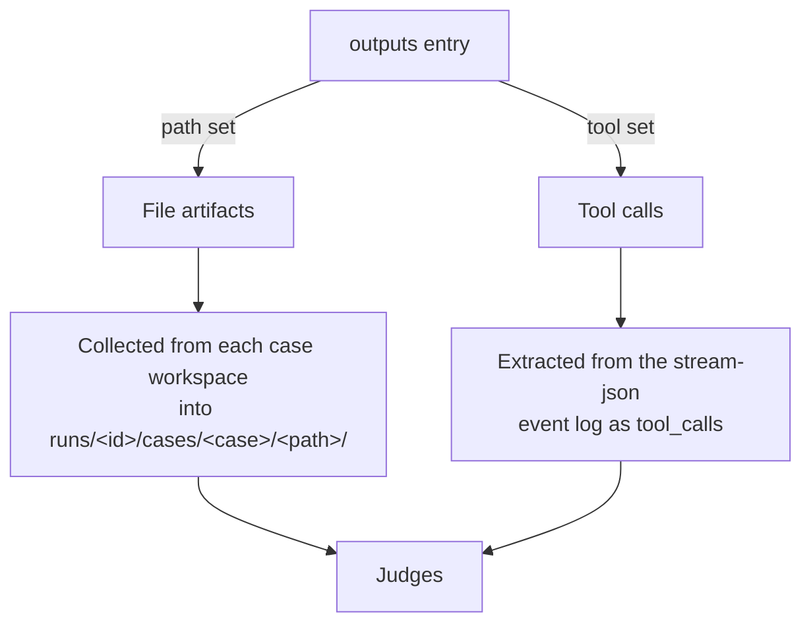

# outputs

`outputs` is a **list** of the things a run produces that you want to collect and score:
files written to disk (`path`) or tool calls captured from the event stream (`tool`).
Each entry carries a natural-language `schema` that documents its structure for judges —
the harness moves file *paths*, it never parses the schema.

Each list item maps to an [`OutputConfig`](https://github.com/opendatahub-io/agent-eval-harness/blob/main/agent_eval/config.py).
An entry sets **either** `path` or `tool`, never both.

```yaml
outputs:
  # File artifacts on disk
  - path: artifacts
    schema: |
      One markdown file per case, named NNN-slug.md where NNN is the
      case number (001, 002, ...).

  # Tool call outputs (side effects like Jira creation)
  - tool: mcp__atlassian__create_issue
    schema: |
      Creates a Jira issue. The tool input contains title,
      description, priority, labels.
```

## Fields

| Field | Type | Applies to | Purpose |
| --- | --- | --- | --- |
| `path` | string (relative dir/file) | file outputs | Directory or file the skill writes, relative to each case workspace |
| `tool` | string (tool name/pattern) | tool outputs | Tool call to capture from the stream-json events (e.g. `mcp__atlassian__create_issue`) |
| `schema` | string (natural language) | both | Documents the output's shape for LLM judges |
| `batch_pattern` | string | file outputs, batch mode | Maps output files to cases with `{n}` (see below) |
| `types` | map (filename/glob → type) | file outputs | Semantic type hints the HTML report uses to render artifacts |

!!! note "Schema is documentation, not a spec"
    `schema` is prose read by LLM agents and judges — there are no hardcoded field
    names and nothing is validated against it. Collection scripts operate on file paths
    from `path` directly. Same convention as [`dataset.schema`](dataset.md).

## path vs tool



=== "File outputs (`path`)"

    `path` names a directory (or single file) the skill writes, **relative to each case
    workspace**. After execution the collector copies everything under it — preserving
    subdirectory structure — into `eval/runs/<run-id>/cases/<case-id>/<path>/`.

    ```yaml
    outputs:
      - path: artifacts
        schema: "One markdown file per case, named NNN-slug.md."
    ```

    !!! tip "Convenience key for judges"
        Collected files are exposed to judges under a convenience key derived from the
        **last component of `path` + `_content`**. For `path: artifacts` the key is
        `artifacts_content`; for `path: artifacts/rfe-tasks` it is `rfe-tasks_content`.
        Reference it in an inline `check` as `outputs["artifacts_content"]`.

=== "Tool outputs (`tool`)"

    `tool` captures a tool invocation instead of a file — useful when the skill's real
    effect is a side effect (creating an issue, calling an API). The matching calls are
    surfaced to judges via `outputs["tool_calls"]`.

    ```yaml
    outputs:
      - tool: mcp__atlassian__create_issue
        schema: "Creates a Jira issue with title, description, priority, labels."

    judges:
      - name: jira_created
        check: |
          calls = outputs.get("tool_calls", [])
          jira = [c for c in calls if "create_issue" in c.get("name", "")]
          if not jira:
              return False, "No Jira issue created"
          return True, "Created issue"
    ```

## batch_pattern — mapping batch files to cases

In `mode: batch`, a single invocation produces outputs for *all* cases at once, so the
collector needs to know which file belongs to which case. `batch_pattern` provides that
mapping. It is **ignored in `case` mode**, where each case already has its own workspace.

`{n}` expands to a **1-based batch index**. A file is assigned to a case when its name
**starts with** the expanded prefix. Python format specs work inside the placeholder:

| Pattern | Case 1 prefix | Case 2 prefix | Matches |
| --- | --- | --- | --- |
| `RFE-{n}` | `RFE-1` | `RFE-2` | `RFE-1-login.md` → case 1 |
| `RFE-{n:03d}` | `RFE-001` | `RFE-002` | `RFE-001-login.md` → case 1 |
| `*` | — | — | *all* files → *every* case (shared) |

```yaml
outputs:
  - path: artifacts
    batch_pattern: "RFE-{n:03d}"   # RFE-001-*, RFE-002-*, ...
    schema: "One markdown file per case, named RFE-NNN-slug.md."
```

!!! note "Multi-artifact cases and shared directories"
    The batch index advances by each case's `entry_count` (from `case_order.yaml`), so a
    case that expands into several batch entries claims a contiguous run of indices. Use
    `batch_pattern: "*"` for a directory whose contents are relevant to *every* case
    (e.g. a shared report or manifest) — the whole directory is copied into every case.

!!! tip "Omit it to auto-detect"
    With `batch_pattern` empty, the collector auto-groups batch files by a common
    `WORD-NNN` prefix, falling back to one file per case positionally. Set the pattern
    explicitly when auto-detection is ambiguous.

## types — semantic hints for the report

`types` is an optional map from a **filename or glob** to a semantic type string. The
HTML report uses it to render matching artifacts specially rather than as plain text —
for example inlining a rendered diagram (`graph`) or a metrics panel (`metrics`).
Exact filenames win over glob patterns.

```yaml
outputs:
  - path: artifacts
    schema: "A dependency graph plus a metrics summary per case."
    types:
      graph.d2: graph          # exact filename
      "*.metrics.json": metrics # glob pattern
```

Unmatched files simply render normally, so `types` is purely additive presentation
metadata — omit it when you don't need custom rendering.

## Path safety

`path` is validated at config load (`_validate_relative_path` with `reject_root=True`).
Because the harness cleans and re-populates output directories, unsafe paths fail fast:

| Value | Result |
| --- | --- |
| `artifacts`, `docs/generated` | OK — relative subdirectory |
| `..` / `../out` (any `..` segment) | **Rejected** — parent traversal |
| `/tmp/out` (absolute) | **Rejected** — must be relative |
| `.` (project root) | **Rejected** — would target the whole project |

!!! warning "`path: '.'` is not allowed"
    An output must live in a *named subdirectory* so the harness can identify, collect,
    and clean it without touching the rest of the project. Point `path` at a dedicated
    directory the skill writes into, never the workspace root.

## See also

<div class="grid cards" markdown>

- [**execution**](execution.md) — `mode: case` vs `batch` (drives whether `batch_pattern` applies)
- [**dataset**](dataset.md) — the input side, with the same natural-language `schema` convention
- [**judges**](judges.md) — how collected outputs are scored
- [**traces**](traces.md) — capturing stdout/stderr/events/metrics alongside outputs
- [**The report**](../../concepts/report.md) — where `types` rendering shows up

</div>
