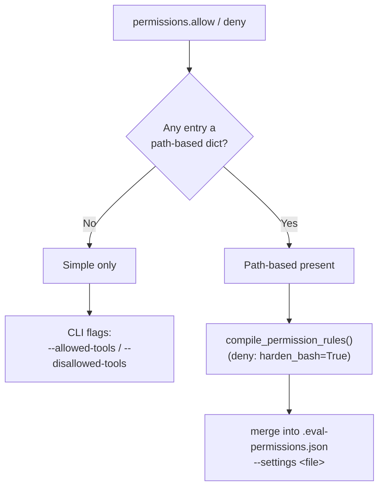

# permissions

The `permissions` block constrains which tools the agent may use during a
**headless** run. It accepts two lists — `allow` and `deny` — and each entry may
be a simple string pattern or a path-based dict. The harness compiles these into
the exact patterns Claude Code's `settings.json` expects.

```yaml
permissions:
  deny:
    - "mcp__*"                              # simple: block all MCP tools
    - { path: "eval/", tools: ["Read", "Bash"] }   # path-based: protect the answer key
  allow:
    - "Skill"
    - { path: "artifacts/", tools: ["Write"] }
```

## Two forms

| Form | Shape | Use for |
| --- | --- | --- |
| **Simple** | a string — a tool name or a pre-formed pattern (`"Skill"`, `"mcp__*"`, `"Write(artifacts/**)"`) | Coarse tool allow/deny; passed through **as-is**. |
| **Path-based** | a dict `{ path: <dir-or-file>, tools: [<tool>, …] }` | Scoping file tools to (or away from) a directory — e.g. keeping a prompt-mode agent out of the answer key. |

You can mix both forms in the same list. The presence of *any* dict switches the
whole block onto the path-based code path (see [How they compile](#how-they-compile)).

## Path-based rules and the compiler

Path-based rules are normalized by
[`compile_permission_rules`](https://github.com/opendatahub-io/agent-eval-harness/blob/main/agent_eval/tools/permissions.py)
in `agent_eval/tools/permissions.py`. The rules that shape the conversion:

### Only file-scoped tools can take a path

A path only makes sense for tools whose argument *is* a file. The compiler
recognizes exactly these (`PATH_SCOPED_TOOLS`):

```python
PATH_SCOPED_TOOLS = ("Read", "Edit", "Write", "Grep", "Glob")
```

Any other tool listed in `tools` is silently dropped from a path-based rule
(with one exception for `Bash` in deny lists — below).

### Paths use gitignore syntax

A **directory** (trailing `/`) is expanded to `dir/**` so it matches
**recursively**; a **file** is emitted verbatim.

| `path` | Emitted for e.g. `Read` |
| --- | --- |
| `eval/` | `Read(eval/**)` |
| `eval.yaml` | `Read(eval.yaml)` |

!!! warning "`dir/` needs the `**` — `dir/*` would only match direct children"
    This is why the compiler appends `**` for you. If you write a pre-formed
    simple pattern by hand, remember `Read(eval/*)` matches only the files
    directly inside `eval/`, not nested paths.

### Why Bash can't be path-scoped

`Bash(...)` matches the **command string**, not a file path — so a path-based
rule can never be expressed as `Bash(some/path)`. The compiler therefore skips
`Bash` entirely.

For **deny** lists this leaves a hole: an agent could still `cat eval/answers.yaml`
via Bash. The compiler closes it with `harden_bash` — when a deny path rule lists
`Bash`, it *also* emits `Read` and `Edit` for that path:

```yaml
permissions:
  deny:
    - { path: "eval/", tools: ["Bash"] }
```

compiles (deny, `harden_bash=True`) to:

```json
["Read(eval/**)", "Edit(eval/**)"]
```

!!! note "`Read`/`Edit` deny covers built-in file tools *and* common bash file commands"
    A `Read`/`Edit` deny blocks the built-in `Read`/`Edit`/`Write` tools **and**
    recognized bash file commands (`cat`, `head`, `tail`, `sed`). It does **not**
    cover arbitrary subprocess reads such as `python3 -c ...` or `awk` — those
    need an OS `sandbox` denyRead, outside this block.

!!! tip "`harden_bash` is deny-only"
    Hardening runs only for **deny** lists. It is deliberately off for `allow`
    lists so listing `Bash` on an allow path never over-grants `Read`/`Edit`.

Results are deduplicated with original order preserved.

## How they compile

The runner ([`agent_eval/agent/claude_code.py`](https://github.com/opendatahub-io/agent-eval-harness/blob/main/agent_eval/agent/claude_code.py))
picks one of two paths depending on whether **any** entry (in `allow` *or*
`deny`) is a dict:



=== "Simple only → CLI flags"

    When every entry is a string, the lists are passed straight through as
    comma-separated CLI flags — no file is written:

    ```bash
    claude --print \
      --disallowed-tools "mcp__*" \
      --allowed-tools "Skill,Read"
    ```

=== "Path-based → generated settings file"

    When any entry is a dict, the runner compiles **both** lists, merges them
    into a generated `.eval-permissions.json` (alongside any existing workspace
    `settings.json`, e.g. repo-write protection), and points the CLI at it:

    ```json title=".eval-permissions.json"
    {
      "permissions": {
        "deny": ["Read(eval/**)", "Edit(eval/**)"],
        "allow": ["Write(artifacts/**)"]
      }
    }
    ```

    ```bash
    claude --print --settings .eval-permissions.json
    ```

!!! note "Where the file is written"
    `.eval-permissions.json` is written next to the case workspace's settings
    file (`case_ws/.claude/`) when one exists, otherwise into the workspace root.
    This avoids mutating the repository when the workspace *is* the repo root
    (`runner.workspace_mode: repo`).

The same compiler is used to emit valid rules for both the local runner and the
Harbor task package, so path-based protection behaves identically across
[execution backends](../../concepts/backends.md).

## Common patterns

```yaml
permissions:
  # Block all MCP tools during eval (simple)
  deny:
    - "mcp__*"

  # Keep a prompt-mode / workspace_mode: repo agent out of the answer key
    - { path: "eval/",      tools: ["Read", "Edit", "Bash"] }
    - { path: "eval.yaml",  tools: ["Read"] }
    - { path: "eval.md",    tools: ["Read"] }
    - { path: "tmp/",       tools: ["Read", "Edit"] }
```

!!! tip "Answer-key protection is why path rules exist"
    Prompt-mode evals and `workspace_mode: repo` runs execute the agent inside
    the real repository, where the dataset, `eval.yaml`, and reference outputs
    live. Path-based deny rules stop the agent from reading its own answer key.
    See [tool interception](../../concepts/tool-interception.md) and
    [runners](../../concepts/runners.md).

## See also

<div class="grid cards" markdown>

- [**eval.yaml schema**](../eval-yaml.md) — all top-level keys
- [**inputs.tools**](inputs-tools.md) — intercepting tool calls at runtime
- [**runner**](runner.md) — `workspace_mode` and where the agent executes
- [**Backends**](../../concepts/backends.md) — Local, Harbor, EvalHub

</div>
