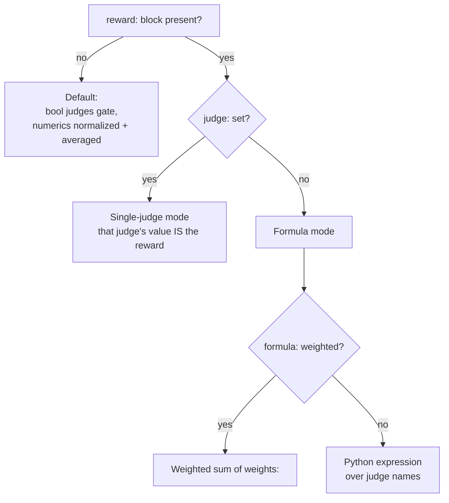

# reward

The optional `reward` block collapses per-judge results into a single scalar in
`[0, 1]` — the reward signal for RL training (e.g. GRPO). It is only needed when
training; the normal [`/eval-run`](../../guides/eval-run.md) report path scores
each judge independently and ignores this block.

!!! info "Where the reward is computed"
    On [Harbor](../../guides/harbor.md), the in-container verifier composes the
    reward per case and writes Harbor's `reward.json` / `reward.txt` contract. See
    the [reward API concept](../../concepts/reward-api.md) and the
    [RL cookbook](../../cookbook/reward-rl.md) for the end-to-end flow.

## Two mutually-exclusive modes

The block produces the reward one of two ways, and `judge` vs `formula` cannot
be mixed:



=== "Single judge"

    The named judge's value **is** the reward — e.g. a learned reward model that
    already emits a `[0, 1]` score.

    ```yaml
    judges:
      - name: reward_model        # emits a float in [0, 1]
        module: eval.judges.rm
        function: score

    reward:
      judge: reward_model         # this judge's value is the reward
      normalize: false            # default: clamp to [0, 1] as-is
      # gate: false               # default in judge mode
    ```

    Set `normalize: true` to instead map the value from `score_range` to `[0, 1]`
    (useful when the judge emits, say, a 1-5 rubric score):

    ```yaml
    reward:
      judge: output_quality
      normalize: true
      score_range: [1, 5]
    ```

    !!! warning "`judge` stands alone"
        `judge` cannot be combined with `formula`, `weights`, or `raw` —
        combining them fails at config load. The judge name must match a judge
        defined in `judges:`, also validated at load. A missing or skipped judge
        (value `None`) scores `0.0`.

=== "Weighted formula"

    Weighted sum of the judges named in `weights`, each normalized to `[0, 1]`.
    The result is the weighted mean (divided by the sum of weights), clamped to
    `[0, 1]`.

    ```yaml
    reward:
      formula: weighted
      weights:
        quality: 0.7
        efficiency: 0.3
      score_range: [1, 5]     # numeric judges normalized from this range
      raw: [efficiency]       # already in [0, 1] — skip normalization
      gate: true              # default in formula mode
    ```

    Weights must be numeric and non-negative. A judge with a missing value is
    dropped from both the numerator and the weight sum.

=== "Expression formula"

    Any other `formula` value is a Python expression over judge names as
    variables. Each variable is that judge's value already normalized to `[0, 1]`.

    ```yaml
    reward:
      formula: "0.6 * quality + 0.4 * efficiency"
      score_range: [1, 5]
      raw: [efficiency]
      gate: false             # see the double-gating note below
    ```

    Multi-line expressions are allowed; the **last line is the returned value**
    (it must be an expression, not an assignment):

    ```yaml
    reward:
      formula: |
        base = mean([clarity, accuracy])
        min(base, efficiency)
      gate: false
    ```

## Fields

| Field | Type | Default | Applies to | Purpose |
| --- | --- | --- | --- | --- |
| `judge` | string | — | single-judge | Name of the judge whose value is the reward. Mutually exclusive with `formula`/`weights`/`raw`. |
| `normalize` | bool | `false` | single-judge | `false` clamps the judge value to `[0, 1]` as-is; `true` maps it from `score_range`. |
| `formula` | string | `"weighted"` | formula | `"weighted"` or a Python expression over judge names. |
| `weights` | map | `{}` | formula (`weighted`) | Per-judge weights (numeric, non-negative). |
| `score_range` | `[min, max]` | `[1, 5]` | both | Range used to normalize numeric judge values to `[0, 1]`. Must be increasing. |
| `raw` | list | `[]` | formula | Judges whose values are already in `[0, 1]`; clamped, not normalized. |
| `gate` | bool | `true` formula / `false` single-judge | both | When `true`, any boolean judge that returned `false` zeros the reward. |

## Gating

When `gate` is `true`, **any** boolean judge that returned `false` forces the
reward to `0.0` — regardless of whether the `formula` even references that judge.

!!! warning "Avoid double-gating"
    Because gating applies to *every* boolean judge, an expression that already
    uses a boolean as its own gate (e.g. `passed * quality`) should set
    `gate: false` — otherwise the reward is gated twice.

`gate` defaults to `true` in formula mode and `false` in single-judge mode.

## Expression safety (AST validation)

Expression formulas are parsed and validated at **config load** — a typo or an
unsafe construct fails loudly then, rather than silently returning `0.0` on every
case at run time.

| Rule | Detail |
| --- | --- |
| Allowed calls | `min`, `max`, `abs`, `round`, `sum`, `len`, `mean` — nothing else |
| Operators | `+ - * / // %`, comparisons, `and`/`or`, ternary (`x if c else y`) |
| Banned | `**` (exponentiation), string/bytes constants, names starting with `_` |
| Constants | absolute magnitude capped at `1e6` |
| Size | at most 200 AST nodes |
| Structure | last statement must be an expression (the return value) |

!!! note "Load-time vs run-time errors"
    Structural and syntax problems are caught at load. **Run-time** failures — an
    undefined judge name in an expression, a division by zero — are caught during
    scoring: they emit a warning and degrade to reward `0.0` for that case.

## Default when `reward` is omitted

With no `reward` block, the harness falls back to a built-in composition:

- any boolean judge returning `false` gates the reward to `0.0`;
- otherwise numeric judges are normalized (from `[1, 5]`) and averaged;
- if no numeric judges scored and the gate passed, the reward is `1.0`.

## See also

<div class="grid cards" markdown>

- [**Reward API**](../../concepts/reward-api.md) — how rewards flow from judges to Harbor
- [**RL cookbook**](../../cookbook/reward-rl.md) — a complete reward-training config
- [**judges**](judges.md) — the judges a reward composes from
- [**thresholds**](thresholds.md) — suite-level regression gates (distinct from reward)

</div>
