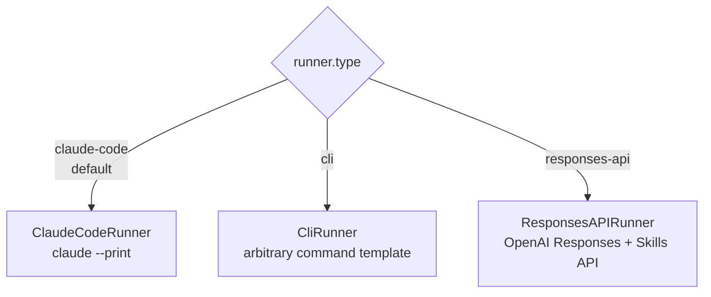

# runner

The `runner` block selects **which agent runtime executes your skill or prompt** and
carries runtime-specific knobs. Its `type` is a discriminator; the remaining fields are
read selectively — a field a runner doesn't understand is simply ignored, so the same
block is safe to share across runs.

!!! tip "Runtime, not backend"
    `runner.type` picks the *agent* (Claude Code, an opaque CLI, the OpenAI Responses
    API). The **execution backend** (Local, Harbor, EvalHub) is a separate `--runner`
    CLI flag, never a config key. See [backends](../../concepts/backends.md) and the
    [runners concept](../../concepts/runners.md) for the distinction.

## The three runner types



| `type` | Runtime | Use it for |
| --- | --- | --- |
| `claude-code` *(default)* | Claude Code CLI in headless mode (`claude --print --output-format …`) | The primary path — full tracing, tool interception, permission enforcement, subagent capture |
| `cli` | Any command you provide, via a placeholder template | Wrapping OpenCode, Codex, a custom agent, or a shell script. See the [opaque CLI runner contract](https://github.com/opendatahub-io/agent-eval-harness/blob/main/docs/opaque-cli-runner-contract.md) |
| `responses-api` | OpenAI Responses API with the Shell tool + Skills API | Apples-to-apples comparison of the *same* skill on an OpenAI model |

## Field reference

Not every runner reads every field. The matrix below shows where each field lands.

| Field | Type | `claude-code` | `cli` | `responses-api` |
| --- | --- | :---: | :---: | :---: |
| `type` | `str` | discriminator | discriminator | discriminator |
| `effort` | `str` (enum) | `--effort` flag | `{effort}` placeholder | — |
| `settings` | `dict` | merged into workspace `.claude/settings.json` | — | connection settings (see below) |
| `plugin_dirs` | `list[str]` | one `--plugin-dir` per entry | — | — |
| `env` | `dict` | injected on the safe allowlist | — (uses `execution.env`) | — |
| `system_prompt` | `str` | `--append-system-prompt` | `{system_prompt}` placeholder | `developer` message |
| `command` | `str` \| `list[str]` | — | **required** — command template | — |
| `workspace_mode` | `None` \| `"repo"` | harness-level (all runners) | harness-level | harness-level |

!!! warning "Unset ≠ empty behavior"
    A field ignored by the active runner is harmless — it just does nothing. But two
    fields are easy to misplace: `runner.env` has **no effect** on the `cli` runner
    (which inherits the full caller environment and reads `execution.env` for
    additions), and `runner.settings` means **completely different things** to
    `claude-code` versus `responses-api` (see below).

### `type`

Selects the runner implementation. One of `claude-code` (default), `cli`, or
`responses-api`. Any other value fails to resolve at run time.

### `effort`

Reasoning-effort level for the agent. Valid values, low to high:

| Value | `low` | `medium` | `high` | `xhigh` | `max` |
| --- | --- | --- | --- | --- | --- |

An invalid value raises at construction time for `claude-code`. The CLI `--effort` flag
overrides this field. For the `cli` runner it is exposed as the `{effort}` placeholder
(empty string if unset); `responses-api` ignores it.

```yaml
runner:
  type: claude-code
  effort: high        # low | medium | high | xhigh | max
```

### `settings`

A `dict` whose meaning depends on the runner:

=== "claude-code"

    Merged into each case workspace's generated `.claude/settings.json` (after the
    harness defaults, so your scalars win and lists are extended). Use it to add
    Claude Code settings — model defaults, `env`, MCP servers — without forking the
    harness.

    ```yaml
    runner:
      type: claude-code
      settings:
        env:
          MY_FLAG: "1"
        # any valid .claude/settings.json keys
    ```

=== "responses-api"

    Connection and container settings for the OpenAI Responses API. Recognized keys:
    `base_url`, `api_key`, `default_model`, `network_policy`, `memory_limit_mb`
    (default `512`). Missing `base_url` / `api_key` / `default_model` fall back to the
    `OPENAI_BASE_URL`, `OPENAI_API_KEY`, and `OPENAI_MODEL` env vars.

    ```yaml
    runner:
      type: responses-api
      settings:
        default_model: gpt-5
        memory_limit_mb: 4096
    ```

The `cli` runner ignores `settings`.

### `plugin_dirs`

`claude-code` only. A list of directories, each passed as `--plugin-dir` so the CLI can
discover the skills/plugins under test. Relative paths are resolved to absolute.

```yaml
runner:
  type: claude-code
  plugin_dirs:
    - ./my-plugin
    - ../shared-skills
```

### `env`

`claude-code` only. Extra environment variables injected into the runner subprocess,
**additive** to Claude Code's built-in safe allowlist (`PATH`, `HOME`,
`ANTHROPIC_API_KEY`, `MLFLOW_TRACKING_URI`, …). A value starting with `$` is resolved
from the caller's environment; missing vars are dropped.

```yaml
runner:
  type: claude-code
  env:
    ANTHROPIC_AUTH_TOKEN: $ANTHROPIC_AUTH_TOKEN   # forward from caller
    FEATURE_FLAG: "enabled"                        # literal
```

!!! note "Where env vars belong"
    `runner.env` forwards vars **into the agent runtime**. To make a var available to
    the skill *and its hooks* inside each case workspace, use
    [`execution.env`](execution.md) instead. The `cli` runner reads only
    `execution.env` — `runner.env` is a no-op there. See
    [environment variables](../environment-variables.md).

### `system_prompt`

Extra system-prompt text prepended to the agent's context.

- `claude-code` — passed via `--append-system-prompt`, composed with the harness prompt.
- `cli` — exposed as the `{system_prompt}` placeholder in the command template.
- `responses-api` — sent as a `developer` role message.

```yaml
runner:
  system_prompt: "You are being evaluated. Follow the skill instructions exactly."
```

### `command`

`cli` only, and **required** for it. A command template — a string (shell-parsed via
`shlex`) or a list of arguments (safer; no shell parsing). Placeholders are substituted
before execution and string values are shell-quoted.

Common placeholders (full list in the
[contract](https://github.com/opendatahub-io/agent-eval-harness/blob/main/docs/opaque-cli-runner-contract.md)):

| Placeholder | Value |
| --- | --- |
| `{agent}` | Skill name (empty in prompt mode) |
| `{workspace}` | Absolute case workspace path |
| `{output_dir}` | `{workspace}/output` (write artifacts here) |
| `{model}` | Resolved model (`--model` or `models.skill`) |
| `{subagent_model}` | Subagent model (empty if unset) |
| `{args}` | Resolved `execution.arguments` |
| `{effort}` / `{system_prompt}` | From `runner.effort` / `runner.system_prompt` |
| `{timeout}` / `{max_budget_usd}` | From `execution` (budget is advisory only) |
| `{field}` | Any field from the case `input.yaml` |

```yaml
runner:
  type: cli
  command: "opencode run --model {model} --cwd {workspace} '/{agent} {args}'"
```

!!! warning "Contract obligations"
    An opaque command **must** exit non-zero on failure and write artifacts to
    `{output_dir}` (or the `outputs[*].path` dirs). To surface token/cost data it must
    write `{output_dir}/metrics.json` — otherwise cost tables are empty. Tool
    interception, stream-json tracing, subagent capture, and budget *enforcement* are
    Claude-Code-only and do not work with `cli`. See the
    [cross-runner cookbook](../../cookbook/cross-runner-opencode.md).

### `workspace_mode`

Execution context, honored by all runners. Validated at load time — only `None` or
`"repo"` are accepted (a typo raises rather than silently changing behavior).

| Value | Meaning |
| --- | --- |
| *unset* (`None`) | **Isolated workspace** (default) — each case runs in its own temp workspace with symlinked project resources |
| `repo` | **In-repo** — the agent runs against the real repository checkout |

`workspace_mode: repo` is meaningful for **prompt mode** evals that need the agent to
navigate the actual repository (e.g. agentic-docs testing). Pair it with
[`permissions`](permissions.md) to keep the agent from writing to the repo.

```yaml
execution:
  prompt: "{{ input.prompt }}"

runner:
  workspace_mode: repo    # navigate the real repository
```

## Examples

=== "Claude Code (default)"

    ```yaml
    runner:
      type: claude-code
      effort: high
      plugin_dirs:
        - ./my-plugin
      env:
        ANTHROPIC_AUTH_TOKEN: $ANTHROPIC_AUTH_TOKEN
    ```

=== "Opaque CLI"

    ```yaml
    runner:
      type: cli
      command:
        - opencode
        - run
        - --model
        - "{model}"
        - "/{agent} {args}"
    ```

=== "Responses API"

    ```yaml
    runner:
      type: responses-api
      settings:
        default_model: gpt-5
        memory_limit_mb: 4096
    ```

## See also

<div class="grid cards" markdown>

- [**runners concept**](../../concepts/runners.md) — how runtimes differ and when to reach for each
- [**models**](models.md) — model-per-role and the `{model}` / `{subagent_model}` resolution
- [**execution**](execution.md) — `execution.env`, timeout, budget, parallelism
- [**permissions**](permissions.md) — allow/deny, essential for `workspace_mode: repo`
- [**headless execution**](../../guides/headless.md) — how the Claude Code runner is driven non-interactively

</div>
