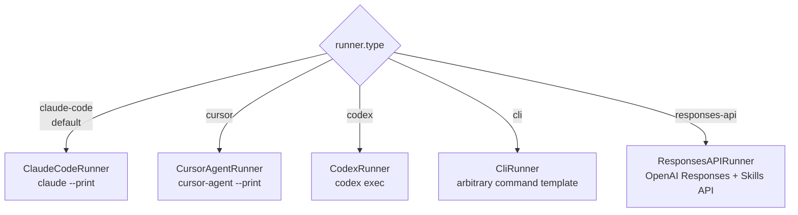

# runner

The `runner` block selects **which agent runtime executes your skill or prompt** and
carries runtime-specific knobs. Its `type` is a discriminator; the remaining fields are
read selectively. Fields a runner doesn't understand are ignored, and runners may warn
when an unsupported setting would otherwise be easy to miss.

!!! tip "Runtime, not backend"
    `runner.type` picks the *agent* (Claude Code, Cursor, Codex, an opaque CLI, or the OpenAI
    Responses API). The **execution backend** (Local, Harbor, EvalHub) is a separate `--runner`
    CLI flag, never a config key. See [backends](../../concepts/backends.md) and the
    [runners concept](../../concepts/runners.md) for the distinction.

## The five runner types


```mermaid
flowchart TD
    T{runner.type}
    T -->|claude-code<br/>default| CC[ClaudeCodeRunner<br/>claude --print]
    T -->|cursor| CU[CursorAgentRunner<br/>cursor-agent --print]
    T -->|codex| CX[CodexRunner<br/>codex exec]
    T -->|cli| CLI[CliRunner<br/>arbitrary command template]
    T -->|responses-api| RA[ResponsesAPIRunner<br/>OpenAI Responses + Skills API]
```

| `type` | Runtime | Use it for |
| --- | --- | --- |
| `claude-code` *(default)* | Claude Code CLI in headless mode (`claude --print --output-format …`) | The primary path — full tracing, tool interception, permission enforcement, subagent capture |
| `cursor` | Cursor Agent CLI in headless mode (`cursor-agent --print --output-format …`) | Local Cursor-account execution with Cursor-managed model access and plugin loading; not available in EvalHub |
| `codex` | Codex CLI in non-interactive mode (`codex exec --json`) | Native Codex execution, skill staging, JSONL usage parsing, and sandbox-mode mapping |
| `cli` | Any command you provide, via a placeholder template | Wrapping OpenCode, a custom agent, or a shell script. See the [opaque CLI runner contract](https://github.com/opendatahub-io/agent-eval-harness/blob/main/docs/opaque-cli-runner-contract.md) |
| `responses-api` | OpenAI Responses API with the Shell tool + Skills API | Apples-to-apples comparison of the *same* skill on an OpenAI model |

## Field reference

Not every runner reads every field. The matrix below shows where each field lands.

| Field | Type | `claude-code` | `cursor` | `codex` | `cli` | `responses-api` |
| --- | --- | :---: | :---: | :---: | :---: | :---: |
| `type` | `str` | discriminator | discriminator | discriminator | discriminator | discriminator |
| `effort` | `str` (enum) | `--effort` flag | appended to a base `--model` as `[effort=…]`; existing Cursor effort variants pass through | `model_reasoning_effort` | `{effort}` placeholder | — |
| `permission_mode` | `str` (enum) | `--permission-mode` flag | `plan` → `--mode plan`; `bypassPermissions` → `--force` | mapped to Codex sandbox mode | — | — |
| `settings` | `dict` | merged into workspace `.claude/settings.json` | `binary` only; other keys warn and are ignored | `-c` config overrides for `codex exec` | — | connection settings (see below) |
| `plugin_dirs` | `list[str]` | one `--plugin-dir` per entry (workspace-staged copy for out-of-workspace paths) | one `--plugin-dir` per entry (workspace-staged copy for out-of-workspace paths) | skills copied into `.agents/skills` | — | — |
| `env` | `dict` | injected on the safe allowlist | injected into the subprocess env | injected on the safe allowlist | — (uses `execution.env`) | — |
| `system_prompt` | `str` | `--append-system-prompt` | prepended to the prompt | prepended to the prompt | `{system_prompt}` placeholder | `developer` message |
| `command` | `str` \| `list[str]` | — | — | — | **required** — command template | — |
| `workspace_mode` | `None` \| `"repo"` | harness-level (all runners) | harness-level | rejected | harness-level | harness-level |

!!! warning "Unset ≠ empty behavior"
    A field ignored by the active runner is harmless — it just does nothing. But two
    fields are easy to misplace: `runner.env` has **no effect** on the `cli` runner
    (which inherits the full caller environment and reads `execution.env` for
    additions), and `runner.settings` means **completely different things** to
    each runtime (see below). Cursor recognizes only `binary` in that mapping and
    warns for other keys.

### `type`

Selects the runner implementation. One of `claude-code` (default), `cursor`,
`codex`, `cli`, or `responses-api`. Any other value fails to resolve at run time.

### `effort`

Reasoning-effort level for the agent. The accepted values are runner-specific:

| Runner | Valid values |
| --- | --- |
| `claude-code` | `low`, `medium`, `high`, `xhigh`, `max` |
| `codex` | `minimal`, `low`, `medium`, `high`, `xhigh` |
| `cursor` | Passed as the Cursor model's `effort` parameter; accepted values depend on the selected model |

An invalid value raises at construction time for `claude-code` and `codex`. Cursor
does not have a standalone `--effort` flag; it appends the value to the model ID,
for example `gpt-5.4[effort=high]`. If the model is already a Cursor catalog
variant such as `gpt-5.4-medium`, the runner passes that ID through unchanged
instead of producing an invalid compound ID such as
`gpt-5.4-medium[effort=medium]`. The selected Cursor model validates whether
the parameter is accepted. The CLI `--effort` flag overrides this field.
For the `cli` runner it is exposed as the `{effort}` placeholder (empty string if
unset); `responses-api` ignores it.

```yaml
runner:
  type: claude-code
  effort: high        # low | medium | high | xhigh | max
```

### `permission_mode`

Claude Code permission mode, passed as the `--permission-mode` CLI flag. Because
it is a CLI flag (not a settings-file key), it applies even in the untrusted,
isolated per-case workspaces where `.claude/settings.json` `permissions.allow` /
`additionalDirectories` are trust-gated and the trust dialog can't appear in
headless mode. One of:

| Value | `default` | `acceptEdits` | `plan` | `auto` | `dontAsk` | `bypassPermissions` |
| --- | --- | --- | --- | --- | --- | --- |

An invalid value raises at construction time for `claude-code` and `codex`; `cli` and
`responses-api` ignore the field. For a prompt-free, deny-by-default headless
run, pair `dontAsk` (allows only what's pre-approved) with a complete
[`permissions.allow`](permissions.md) list (fed to `--allowed-tools`, also
trust-independent). `bypassPermissions` skips all prompts — isolated
environments (containers/VMs) only.

Codex preserves the same intent using its available sandbox modes: `plan` maps to
`read-only`; `bypassPermissions` maps to Codex's explicit dangerous bypass; and the
remaining modes map to `workspace-write`. Codex cannot translate Claude Code's
fine-grained tool allow/deny rules exactly, so the runner emits a warning when such
rules are configured.

Cursor maps `plan` to `cursor-agent --mode plan` and
`bypassPermissions` to `cursor-agent --force`. The other common modes have no
exact Cursor equivalent and produce an explicit warning before Cursor's default
approval behavior is used. Prompt-only Cursor invocations clear `permission_mode`
so judges and synthetic generation are not launched in plan mode.

```yaml
runner:
  type: claude-code
  permission_mode: dontAsk   # default | acceptEdits | plan | auto | dontAsk | bypassPermissions
```

### `settings`

A `dict` whose meaning depends on the runner:

=== "claude-code"

    Merged into each case workspace's generated `.claude/settings.json` (after the
    harness defaults, so your scalars win and lists are extended). Use it to add
    Claude Code settings — model defaults, `env`, MCP servers — without forking the
    harness.

    ```yaml
    runner:
      type: claude-code
      settings:
        env:
          MY_FLAG: "1"
        # any valid .claude/settings.json keys
    ```

    **Plugin hermeticity.** In an isolated workspace the operator's
    user-installed plugins (from `~/.claude/plugins/installed_plugins.json`)
    are disabled **by default**: the harness synthesizes
    `enabledPlugins: {<id>: false}` for every installed plugin and merges it
    before your `settings`, so an explicit entry re-enables a plugin with one
    line. `workspace_mode: repo` disables nothing — that session runs in your
    real environment. Plugins under test are immune: `--plugin-dir` plugins
    register as `<name>@inline` and never appear in the registry.

    The `enabledPlugins` pseudo-entry `"*"` steers the policy explicitly:

    ```yaml
    runner:
      settings:
        enabledPlugins:
          "*": false                        # force hermeticity (also in repo mode)
          "memsearch@my-marketplace": true  # explicit entries win
    ```

    `"*"` is **harness-interpreted** — upstream Claude Code has no
    `enabledPlugins` wildcard — and is stripped before `settings.json` is
    written, so the CLI never sees it. `"*": true` opts out of hermeticity
    entirely. Configs that relied on an installed plugin silently loading
    into case sessions fail loudly (`Unknown command`) after upgrading; the
    fix is one explicit entry or a `plugin_dirs` entry.

=== "cursor"

    Cursor recognizes `binary` to select a specific `cursor-agent` executable.
    Other Cursor-specific connection, trust, header, MCP, and filesystem flags
    are intentionally not part of the harness runner contract; configuring one
    produces a warning and the key is ignored. Use `runner.env` for provider
    environment variables such as `CURSOR_API_KEY` or `CURSOR_API_ENDPOINT`.

    ```yaml
    runner:
      type: cursor
      settings:
        binary: /opt/cursor-agent
    ```

=== "responses-api"

    Connection and container settings for the OpenAI Responses API. Recognized keys:
    `base_url`, `api_key`, `default_model`, `network_policy`, `memory_limit_mb`
    (default `512`). Missing `base_url` / `api_key` / `default_model` fall back to the
    `OPENAI_BASE_URL`, `OPENAI_API_KEY`, and `OPENAI_MODEL` env vars.

    ```yaml
    runner:
      type: responses-api
      settings:
        default_model: gpt-5
        memory_limit_mb: 4096
    ```

=== "codex"

    Each key is passed to `codex exec` as a `-c key=value` config override.
    `model_reasoning_effort` is also accepted here as a fallback when
    `runner.effort` is unset; the top-level `effort` field takes precedence
    and is validated against Codex's effort values.

    ```yaml
    runner:
      type: codex
      settings:
        model_reasoning_effort: xhigh
    ```

The `cli` runner ignores `settings`.

### `plugin_dirs`

`claude-code`, `cursor`, and `codex`. These runners copy plugin content into the case workspace
rather than exposing the configured path to the session. Claude Code stages each
entry's discoverable content (manifest, skill roots, `commands/`, `agents/`,
`hooks/`, `scripts/`) into `.staged-plugins/` and passes the staged copy to
`--plugin-dir` — the configured path would otherwise land verbatim in session
context, where Bash (not path-gated) can follow it out of the workspace. An entry
already inside the workspace is passed through unchanged, and
`workspace_mode: repo` skips staging for Claude Code and Cursor — the workspace is
the real project there, so there is nothing to isolate. Cursor applies common
permissions through a temporary project-local `.cursor/cli.json` and restores the
original file after the run; in isolated mode it follows the same `--plugin-dir`
staging path and embeds the selected `SKILL.md` in its prompt because Cursor does
not consume the harness's slash-command target directly. Codex copies
each plugin's skills into the case workspace's `.agents/skills` directory for the
duration of the run. Relative paths are always
resolved from the project root.
A lexically external path such as `../shared-skills` is an explicit opt-in like an
absolute path; a path declared inside the project may not escape through a symlink.

```yaml
runner:
  type: claude-code
  plugin_dirs:
    - ./my-plugin
    - ../shared-skills
```

### `env`

`claude-code` and `codex`. Extra environment variables injected into the runner
subprocess, **additive** to the runner's built-in safe allowlist (`PATH`, `HOME`,
provider credentials, `MLFLOW_TRACKING_URI`, …). A value starting with `$` is resolved
from the caller's environment; missing vars are dropped.

```yaml
runner:
  type: claude-code
  env:
    ANTHROPIC_AUTH_TOKEN: $ANTHROPIC_AUTH_TOKEN   # forward from caller
    FEATURE_FLAG: "enabled"                        # literal
```

!!! note "Where env vars belong"
    `runner.env` forwards vars **into the agent runtime**. To make a var available to
    the skill *and its hooks* inside each case workspace, use
    [`execution.env`](execution.md) instead. The `cli` runner reads only
    `execution.env` — `runner.env` is a no-op there. See
    [environment variables](../environment-variables.md).

### `system_prompt`

Extra system-prompt text prepended to the agent's context.

- `claude-code` — passed via `--append-system-prompt`, composed with the harness prompt.
- `cursor` / `codex` — prepended to the user prompt.
- `cli` — exposed as the `{system_prompt}` placeholder in the command template.
- `responses-api` — sent as a `developer` role message.

```yaml
runner:
  system_prompt: "You are being evaluated. Follow the skill instructions exactly."
```

### `command`

`cli` only, and **required** for it. A command template — a string (shell-parsed via
`shlex`) or a list of arguments (safer; no shell parsing). Placeholders are substituted
before execution and string values are shell-quoted.

Common placeholders (full list in the
[contract](https://github.com/opendatahub-io/agent-eval-harness/blob/main/docs/opaque-cli-runner-contract.md)):

| Placeholder | Value |
| --- | --- |
| `{agent}` | Skill name (empty in prompt mode) |
| `{workspace}` | Absolute case workspace path |
| `{output_dir}` | `{workspace}/output` (write artifacts here) |
| `{model}` | Resolved model (`--model` or `models.skill`) |
| `{subagent_model}` | Subagent model (empty if unset) |
| `{args}` | Resolved `execution.arguments` |
| `{effort}` / `{system_prompt}` | From `runner.effort` / `runner.system_prompt` |
| `{timeout}` / `{max_budget_usd}` | From `execution` (budget is advisory only) |
| `{field}` | Any field from the case `input.yaml` |

```yaml
runner:
  type: cli
  command: "opencode run --model {model} --cwd {workspace} '/{agent} {args}'"
```

!!! warning "Contract obligations"
    An opaque command **must** exit non-zero on failure and write artifacts to
    `{output_dir}` (or the `outputs[*].path` dirs). To surface token/cost data it must
    write `{output_dir}/metrics.json` — otherwise cost tables are empty. Tool
    interception, stream-json tracing, subagent capture, and budget *enforcement* are
    Claude-Code-only and do not work with `cli`. See the
    [cross-runner cookbook](../../cookbook/cross-runner-opencode.md).

### `workspace_mode`

Execution context. Validated at load time — only `None` or `"repo"` are accepted (a
typo raises rather than silently changing behavior). Claude Code, Cursor, and the
opaque runner honor `repo`; Codex rejects it because the harness cannot enforce
repository protections there.

| Value | Meaning |
| --- | --- |
| *unset* (`None`) | **Isolated workspace** (default) — each case runs in its own temp workspace with symlinked project resources |
| `repo` | **In-repo** — the agent runs against the real repository checkout |

`workspace_mode: repo` is meaningful for **prompt mode** evals using Claude Code or
Cursor that need the agent to navigate the actual repository (e.g. agentic-docs
testing). Pair it with
[`permissions`](permissions.md) to keep the agent from writing to the repo.

```yaml
execution:
  prompt: "{{ input.prompt }}"

runner:
  type: claude-code
  workspace_mode: repo    # navigate the real repository
```

## Examples

=== "Claude Code (default)"

    ```yaml
    runner:
      type: claude-code
      effort: high
      plugin_dirs:
        - ./my-plugin
      env:
        ANTHROPIC_AUTH_TOKEN: $ANTHROPIC_AUTH_TOKEN
    ```

=== "Codex"

    ```yaml
    runner:
      type: codex
      effort: xhigh
      plugin_dirs:
        - ./my-plugin
      env:
        OPENAI_API_KEY: $OPENAI_API_KEY
    ```

=== "Opaque CLI"

    ```yaml
    runner:
      type: cli
      command:
        - opencode
        - run
        - --model
        - "{model}"
        - "/{agent} {args}"
    ```

=== "Responses API"

    ```yaml
    runner:
      type: responses-api
      settings:
        default_model: gpt-5
        memory_limit_mb: 4096
    ```

## See also

<div class="grid cards" markdown>

- [**runners concept**](../../concepts/runners.md) — how runtimes differ and when to reach for each
- [**models**](models.md) — model-per-role and the `{model}` / `{subagent_model}` resolution
- [**execution**](execution.md) — `execution.env`, timeout, budget, parallelism
- [**permissions**](permissions.md) — allow/deny, essential for `workspace_mode: repo`
- [**headless execution**](../../guides/headless.md) — how the Claude Code runner is driven non-interactively

</div>
