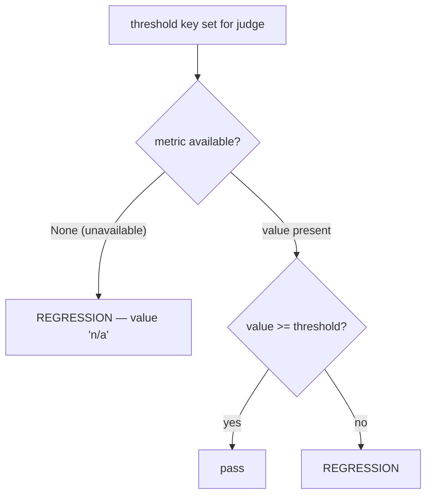

# thresholds

`thresholds` turns judge scores into a **pass/fail gate**. Each entry maps a
[judge](judges.md) name to one or more minimum-metric checks; if a run falls
below any of them, scoring exits non-zero — the hook you want for CI.

```yaml
thresholds:
  output_quality:
    min_mean: 3.5            # numeric judge — average score across cases
  has_content:
    min_pass_rate: 1.0       # boolean judge — fraction of cases passing (0.0–1.0)
  # pairwise:
  #   min_win_rate: 0.6      # pairwise judge — fraction of cases won vs baseline
```

The block is a plain mapping (`dict`, default empty). When it is empty or
omitted, no gate runs and scoring always succeeds.

## The three keys

| Key | Applies to | Metric compared | Passes when |
| --- | --- | --- | --- |
| `min_mean` | numeric (score) judges | mean score across cases | `mean >= min_mean` |
| `min_pass_rate` | boolean judges | fraction of cases returning `True` | `pass_rate >= min_pass_rate` |
| `min_win_rate` | the `pairwise` judge | fraction of cases won vs the `--baseline` run | `win_rate >= min_win_rate` |

You may set more than one key per judge; each is checked independently. Values
are compared with `<`, so a metric exactly equal to the threshold **passes**.

## Match the key to the judge's value type

This is the load-bearing gotcha: each judge produces exactly one aggregate
metric, decided by what its values *are* — not by which threshold key you write.

| Judge returns | `mean` | `pass_rate` | Use |
| --- | --- | --- | --- |
| booleans (`True`/`False`) | = pass_rate | fraction `True` | `min_pass_rate` (or `min_mean`) |
| integers/floats (e.g. 1–5) | average | `None` | `min_mean` |
| pairwise verdicts | `None` | `None` | `min_win_rate` |

!!! note "Boolean judges expose both `mean` and `pass_rate`"
    For a boolean judge the two are equal, so `min_mean: 1.0` and
    `min_pass_rate: 1.0` behave identically. Numeric judges, however, have
    `pass_rate == None` — putting `min_pass_rate` on a 1–5 judge never
    measures what you want (see below).

## A `None` metric is flagged as a regression — never skipped

When a threshold key is configured but the metric it targets is unavailable
(`None`), the harness treats that as a **regression**, not a silent pass. A
missing metric almost always means a misconfiguration or a run that produced no
data:

- the judge was **skipped for every case** (e.g. an `if:` condition never fired), or
- the threshold **targets the wrong judge type** — `min_pass_rate` on a numeric
  judge, or `min_win_rate` without a pairwise comparison.



!!! warning "Wrong-type thresholds fail loudly"
    `min_pass_rate` on a numeric judge (whose `pass_rate` is always `None`) is
    reported as a regression with the detail *"pass_rate unavailable — judge
    skipped for all cases or not a boolean judge"*. Fix it by switching to
    `min_mean`, not by removing the threshold.

## What happens on a regression

`score.py` runs the check after judging and again on demand:

=== "During a run"

    `/eval-run` scores, then evaluates `thresholds`. Detected regressions are
    printed and the process **exits with status 1**:

    ```text
    REGRESSIONS: 2 detected
      [output_quality] mean: >= 3.5 -> 3.1
      [has_content] pass_rate: >= 1.0 -> 0.8
    ```

=== "Standalone re-check"

    Re-run the gate against a stored run's `summary.yaml` without re-scoring —
    handy in CI:

    ```bash
    python3 ${CLAUDE_SKILL_DIR}/scripts/score.py regression \
      --run-id <id> --config eval.yaml
    ```

    Prints `REGRESSIONS: 0` and exits `0` when clean, or lists them and exits
    `1`. Judges with no matching threshold are ignored.

## Optional baseline comparison

The `regression` command accepts `--baseline <run-id>`. In addition to the
absolute `min_*` checks, it flags any judge whose `mean` or `pass_rate` has
**dropped by more than 0.5** relative to the baseline run:

```bash
python3 ${CLAUDE_SKILL_DIR}/scripts/score.py regression \
  --run-id <id> --baseline <prior-id> --config eval.yaml
```

```text
REGRESSIONS: 1 detected
  [output_quality] mean_vs_baseline: 4.2 -> 3.5
```

Baseline degradation is only checked for metrics present in both runs; the
0.5 delta is fixed and not configurable.

## Related

<div class="grid cards" markdown>

- [**judges**](judges.md) — the judges whose names you reference here
- [**reward**](reward.md) — collapse the same judges into one RL scalar instead
- [**thresholds (concept)**](../../concepts/thresholds.md) — how gating fits the lifecycle
- [**CI integration**](../../guides/ci.md) — wiring the non-zero exit into a pipeline

</div>
