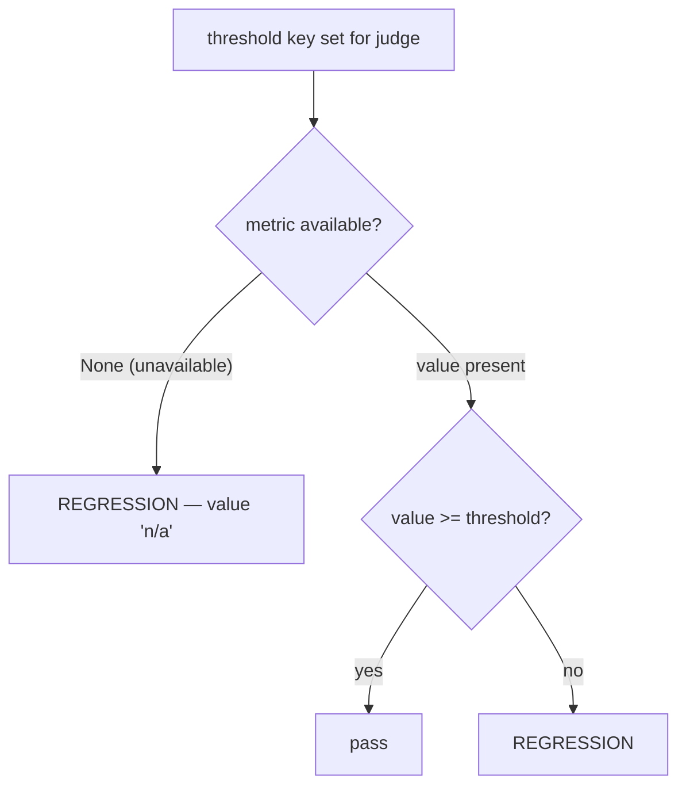

# thresholds

`thresholds` turns judge scores into a **pass/fail gate**. Each entry maps a
[judge](judges.md) name to one or more metric checks; if a run misses any of
them, scoring exits non-zero — the hook you want for CI.

```yaml
thresholds:
  output_quality:
    min_mean: 3.5            # numeric judge — average score across cases
    min_alpha: 0.7           # sampled judge — self-consistency alpha over the sampling matrix
  has_content:
    min_pass_rate: 1.0       # boolean judge — fraction of cases passing (0.0–1.0)
    max_error_rate: 0.2      # optional — fail if >20% of cases errored
  # format_check:
  #   min_human_agreement: 0.6  # judge-vs-human kappa/alpha, after `score.py calibration`
  # task_quality:
  #   min_panel_alpha: 0.67  # panel judge (judges[].model as a list) — cross-model alpha
  # pairwise:
  #   min_win_rate: 0.6      # pairwise judge — fraction of cases won vs baseline
  # simulator:               # RESERVED key — gates the simulator block, not a judge
  #   max_fallback_rate: 0.0
  #   min_gold_agreement: 0.8
```

The block is a plain mapping (`dict`, default empty). When it is empty or
omitted, no gate runs and scoring always succeeds. Unknown keys **warn** at
config load (they never gate); `*_alpha` / `*_agreement` values must be
finite numbers ≤ 1.0 (the coefficient maximum). The mapping key
`simulator` is **reserved** — see
[the reserved `simulator` key](#the-reserved-simulator-key) below.

## The seven per-judge keys

| Key | Applies to | Metric compared | Passes when |
| --- | --- | --- | --- |
| `min_mean` | numeric (score) judges | mean score across cases | `mean >= min_mean` |
| `min_pass_rate` | boolean judges | fraction of cases returning `True` | `pass_rate >= min_pass_rate` |
| `min_win_rate` | the `pairwise` judge | fraction of cases won vs the `--baseline` run | `win_rate >= min_win_rate` |
| `max_error_rate` | any judge | fraction of cases where the judge errored | `error_rate <= max_error_rate` |
| `min_alpha` | LLM/agent judges run with [`samples > 1`](judges.md) | single-judge self-consistency alpha (upper bound on inter-rater reliability) over the case × sample rating matrix | `alpha >= min_alpha`, or all ratings identical (see below) |
| `min_human_agreement` | any calibrated judge (deterministic `check` judges included) | judge-vs-human agreement (Cohen's kappa / Krippendorff's alpha) merged by `score.py calibration` from `/eval-review` verdicts | `value >= min_human_agreement`, perfect agreement, or the judge was never calibrated (see below) |
| `min_panel_alpha` | [panel judges](judges.md#judge-panels-cross-family-ensembles) (`model` is a list) | cross-model panel alpha (Krippendorff) over the cases × models matrix of per-model reduced verdicts | `alpha >= min_panel_alpha`, or all ratings identical (see below) |

`max_error_rate` is the coverage gate. `min_mean`, `min_pass_rate` and
`min_win_rate` are computed over the cases that produced a value, so a judge
that errors on most of the dataset still reports a `mean` over the survivors
and passes `min_mean`. Declare `max_error_rate` to say how much of the
dataset actually has to be scored. It is off unless declared — one flaky
judge run should not fail a suite by default.

You may set more than one key per judge; each is checked independently. The
`min_*` keys are compared with `<` and `max_error_rate` with `>`, so a
metric exactly equal to its threshold **passes** either way.

## `min_alpha` — the reliability gate

`min_alpha` gates the chance-corrected agreement of a sampled judge with
itself: the **single-judge self-consistency alpha (an upper bound on
inter-rater reliability)** written to `stability.irr` in `summary.yaml`. It
has three states:

1. **Breach** — the alpha is computed and below the bound → regression.
2. **Perfect agreement** — every rating identical, so the coefficient is 0/0
   (`reason_code: perfect_agreement`) → **passes**. A mature all-pass suite
   must not fail CI on a degenerate denominator.
3. **Configured but unavailable** — the judge ran with `samples: 1`, is
   deterministic, errored everywhere, or had too little pairable data →
   regression, matching how the other keys treat a `None` metric.

Instead of (or alongside) an explicit bound, tag the judge with a
[`consequence` tier](judges.md): `exploratory`/`safety`/`gating` inject a
default `min_alpha` of 0.67/0.70/0.80 at detection time. An explicit
`min_alpha` always wins, and the stored `thresholds` block is never
rewritten. Only 0.67 is literature-backed (Krippendorff's customary floor
for tentative conclusions); 0.70 and 0.80 are author-proposed.

!!! note "Local scoring path only"
    Harbor and EvalHub aggregations carry no per-sample stability data, so
    `min_alpha` (explicit or tier-injected) is **skipped with a stderr
    notice** on those execution paths — it never regresses a containerized
    run. Score the run locally to evaluate the reliability gate.

## `min_panel_alpha` — the panel gate

`min_panel_alpha` gates the **cross-model panel alpha** of a
[panel judge](judges.md#judge-panels-cross-family-ensembles) (`judges[].model`
as a list): Krippendorff's alpha over the cases × models matrix, where each
model's per-case *reduced* verdict is one rater and an errored model is a
missing rating. It follows the same three states as `min_alpha`:

1. **Breach** — alpha computed and below the bound → regression (the detail
   names the panel's family composition, so a within-family breach reads
   correctly).
2. **Perfect agreement** — every rating identical (`reason_code:
   perfect_agreement`) → **passes**.
3. **Configured but unavailable** — no panel data at all (the judge has no
   `model` list, or too few pairable cases) → regression with an actionable
   detail.

Consequence tiers inject `min_alpha` **only** — a consequence-tagged panel
judge without an explicit `min_panel_alpha` gets a load warning telling you
to set one. Value validation is shared with the other `*_alpha` keys
(finite, ≤ 1.0).

!!! note "Harbor: panels execute, the gate does not"
    Panels still **execute in-container on Harbor** — the in-container
    verifier runs the full judge engine, so you pay m× judge cost — while
    the cross-case panel alpha is **not aggregated on that path yet**.
    `min_panel_alpha` is therefore skipped with the same stderr notice as
    `min_alpha` on the Harbor/EvalHub paths. Score the run locally to
    evaluate the gate.

## `min_human_agreement` — the calibration gate

`min_human_agreement` gates the **judge-vs-human agreement** written by
`score.py calibration`: `/eval-review` (optionally) collects the reviewer's
own verdict per judge per case, and the calibration subcommand joins those
verdicts against the reduced per-case judge values, computes Cohen's kappa
(bool judges) or Krippendorff's alpha (ordinal/interval scales), and merges
a `human_agreement` block into the judge's `summary.yaml` entry — labeled
*"agreement with a single human reviewer (n=X)"*, never validated accuracy.
Below 5 joined pairs no coefficient is computed; the block carries the raw
(uncorrected) agreement table instead. Deterministic `check` judges are
first-class calibration targets.

Calibration is **post-hoc**, so the gate has three states:

1. **Breach** — the coefficient is computed and below the bound →
   regression. A calibrated-but-unavailable coefficient (below the floor,
   undefined) also regresses, matching the other keys.
2. **Perfect agreement** — judge and reviewer agree everywhere with zero
   variance (`reason_code: perfect_agreement`, the coefficient is 0/0) →
   **passes**.
3. **Never calibrated** — the judge row has no `human_agreement` block and
   the summary has no `human_calibration` block → **silently skipped**.
   `score.py judges` gates at scoring time, before any review can exist,
   and Harbor/EvalHub aggregates never carry the key — the gate only
   activates once you calibrate.

!!! warning "Stale calibration is a regression"
    Re-running `score.py judges` rewrites `summary['judges']` wholesale and
    **drops** every `human_agreement` block (new judge values invalidate old
    calibration; a note is printed). The run-level `human_calibration` block
    survives — and a judge it lists whose row lost `human_agreement` is
    reported as *"stale calibration — re-run score.py calibration"*, a loud
    regression rather than a silent skip. The verdicts in `review.yaml`
    survive re-scoring, so re-running `score.py calibration` restores the
    gate.

## The reserved `simulator` key

`thresholds.simulator` is a **reserved mapping key** — it gates the run-level
`summary['simulator']` block (aggregated by `score.py` from the
`hook_answers.jsonl` answer ledgers of an
[intercepted](inputs-tools.md) run), never a judge. Consequently the name
`simulator` cannot be a judge name: a judge called `simulator` next to a
`thresholds.simulator` block is a **load error**; without the block it loads
with a `DeprecationWarning` telling you to rename the judge.

Three sub-keys (anything else warns at load and is ignored):

| Sub-key | Gates | Passes when |
| --- | --- | --- |
| `max_fallback_rate` | the share of recorded answer events that were `fallback` or `disabled` — answers the agent under test received arbitrarily or without interception | `fallback_rate <= max_fallback_rate` |
| `min_gold_agreement` | the held-out calibration-shadow agreement over **human-provenance pairs only** (`inputs.tools[].calibration: true` + `case_overrides_source: human`) | `gold_agreement >= min_gold_agreement` with ≥ 1 human pair |
| `min_cross_simulator_agreement` | the cross-simulator **all-agree rate** — the share of fully shadow-covered questions where every [`models.hook_shadow`](models.md#hook_shadow) shadow answered exactly like the primary hook (`summary['simulator'].cross_simulator`) | `all_agree_rate >= min_cross_simulator_agreement` |

The gates follow the configured-but-unavailable rule: a configured
`thresholds.simulator` with **no simulator block** in the summary (never
scored locally, or old summary) is a regression per configured sub-key,
`min_gold_agreement` with **zero human-provenance pairs** fails loudly —
agent-authored override pairs measure LLM-vs-LLM consistency, not human
calibration, and are never silently substituted — and
`min_cross_simulator_agreement` with **no recorded shadow answers** (no
`models.hook_shadow`, or every shadow skipped/errored) is a regression
pointing at the missing configuration. A cross-simulator breach on a
**single-family** shadow panel says so in the regression detail:
within-family agreement is not cross-family robustness.

!!! note "Local scoring path only"
    Harbor and EvalHub aggregations carry no hook-ledger data, so the
    reserved key is **stripped with a stderr notice** on those paths
    (`thresholds.simulator is not evaluated on the Harbor/EvalHub path`),
    the EvalHub provider translation excludes it from `pass_criteria`, and
    Harbor task-package reuse never demands a bundled judge named
    `simulator`. Score the run locally to evaluate the simulator gates.

## Match the key to the judge's value type

This is the load-bearing gotcha: each judge produces exactly one aggregate
metric, decided by what its values *are* — not by which threshold key you write.

| Judge returns | `mean` | `pass_rate` | Use |
| --- | --- | --- | --- |
| booleans (`True`/`False`) | = pass_rate | fraction `True` | `min_pass_rate` (or `min_mean`) |
| integers/floats (e.g. 1–5) | average | `None` | `min_mean` |
| pairwise verdicts | `None` | `None` | `min_win_rate` |

!!! note "Boolean judges expose both `mean` and `pass_rate`"
    For a boolean judge the two are equal, so `min_mean: 1.0` and
    `min_pass_rate: 1.0` behave identically. Numeric judges, however, have
    `pass_rate == None` — putting `min_pass_rate` on a 1–5 judge never
    measures what you want (see below).

## A `None` metric is flagged as a regression — never skipped

When a threshold key is configured but the metric it targets is unavailable
(`None`), the harness treats that as a **regression**, not a silent pass. A
missing metric almost always means a misconfiguration or a run that produced no
data:

- the judge was **skipped for every case** (e.g. an `if:` condition never fired),
- the judge **errored on every case** — every value rejected by its
  [`score_range`](judges.md), say, since an off-scale value is recorded as an error
  sample and never aggregated (the detail names it: *"…judge errored on N cases; see
  the per-case rationales"*), or
- the threshold **targets the wrong judge type** — `min_pass_rate` on a numeric
  judge, or `min_win_rate` without a pairwise comparison.


```mermaid
flowchart TD
    A["threshold key set for judge"] --> B{"metric available?"}
    B -->|"None (unavailable)"| R["REGRESSION — value 'n/a'"]
    B -->|"value present"| C{"value >= threshold?"}
    C -->|"yes"| P["pass"]
    C -->|"no"| R2["REGRESSION"]
```

!!! warning "Wrong-type thresholds fail loudly"
    `min_pass_rate` on a numeric judge (whose `pass_rate` is always `None`) is
    reported as a regression with the detail *"pass_rate unavailable — judge
    skipped for all cases or not a boolean judge"*. Fix it by switching to
    `min_mean`, not by removing the threshold.

## What happens on a regression

`score.py` runs the check after judging and again on demand:

=== "During a run"

    `/eval-run` scores, then evaluates `thresholds`. Detected regressions are
    printed and the process **exits with status 1**:

    ```text
    REGRESSIONS: 2 detected
      [output_quality] mean: >= 3.5 -> 3.1
      [has_content] pass_rate: >= 1.0 -> 0.8
    ```

=== "Standalone re-check"

    Re-run the gate against a stored run's `summary.yaml` without re-scoring —
    handy in CI:

    ```bash
    python3 ${CLAUDE_SKILL_DIR}/scripts/score.py regression \
      --run-id <id> --config eval.yaml
    ```

    Prints `REGRESSIONS: 0` and exits `0` when clean, or lists them and exits
    `1`. Judges with no matching threshold are ignored.

## Optional baseline comparison

The `regression` command accepts `--baseline <run-id>`. In addition to the
absolute `min_*` checks, it flags any judge whose `mean` or `pass_rate` has
**dropped by more than 0.5** relative to the baseline run:

```bash
python3 ${CLAUDE_SKILL_DIR}/scripts/score.py regression \
  --run-id <id> --baseline <prior-id> --config eval.yaml
```

```text
REGRESSIONS: 1 detected
  [output_quality] mean_vs_baseline: 4.2 -> 3.5
```

Baseline degradation is only checked for metrics present in both runs; the
0.5 delta is fixed and not configurable.

## Related

<div class="grid cards" markdown>

- [**judges**](judges.md) — the judges whose names you reference here
- [**reward**](reward.md) — collapse the same judges into one RL scalar instead
- [**thresholds (concept)**](../../concepts/thresholds.md) — how gating fits the lifecycle
- [**CI integration**](../../guides/ci.md) — wiring the non-zero exit into a pipeline

</div>
