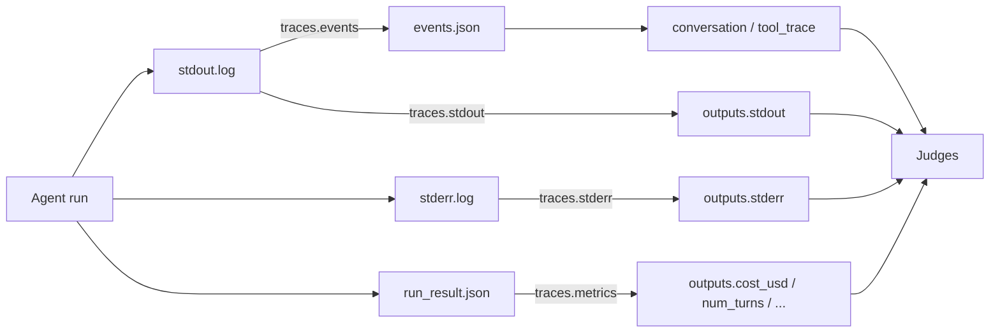

# traces

The `traces` block controls which execution data the harness captures during a
run and makes available to [judges](../../reference/config/judges.md). Each toggle
is an independent boolean; **all four default to `true`**, so the block is
entirely optional.

```yaml
traces:
  stdout: true    # capture stdout.log
  stderr: true    # capture stderr.log
  events: false   # parse stream-json into events.json (verbose)
  metrics: true   # capture exit code, tokens, cost, duration
```

## Fields

| Field | Default | Captures | Written to |
| --- | --- | --- | --- |
| `stdout` | `true` | Raw agent standard output | `stdout.log` |
| `stderr` | `true` | Raw agent standard error | `stderr.log` |
| `events` | `true` | Structured events (tool calls, reasoning, results) parsed from the stream-json stdout | `events.json` |
| `metrics` | `true` | Exit code, duration, token usage, cost, turn count | `run_result.json` |

!!! note "Omitting the block keeps everything on"
    `traces` is optional. When absent, `TracesConfig` defaults apply and all
    four artifacts are captured. Set a field to `false` only to opt *out* of
    a specific capture.

## How captures reach judges

Judges are Python/LLM scorers that receive an `outputs` record per case
(see [judges](../../reference/config/judges.md)). The `traces` toggles decide
which keys that record contains.



### metrics gates the execution-metadata keys

When `metrics: true` (and the run has a `run_result.json`), the case record is
enriched with execution-metadata keys pulled from `run_result.json`
(per-case values fall back to run-level values):

| Key in `outputs` | Meaning |
| --- | --- |
| `exit_code` | Agent process exit code |
| `duration_s` | Wall-clock duration in seconds |
| `token_usage` | Input/output token counts |
| `cost_usd` | Dollar cost of the invocation |
| `num_turns` | Number of agent turns |

A cost- or efficiency-oriented judge reads these directly:

```yaml
judges:
  - name: cost_reasonable
    description: Verify cost stays under $0.50 per case
    check: |
      cost = outputs.get("cost_usd", 0)
      if cost and cost > 0.50:
          return False, f"Cost ${cost:.2f} exceeds limit"
      return True, f"Cost ${cost:.2f}"
```

!!! warning "Setting `metrics: false` hides these keys from judges"
    With `metrics: false`, the `exit_code`, `duration_s`, `token_usage`,
    `cost_usd`, and `num_turns` keys are **not** added to the `outputs` record.
    Any judge that reads `outputs.get("cost_usd")` or `outputs.get("num_turns")`
    then sees the default (e.g. `0`/`None`) rather than the real value. Keep
    `metrics: true` whenever you gate on cost or turn count — including
    [reward composition](../../reference/config/reward.md) and
    [thresholds](../../reference/config/thresholds.md) that depend on
    efficiency judges.

### stdout / stderr

`stdout: true` and `stderr: true` make the raw `stdout.log` and `stderr.log`
available to judges (e.g. for grepping error strings or inspecting agent
narration). When the structured `events.json` is missing, the harness also
falls back to reconstructing the conversation from `stdout.log`.

## The `events` toggle

`events: true` parses the runner's stream-json stdout into a structured
`events.json` (tool calls, reasoning steps, results). This drives the derived
`conversation` and `tool_trace` values that LLM judges render via
`{{ conversation }}` and `{{ tool_trace }}`.

!!! note "Structured `outputs["events"]` for judges is not yet implemented"
    Exposing the parsed events as a first-class, structured `outputs["events"]`
    field for inline `check` judges is on the roadmap, not shipped. Today
    `events` produces `events.json` and feeds the conversation/tool-trace
    rendering; judges cannot yet iterate a typed event list from the `outputs`
    record. Because the stream is verbose, many configs set `events: false`
    (as the canonical [`eval.yaml`](https://github.com/opendatahub-io/agent-eval-harness/blob/main/eval.yaml)
    does) unless a judge needs behavioral tracing.

## See also

- [judges](../../reference/config/judges.md) — how the `outputs` record is consumed
- [outputs](../../reference/config/outputs.md) — file artifacts and tool calls (separate from traces)
- [tracing concepts](../../concepts/tracing.md) — how traces flow into MLflow
- [runs directory](../../reference/runs-directory.md) — where `stdout.log`, `events.json`, and `run_result.json` live
