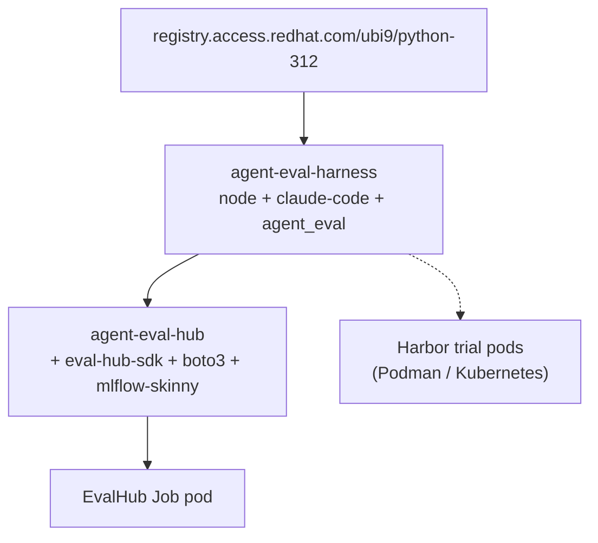

# Container images

The harness ships **two** container images. The base image carries the agent CLIs
plus the `agent_eval` package (judge engine, reward bridge, tool interception); the
EvalHub provider image is a thin layer on top of it. Neither contains any project
code — so **no project-specific images are needed**.

## The two images

| Image | Containerfile | Base | Extra contents | Used by |
|---|---|---|---|---|
| **`agent-eval-harness`** | [`deploy/Containerfile`](https://github.com/opendatahub-io/agent-eval-harness/blob/main/deploy/Containerfile) | `ubi9/python-312` | Node + npm, git, tar, `@anthropic-ai/claude-code`, `anthropic[vertex]`, `pyyaml`, `jinja2`, the `agent_eval` package + `skills/` | Harbor trial pods (local Podman + K8s/OpenShift), and as the **base** for EvalHub Job pods |
| **`agent-eval-hub`** | [`deploy/evalhub/Containerfile`](https://github.com/opendatahub-io/agent-eval-harness/blob/main/deploy/evalhub/Containerfile) | `agent-eval-harness` | `eval-hub-sdk[adapter]`, `boto3`, `mlflow-skinny`, and `entrypoint.py` | The EvalHub provider pod (adapter runs **in-process** — no Harbor, no sub-pods) |



## `agent-eval-harness` (base)

A generic runtime for agent-evaluation trial pods. It contains the agent CLIs and the
harness package, but **no project code** — project resources are delivered at run time
(see [below](#no-project-specific-images)).

What's inside:

- **UBI9 + Python 3.12** (`ubi9/python-312`).
- **System deps:** `nodejs`, `npm` (for the agent CLIs), `git`, `tar`.
- **Agent CLI:** `@anthropic-ai/claude-code` installed globally via npm.
- **Python deps:** `pyyaml`, `anthropic[vertex]` (LLM judges via Vertex or the direct
  API), `jinja2`.
- **The harness itself:** `agent_eval/`, `skills/`, and `pyproject.toml` copied to
  `/opt/agent-eval-harness`, put on `PYTHONPATH`.

=== "Build"

    ```bash
    podman build \
      -f deploy/Containerfile \
      -t quay.io/rhoai/agent-eval-harness:latest .
    ```

!!! note "OpenShift-friendly by design"
    The image runs under an **arbitrary non-root UID** (the restricted-v2 SCC). Files
    are group-`0`-writable (`chmod -R g=u`), `HOME` is set to `/workspace`, and the
    writable dirs (`/workspace`, `/logs/*`, `/tests`, `/solution`, `/installed-agent`)
    are pre-created and `chgrp 0`. `/tests` and `/solution` exist up front because
    Harbor's verifier uploads there and `oc cp` / tar extraction runs as the pod user.

## `agent-eval-hub` (EvalHub provider)

`FROM agent-eval-harness` plus the dependencies the EvalHub adapter needs — which are
**not** present in Harbor trial pods:

| Dependency | Why |
|---|---|
| `eval-hub-sdk[adapter]>=0.1,<1.0` | The `FrameworkAdapter` contract (JobSpec → JobResults) |
| `boto3>=1.34,<2.0` | S3 dataset download for EvalHub datasets |
| `mlflow-skinny>=3.5` | Result logging |

It adds `deploy/evalhub/entrypoint.py` and sets
`ENTRYPOINT ["python3", "entrypoint.py"]`. The adapter runs the eval **in-process**
inside the Job pod created by EvalHub's server — it uses `ClaudeCodeRunner` directly
and never creates sub-pods or invokes Harbor. See the
[EvalHub guide](../guides/evalhub.md).

=== "Build"

    ```bash
    # Requires the base image to exist first.
    podman build \
      -f deploy/evalhub/Containerfile \
      -t quay.io/rhoai/agent-eval-hub:latest .
    ```

!!! warning "Build the base first"
    `agent-eval-hub` is `FROM quay.io/rhoai/agent-eval-harness:latest`. Build (or pull)
    the base image before building the provider image.

## No project-specific images {#no-project-specific-images}

The base image is deliberately project-agnostic. Your `eval.yaml`, dataset, and any
project files reach the trial pod through one of three delivery mechanisms — never by
baking a new image per project:

| Mechanism | How | Env var |
|---|---|---|
| **Kubernetes** | ConfigMap volume mounted into the pod | `AGENT_EVAL_K8S_PROJECT_CONFIGMAP` |
| **Podman** | Host directory bind-mounted into the container | `AGENT_EVAL_PODMAN_PROJECT_DIR` |
| **Image layer** | `FROM agent-eval-harness` + `COPY project/` in your own repo's Containerfile | — |

!!! tip "The same image, everywhere"
    Because the [execution substrate is a CLI flag](../concepts/backends.md), not a
    config key, one base image serves local Podman runs, OpenShift, and EvalHub. The
    [`eval.yaml`](eval-yaml.md) describes *what* to evaluate; the image and backend
    describe *where*.

## See also

<div class="grid cards" markdown>

- [**Backends**](../concepts/backends.md) — Local, Harbor, and EvalHub execution paths
- [**Harbor guide**](../guides/harbor.md) — containerized trial orchestration
- [**EvalHub guide**](../guides/evalhub.md) — platform-triggered, in-process runs
- [**Environment variables**](environment-variables.md) — including the project-delivery vars above

</div>
