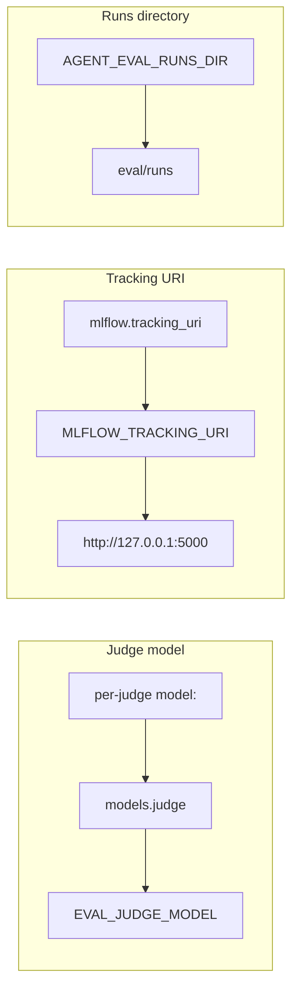

# Environment variables

The harness is configured almost entirely through `eval.yaml`, but a handful of
things live in the environment: **model credentials**, the **MLflow tracking
endpoint**, and the **Harbor container backends** (Podman, Kubernetes). This page
lists every variable the code actually reads, grouped by what it controls.

!!! tip "eval.yaml first, env second"
    Prefer `eval.yaml` for anything portable (models, experiment name). Reserve
    environment variables for secrets and machine-specific paths so the same
    config runs unchanged across [Local, Harbor, and EvalHub](../concepts/backends.md).

## Model authentication

Credentials for the agent under test and for LLM/pairwise judges. Provide **one**
auth path — a direct API key, a custom gateway, or a cloud provider (Vertex /
Bedrock).

=== "Anthropic API"

    ```bash
    export ANTHROPIC_API_KEY="sk-ant-..."
    ```

=== "Custom gateway / proxy"

    ```bash
    export ANTHROPIC_BASE_URL="https://litellm.internal/v1"
    export ANTHROPIC_AUTH_TOKEN="..."   # bearer token instead of an API key
    ```

=== "Google Vertex AI"

    ```bash
    export CLAUDE_CODE_USE_VERTEX=1
    export ANTHROPIC_VERTEX_PROJECT_ID="my-gcp-project"
    export CLOUD_ML_REGION="us-east5"
    ```

| Variable | What it does |
| --- | --- |
| `ANTHROPIC_API_KEY` | Direct Anthropic API key. Detected by `/eval-setup` preflight and forwarded into every workspace and container. |
| `ANTHROPIC_AUTH_TOKEN` | Bearer token used in place of an API key (e.g. behind a gateway). |
| `ANTHROPIC_BASE_URL` | Override the API endpoint — point Claude Code at a proxy or LiteLLM gateway. |
| `CLAUDE_CODE_USE_VERTEX` | Set to `1` to route Claude Code through Google Vertex AI. |
| `ANTHROPIC_VERTEX_PROJECT_ID` | GCP project for Vertex. Accepted by preflight as an alternative to `ANTHROPIC_API_KEY`. |
| `CLOUD_ML_REGION` | Vertex region for the Claude Code CLI (e.g. `us-east5`). |
| `ANTHROPIC_VERTEX_REGION` | Vertex region for **synthetic dataset generation** (`/eval-dataset`), which builds an `AnthropicVertex` client directly. Defaults to `us-east5`. |
| `ANTHROPIC_MODEL` | Default model hint forwarded to Harbor containers. |
| `ANTHROPIC_DEFAULT_OPUS_MODEL` / `ANTHROPIC_DEFAULT_SONNET_MODEL` / `ANTHROPIC_DEFAULT_HAIKU_MODEL` | Map the `opus`/`sonnet`/`haiku` aliases to specific model IDs. |
| `GOOGLE_APPLICATION_CREDENTIALS`, `GOOGLE_CLOUD_PROJECT` | Standard GCP credential/project vars, forwarded when set. |

!!! warning "At least one auth path is required"
    `/eval-setup` passes preflight only when `ANTHROPIC_API_KEY` **or**
    `ANTHROPIC_VERTEX_PROJECT_ID` is set. With neither, the runner and all LLM
    judges fail.

!!! note "AWS Bedrock"
    The Harbor Podman backend also forwards `CLAUDE_CODE_USE_BEDROCK`, `AWS_REGION`,
    `AWS_ACCESS_KEY_ID`, `AWS_SECRET_ACCESS_KEY`, `AWS_SESSION_TOKEN`, and
    `AWS_BEARER_TOKEN_BEDROCK` into the trial container when present.

## MLflow

Tracking is opt-in. When these are unset the harness falls back to a local file
store / `http://127.0.0.1:5000`.

| Variable | What it does |
| --- | --- |
| `MLFLOW_TRACKING_URI` | MLflow tracking server URI. Precedence: `mlflow.tracking_uri` in `eval.yaml` **>** this variable **>** `http://127.0.0.1:5000`. |
| `MLFLOW_EXPERIMENT_NAME` | Experiment cases and traces are logged under. Injected into each eval workspace. |

See the [mlflow config block](config/mlflow.md) and the
[tracing concept](../concepts/tracing.md) for how traces are produced.

## Harness

General harness knobs, read by the skills and runner directly.

| Variable | Default | What it does |
| --- | --- | --- |
| `AGENT_EVAL_RUNS_DIR` | `eval/runs` | Base directory where each run's workspace, artifacts, scores, and `report.html` are written. See [the runs directory](runs-directory.md). |
| `EVAL_JUDGE_MODEL` | *(none)* | Fallback model for LLM and pairwise judges. Resolution order: per-judge `model:` **>** `models.judge` **>** this variable. |
| `CLAUDE_CODE_SUBAGENT_MODEL` | *(none)* | Model used for subagents spawned by the skill under test. Set automatically from `models.subagent` when configured. |

!!! note "Workspace env allowlist"
    The Claude Code runner does **not** forward your whole environment into an
    eval workspace — only an allowlist (the auth, MLflow, and harness variables
    above). To inject additional variables, use the
    [`execution.env`](config/execution.md) block in `eval.yaml`, which supports
    `$VAR` passthrough from the caller's environment.

## Harbor — Podman backend

Read by `agent_eval.harbor.podman` when running `/eval-run --runner harbor` (or
`harbor run`) against local Podman containers. All variables are optional.

| Variable | Default | What it does |
| --- | --- | --- |
| `PODMAN_BINARY` | `podman` | Path/name of the Podman executable. |
| `AGENT_EVAL_PODMAN_KEEP_RUN` | *(off)* | Set to `1` to keep the trial container after the run for `podman logs` / `podman exec` debugging. |
| `AGENT_EVAL_PODMAN_PROJECT_DIR` | *(none)* | Host directory of project resources (skills, scripts, CLAUDE.md) to bind-mount read-only — no project-specific image needed. |
| `AGENT_EVAL_PODMAN_PROJECT_MOUNT` | `/opt/project` | Mount point inside the container for `AGENT_EVAL_PODMAN_PROJECT_DIR`. |
| `AGENT_EVAL_PODMAN_GCP_CREDENTIALS_FILE` | *(none)* | Path to a GCP service-account key file, mounted read-only at `/var/creds/creds.json` and exported as `GOOGLE_APPLICATION_CREDENTIALS`. |

!!! warning "No security boundary on Podman"
    The Podman container runs on the host, so API keys (`ANTHROPIC_API_KEY`,
    `ANTHROPIC_AUTH_TOKEN`, AWS keys) are forwarded straight into it. On
    Kubernetes, credentials instead come from a cluster Secret.

## Harbor — Kubernetes backend

Read by `agent_eval.harbor.kubernetes` when running against OpenShift/Kubernetes
(`--environment-import-path agent_eval.harbor.kubernetes:KubernetesEnvironment`).
Credentials come from cluster Secrets, never the host — only `ANTHROPIC_MODEL` and
`ANTHROPIC_BASE_URL` are inherited from your environment.

| Variable | Default | What it does |
| --- | --- | --- |
| `AGENT_EVAL_K8S_NAMESPACE` | *(auto)* | Namespace for trial pods. Falls back to the in-cluster service-account namespace, then the active kubeconfig context, then `default`. |
| `AGENT_EVAL_K8S_CREDENTIALS_SECRET` | *(none)* | Secret whose keys are injected as env (`envFrom`) — this is how API keys / gateway config reach the pod. |
| `AGENT_EVAL_K8S_SERVICE_ACCOUNT` | *(none)* | Service account for the trial pod (e.g. for Workload Identity). |
| `AGENT_EVAL_K8S_GCP_CREDENTIALS_SECRET` | *(none)* | Secret mounted read-only at `/var/creds`; sets `GOOGLE_APPLICATION_CREDENTIALS`. |
| `AGENT_EVAL_K8S_GCP_CREDENTIALS_KEY` | `key.json` | Key within the GCP credentials Secret to point `GOOGLE_APPLICATION_CREDENTIALS` at. |
| `AGENT_EVAL_K8S_PROJECT_CONFIGMAP` | *(none)* | ConfigMap of project resources, mounted read-only and reconstructed into `/workspace` — no project-specific image needed. |
| `AGENT_EVAL_K8S_PROJECT_MOUNT` | `/opt/project` | Mount point for the project ConfigMap. |
| `AGENT_EVAL_K8S_CPU` | `1` | CPU request/limit when Harbor does not specify one. |
| `AGENT_EVAL_K8S_MEMORY` | `2Gi` | Memory request/limit when Harbor does not specify one. |
| `AGENT_EVAL_K8S_KEEP_RUN` | *(off)* | Set to `1` to keep the pod after the run for `kubectl logs` / `kubectl exec` debugging. |
| `AGENT_EVAL_K8S_INSTALL_PACKAGES` | *(off)* | Set to `1` to allow in-pod package/agent installs. By default pre-built images skip them. |

## Precedence at a glance

Model and tracking settings each resolve through a fixed chain — the CLI flag or
`eval.yaml` key usually wins over the environment.



## Related

<div class="grid cards" markdown>

- [**Setup**](../guides/eval-run.md) — where these variables are first configured
- [**mlflow config**](config/mlflow.md) — `experiment`, `tracking_uri`, `tags`
- [**models config**](config/models.md) — model roles and precedence
- [**Harbor guide**](../guides/harbor.md) — running in containers
- [**Container images**](container-images.md) — images the backends run
- [**Runs directory**](runs-directory.md) — layout under `AGENT_EVAL_RUNS_DIR`

</div>
