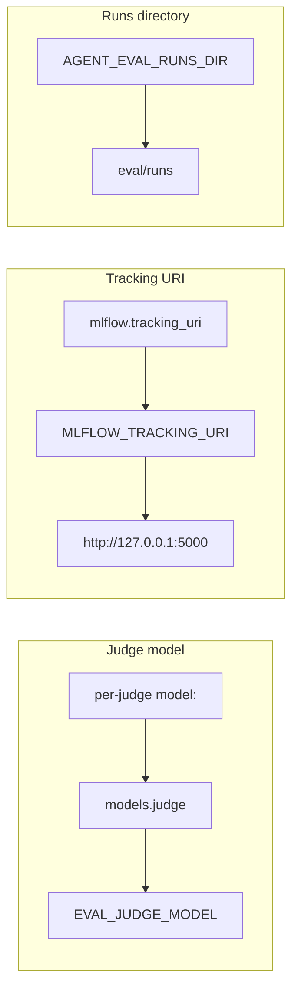

# Environment variables

The harness is configured almost entirely through `eval.yaml`, but a handful of
things live in the environment: **model credentials**, the **MLflow tracking
endpoint**, the **Harbor container backends** (Podman, Kubernetes) and the **EvalHub
client**. This page lists every variable the code reads, grouped by what it controls.

!!! tip "eval.yaml first, env second"
    Prefer `eval.yaml` for anything portable (models, experiment name). Reserve
    environment variables for secrets and machine-specific paths so the same
    config runs unchanged across [Local, Harbor, and EvalHub](../concepts/backends.md).

## Model authentication

Credentials for the agent under test and for LLM/pairwise judges. How they reach the
agent depends on the backend: the local `claude-code` runner forwards an **exact-name
allowlist** (a direct API key, a bearer token plus gateway URL, or Vertex — no Bedrock
switch and no `AWS_*` variable), Harbor Podman forwards a wider host set, and Kubernetes
/ EvalHub pods get theirs from the cluster. Judges run in the harness process (or the
in-container judge engine) and read the same variables through the SDK client the judge
model selects. Provide **one** path:

=== "Anthropic API"

    ```bash
    export ANTHROPIC_API_KEY="sk-ant-..."
    ```

=== "Custom gateway / proxy"

    ```bash
    export ANTHROPIC_BASE_URL="https://litellm.internal/v1"
    export ANTHROPIC_AUTH_TOKEN="..."   # bearer token instead of an API key
    ```

=== "Google Vertex AI"

    Use the recipe in
    [Installation → Provide model credentials](../get-started/installation.md#2-provide-model-credentials):
    `CLAUDE_CODE_USE_VERTEX=1`, `ANTHROPIC_VERTEX_PROJECT_ID` and `CLOUD_ML_REGION`.
    The agent (Claude Code) reads all three; the Anthropic judge client reads
    `ANTHROPIC_VERTEX_PROJECT_ID` and `CLOUD_ML_REGION` (plus `ANTHROPIC_VERTEX_BASE_URL`
    when set), never `CLAUDE_CODE_USE_VERTEX`; `ANTHROPIC_VERTEX_REGION` is read only by
    synthetic dataset generation.

=== "OpenRouter"

    ```bash
    export OPENROUTER_API_KEY="sk-or-..."
    ```

    Read by `openrouter:/…` judges and, through the harness-managed plan, by the agent
    when `models.skill` is `openrouter:/<author>/<slug>`. See
    [Running on OpenRouter](../guides/openrouter.md).

The backend × credential matrix across all of these is in
[Model providers → Credentials by backend](../concepts/providers.md#credentials-by-backend).

### Anthropic — direct API, gateway, Vertex

| Variable | What it does |
| --- | --- |
| `ANTHROPIC_API_KEY` | Direct Anthropic API key, read by Claude Code, the Anthropic judge client and synthetic generation. Forwarded to the agent by the local `claude-code` runner and by Harbor Podman; **blanked under an OpenRouter plan** (the agent's key is then `ANTHROPIC_AUTH_TOKEN`, set by the plan); on Kubernetes it comes from the credentials Secret, never the host. Detected by `/eval-setup` preflight. |
| `ANTHROPIC_AUTH_TOKEN` | Bearer token used in place of an API key (e.g. behind a gateway); the judge client tries it after `ANTHROPIC_API_KEY`. Under a plan it is a managed key: the plan sets it to the OpenRouter inference key and an authored value is rejected. |
| `ANTHROPIC_BASE_URL` | Override the API endpoint — point Claude Code and the judge client at a proxy or LiteLLM gateway. Any host other than `api.anthropic.com` makes the `claude-code` runner label its cost `runner:estimate`. Managed under a plan. |
| `CLAUDE_CODE_USE_VERTEX` | Set to `1` to route Claude Code through Google Vertex AI. Blanked under a plan. |
| `ANTHROPIC_VERTEX_PROJECT_ID` | GCP project for Vertex. When set, the Anthropic judge client builds an `AnthropicVertex` client (it wins over `ANTHROPIC_API_KEY`); synthetic generation uses Vertex only when neither `ANTHROPIC_API_KEY` nor `ANTHROPIC_AUTH_TOKEN` is set. Accepted by preflight as an alternative to `ANTHROPIC_API_KEY`. Blanked under a plan. |
| `CLOUD_ML_REGION` | Vertex region for the Claude Code CLI and the Anthropic judge client (judge default `us-east5`). Blanked under a plan. |
| `ANTHROPIC_VERTEX_REGION` | Vertex region for **synthetic dataset generation only** (`/eval-dataset`; default `us-east5`). Neither the agent nor the judges read it. |
| `ANTHROPIC_VERTEX_BASE_URL` | Vertex host override: forwarded to the agent when set and passed to the Anthropic judge client. With `CLAUDE_CODE_SKIP_VERTEX_AUTH=1` and a bearer `ANTHROPIC_AUTH_TOKEN` it lets a sandbox front Vertex with its own proxy instead of Application Default Credentials. Not forwarded under a plan. |
| `CLAUDE_CODE_SKIP_VERTEX_AUTH` | Forwarded to the agent when set (the sandbox setup above). Not forwarded under a plan. |
| `GCP_SA_ACCESS_TOKEN`, `GOOGLE_VERTEX_AI_SERVICE_ACCOUNT_TOKEN`, `GOOGLE_VERTEX_AI_TOKEN` | Vertex access token for the **Anthropic judge client**, tried in that order; with none set the SDK falls back to Application Default Credentials. Judges only — not on the agent allowlist. |
| `GOOGLE_APPLICATION_CREDENTIALS`, `CLOUDSDK_CONFIG`, `CLOUDSDK_AUTH_CREDENTIAL_FILE_OVERRIDE` | GCP credential locations, forwarded when set — except under an OpenRouter plan, where the agent has no Vertex to reach and none of them is forwarded (an explicit `runner.env` entry still is). |
| `GOOGLE_CLOUD_PROJECT` | GCP project, forwarded when set. Under an OpenRouter plan it is a managed key: blanked by the plan and rejected in `runner.env`. |
| `ANTHROPIC_MODEL` | Default model hint forwarded to Harbor containers (Podman and Kubernetes). Under a plan it is set to the skill id. |
| `ANTHROPIC_DEFAULT_OPUS_MODEL` / `ANTHROPIC_DEFAULT_SONNET_MODEL` / `ANTHROPIC_DEFAULT_HAIKU_MODEL` | Map the `opus`/`sonnet`/`haiku` aliases to specific model IDs; forwarded by the local runner. Under a plan the opus and sonnet slots are set to the skill id and the haiku slot to `background_model`, else the skill id. |

### OpenRouter

| Variable | What it does |
| --- | --- |
| `OPENROUTER_API_KEY` | OpenRouter inference key for `openrouter:/…` judges and for the agent-under-test when `models.skill` is `openrouter:/…` (the agent receives it as `ANTHROPIC_AUTH_TOKEN` through the run's settings overlay / `--agent-env` / a Secret, never under this name). **Env-only**: the variable name is configurable (`models.providers.openrouter.api_key_env`) but the key may never appear in an eval config or any `env:` surface — such entries fail at load. Harbor Podman forwards it from the host when set; under a plan only when an in-container `openrouter:/` judge needs it (the agent never reads it under this name). |
| `OPENROUTER_MANAGEMENT_KEY` | OpenRouter management key, read only at `routing.enforcement: key-guardrail` to provision a per-run key. Env-only, same rule as above; never forwarded anywhere. |

### OpenAI and OpenAI-compatible endpoints

| Variable | What it does |
| --- | --- |
| `OPENAI_API_KEY` | Read by the `codex` runner (forwarded to `codex exec`), the `responses-api` runner (unless `runner.settings.api_key` is set) and `openai:/` judges — including any bare judge id the harness does not classify as Claude. Forwarded by Harbor Podman. Never read by `openrouter:/` judges. |
| `OPENAI_BASE_URL` | OpenAI-compatible endpoint (LiteLLM proxy, Azure, a local server): read by `openai:/` judges (with it set, `OPENAI_API_KEY` may be omitted — a placeholder key is sent) and the `responses-api` runner (`settings.base_url` wins); forwarded to `codex exec` and by Harbor Podman. |
| `OPENAI_MODEL` | Default model for the `responses-api` runner (`settings.default_model` wins); forwarded to `codex exec` and by Harbor Podman. |
| `OPENAI_ORG_ID`, `OPENAI_ORGANIZATION`, `OPENAI_PROJECT` | Forwarded to `codex exec` when set (the Codex allowlist). |
| `CODEX_HOME` | Codex CLI state directory, forwarded when set. |
| `CODEX_API_KEY` | Alternative Codex credential, forwarded when set. |

### Cursor

| Variable | What it does |
| --- | --- |
| `CURSOR_API_KEY` | Cursor Agent credential for `runner.type: cursor`; forwarded into the `cursor-agent` subprocess (also settable via `runner.env`). |
| `CURSOR_API_ENDPOINT` | Overrides the Cursor API endpoint for `runner.type: cursor`. |
| `CURSOR_AGENT_BIN` | Path to the `cursor-agent` executable (alternative to `runner.settings.binary`). |

!!! note "`/eval-setup` checks Anthropic credentials only"
    Its key check knows `ANTHROPIC_API_KEY` and `ANTHROPIC_VERTEX_PROJECT_ID` — an
    OpenRouter-, OpenAI- or Cursor-only setup is flagged although the run works; see
    [Installation → Run `/eval-setup`](../get-started/installation.md#3-optional-run-eval-setup).

!!! note "AWS Bedrock, per backend"
    | Backend | Bedrock |
    | --- | --- |
    | local `claude-code` | Not on the allowlist — pass `CLAUDE_CODE_USE_BEDROCK`, `AWS_REGION` and the AWS credentials through `runner.env`. |
    | Harbor Podman | Forwards `CLAUDE_CODE_USE_BEDROCK`, `AWS_REGION`, `AWS_ACCESS_KEY_ID`, `AWS_SECRET_ACCESS_KEY`, `AWS_SESSION_TOKEN` and `AWS_BEARER_TOKEN_BEDROCK` from the host when present. |
    | Harbor Kubernetes / OpenShift | From the credentials Secret (`AGENT_EVAL_K8S_CREDENTIALS_SECRET`); nothing is copied from the host. |
    | EvalHub | From the job pod's environment, set by the EvalHub server. |
    | LLM judges | Not supported — the Anthropic judge client knows Vertex, an API key or a bearer token only. |

    Under an OpenRouter plan `CLAUDE_CODE_USE_BEDROCK`, `AWS_REGION` and
    `AWS_BEARER_TOKEN_BEDROCK` are blanked in the agent env.

## MLflow

Tracking is opt-in. When these are unset the harness falls back to a local file
store / `http://127.0.0.1:5000`.

| Variable | What it does |
| --- | --- |
| `MLFLOW_TRACKING_URI` | MLflow tracking server URI. Precedence: `mlflow.tracking_uri` in `eval.yaml` **>** this variable **>** `http://127.0.0.1:5000`. |
| `MLFLOW_EXPERIMENT_NAME` | Experiment cases and traces are logged under. Injected into each eval workspace. |

See the [mlflow config block](config/mlflow.md) and the
[tracing concept](../concepts/tracing.md) for how traces are produced.

## Harness

General harness knobs, read by the skills and runner directly.

| Variable | Default | What it does |
| --- | --- | --- |
| `AGENT_EVAL_RUNS_DIR` | `eval/runs` | Base directory where each run's workspace, artifacts, scores, and `report.html` are written. See [the runs directory](runs-directory.md). |
| `EVAL_JUDGE_MODEL` | *(none)* | Fallback model for LLM and pairwise judges. Resolution order: per-judge `model:` **>** `models.judge` **>** this variable. |
| `CLAUDE_CODE_SUBAGENT_MODEL` | *(none)* | Model used for subagents spawned by the skill under test. Set automatically from `models.subagent` when configured. Under an OpenRouter plan it is one of the managed keys the plan sets (see [models → providers](config/models.md#providers-openrouter)). |
| `CLAUDE_CODE_PRINT_BG_WAIT_CEILING_MS` | `600000` | How long the Claude Code CLI waits for background tasks that outlive the final turn before terminating them (`0` = wait indefinitely). Tasks killed at this ceiling fail the case (exit 1) since their artifacts may be half-written — raise it for long-running pipeline skills, via export (on the env allowlist) or `runner.env:`. |
| `CLAUDE_CODE_MAX_RETRIES` / `CLAUDE_CODE_AUTO_COMPACT_WINDOW` | *(none)* | Claude Code CLI tuning variables on the local runner's allowlist: forwarded verbatim to the agent subprocess when exported; the harness does not interpret them. |

!!! note "Workspace env allowlist"
    The Claude Code, Codex and Cursor runners do **not** forward your whole environment
    into an eval workspace — each has an exact-name allowlist (Claude Code: the
    Anthropic / Vertex / GCP variables above, the model aliases, the `CLAUDE_CODE_*`
    rows, MLflow and `AGENT_EVAL_RUNS_DIR`; Codex: the `OPENAI_*` / `CODEX_*` rows;
    Cursor: `CURSOR_API_KEY` / `CURSOR_API_ENDPOINT` / `CURSOR_AGENT_BIN`). A name not on
    the list — `CLAUDE_CODE_USE_BEDROCK`, `AWS_*` or `OPENROUTER_*` for Claude Code — is
    dropped. To inject additional variables, use [`runner.env`](config/runner.md#env) or
    the [`execution.env`](config/execution.md) block in `eval.yaml`, both of which
    support `$VAR` passthrough from the caller's environment. The `cli` runner inherits
    the full environment plus `execution.env` (it does not apply `runner.env`).

## Harbor — Podman backend

Read by `agent_eval.harbor.podman` when running `/eval-run --runner harbor` (or
`harbor run`) against local Podman containers. All variables are optional.

| Variable | Default | What it does |
| --- | --- | --- |
| `PODMAN_BINARY` | `podman` | Path/name of the Podman executable. |
| `AGENT_EVAL_PODMAN_KEEP_RUN` | *(off)* | Set to `1` to keep the trial container after the run for `podman logs` / `podman exec` debugging. |
| `AGENT_EVAL_PODMAN_PROJECT_DIR` | *(none)* | Host directory of project resources (skills, scripts, CLAUDE.md) to bind-mount read-only — no project-specific image needed. |
| `AGENT_EVAL_PODMAN_PROJECT_MOUNT` | `/opt/project` | Mount point inside the container for `AGENT_EVAL_PODMAN_PROJECT_DIR`. |
| `AGENT_EVAL_PODMAN_GCP_CREDENTIALS_FILE` | *(none)* | Path to a GCP service-account key file, mounted read-only at `/var/creds/creds.json` and exported as `GOOGLE_APPLICATION_CREDENTIALS`. Skipped while an OpenRouter plan is active. |
| `AGENT_EVAL_PODMAN_PLAN_EXCLUDE` | *(set by the harness)* | Comma-separated host variables the podman environment must not forward while an OpenRouter plan is active: the managed keys — the Anthropic credentials, the Vertex variables and the Bedrock switches `CLAUDE_CODE_USE_BEDROCK`, `AWS_REGION`, `AWS_BEARER_TOKEN_BEDROCK` — plus the provider key variables. `AWS_ACCESS_KEY_ID` / `AWS_SECRET_ACCESS_KEY` / `AWS_SESSION_TOKEN` and `OPENAI_*` are still forwarded. `harbor/run.py` sets it, operators never do. |
| `AGENT_EVAL_PODMAN_PLAN_FORWARD` | *(set by the harness)* | Extra host variable(s) Podman forwards while a plan is active: the inference key under a custom `api_key_env` name, for an in-container `openrouter:/` judge. Set by `harbor/run.py`. |

!!! warning "No security boundary on Podman"
    The Podman container runs on the host, so API keys (`ANTHROPIC_API_KEY`,
    `ANTHROPIC_AUTH_TOKEN`, AWS keys) are forwarded straight into it. On
    Kubernetes, credentials instead come from a cluster Secret.

## Harbor — Kubernetes backend

Read by `agent_eval.harbor.kubernetes` when running against OpenShift/Kubernetes
(`--environment-import-path agent_eval.harbor.kubernetes:KubernetesEnvironment`).
Credentials come from cluster Secrets, never the host — only `ANTHROPIC_MODEL` and
`ANTHROPIC_BASE_URL` are inherited from your environment, and neither while an OpenRouter
plan is active (both are managed keys the plan sets in the pod spec instead).

| Variable | Default | What it does |
| --- | --- | --- |
| `AGENT_EVAL_K8S_NAMESPACE` | *(auto)* | Namespace for trial pods. Falls back to the in-cluster service-account namespace, then the active kubeconfig context, then `default`. |
| `AGENT_EVAL_K8S_CREDENTIALS_SECRET` | *(none)* | Secret whose keys are injected as env (`envFrom`) — this is how API keys / gateway config reach the pod. Under an OpenRouter plan it must also hold `OPENROUTER_API_KEY`, which the harness maps to `ANTHROPIC_AUTH_TOKEN` through an explicit `secretKeyRef` entry (explicit `env[]` wins over `envFrom`). |
| `AGENT_EVAL_K8S_PLAN_ENV` / `AGENT_EVAL_K8S_TOKEN_SECRET` / `AGENT_EVAL_K8S_TOKEN_SECRET_KEY` / `AGENT_EVAL_K8S_PLAN_MASK` | *(set by the harness)* | How `harbor/run.py` hands an OpenRouter plan to the Kubernetes environment: the non-secret env block (JSON) for the pod `env[]`; the Secret / key the token is mapped from — the credentials Secret at `audit`, the per-run Secret at `key-guardrail`; and the provider key names the credentials Secret may hold that are blanked in the pod with explicit empty `env[]` entries (the management key always, the operator inference key unless an in-container `openrouter:/` judge needs it). Operators never set them. |
| `AGENT_EVAL_K8S_SERVICE_ACCOUNT` | *(none)* | Service account for the trial pod (e.g. for Workload Identity). |
| `AGENT_EVAL_K8S_GCP_CREDENTIALS_SECRET` | *(none)* | Secret mounted read-only at `/var/creds`; sets `GOOGLE_APPLICATION_CREDENTIALS`. The Vertex variables themselves — `CLAUDE_CODE_USE_VERTEX=1`, `ANTHROPIC_VERTEX_PROJECT_ID`, `CLOUD_ML_REGION` — go in the credentials Secret (`AGENT_EVAL_K8S_CREDENTIALS_SECRET`): only `ANTHROPIC_MODEL` / `ANTHROPIC_BASE_URL` are inherited from the host. |
| `AGENT_EVAL_K8S_GCP_CREDENTIALS_KEY` | `key.json` | Key within the GCP credentials Secret to point `GOOGLE_APPLICATION_CREDENTIALS` at. |
| `AGENT_EVAL_K8S_PROJECT_CONFIGMAP` | *(none)* | ConfigMap of project resources, mounted read-only and reconstructed into `/workspace` — no project-specific image needed. |
| `AGENT_EVAL_K8S_PROJECT_MOUNT` | `/opt/project` | Mount point for the project ConfigMap. |
| `AGENT_EVAL_K8S_CPU` | `1` | CPU request/limit when Harbor does not specify one. |
| `AGENT_EVAL_K8S_MEMORY` | `2Gi` | Memory request/limit when Harbor does not specify one. |
| `AGENT_EVAL_K8S_KEEP_RUN` | *(off)* | Set to `1` to keep the pod after the run for `kubectl logs` / `kubectl exec` debugging. |
| `AGENT_EVAL_K8S_INSTALL_PACKAGES` | *(off)* | Set to `1` to allow in-pod package/agent installs. By default pre-built images skip them. |

## EvalHub client

Read by `agent_eval.evalhub.runner` when `/eval-run --runner evalhub` submits a job from
a checkout. They connect the client to the server; the job pod's own credentials
(`ANTHROPIC_*`, `OPENROUTER_API_KEY`, …) are set by the EvalHub server out of band.

| Variable | Default | What it does |
| --- | --- | --- |
| `EVALHUB_URL` | `http://localhost:8080` | EvalHub server the job is submitted to (`--evalhub-url` overrides). |
| `EVALHUB_TOKEN` | *(none)* | Bearer token for that server (`--evalhub-token` overrides). |
| `AGENT_EVAL_K8S_NAMESPACE` | `default` | Namespace for the eval and project ConfigMaps the client creates — the same variable the Harbor Kubernetes backend reads. |

## Precedence at a glance

Model and tracking settings each resolve through a fixed chain — the CLI flag or
`eval.yaml` key usually wins over the environment.


```mermaid
flowchart LR
  subgraph Judge model
    A1["per-judge model:"] --> A2["models.judge"] --> A3["EVAL_JUDGE_MODEL"]
  end
  subgraph Tracking URI
    B1["mlflow.tracking_uri"] --> B2["MLFLOW_TRACKING_URI"] --> B3["http://127.0.0.1:5000"]
  end
  subgraph Runs directory
    C1["AGENT_EVAL_RUNS_DIR"] --> C2["eval/runs"]
  end
```

## Related

<div class="grid cards" markdown>

- [**Setup**](../guides/eval-run.md) — where these variables are first configured
- [**mlflow config**](config/mlflow.md) — `experiment`, `tracking_uri`, `tags`
- [**models config**](config/models.md) — model roles and precedence
- [**models.providers**](config/providers.md) — the `openrouter` block and where its key goes per backend
- [**Model providers**](../concepts/providers.md) — the credential matrix per backend and provider family
- [**Harbor guide**](../guides/harbor.md) — running in containers
- [**Container images**](container-images.md) — images the backends run
- [**Runs directory**](runs-directory.md) — layout under `AGENT_EVAL_RUNS_DIR`

</div>
