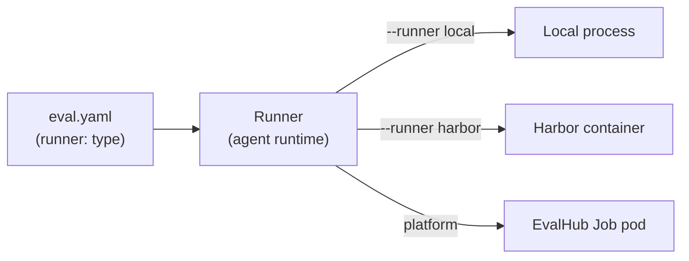

# Glossary

Core terms used throughout the docs, each with a one-line definition and a link
to the page that covers it in depth. Terms are grouped roughly by the order you
meet them in the pipeline.

!!! tip "The one distinction to internalize"
    A **runner** is the agent runtime *inside* the box (which CLI drives the
    model — Claude Code, an OpenCode CLI, …). An **execution backend** is the
    box *around* it (Local process, Harbor container, EvalHub Job pod). The
    runner lives in `eval.yaml` under `runner:`; the backend is always a CLI
    flag (`--runner local|harbor`), **never** a config key — so one config runs
    unchanged everywhere.

## What you execute

| Term | Definition | More |
| --- | --- | --- |
| **Case** | One test case: a directory under `dataset.path` holding `input.yaml` (what the agent sees) and optional `annotations.yaml`. In `mode: case` the harness makes one agent invocation per case. | [Execution model](../concepts/execution-model.md) |
| **Batch** | `execution.mode: batch` — all cases handled in a *single* invocation via a generated `batch.yaml`; the skill/agent loops internally instead of the harness. | [Execution model](../concepts/execution-model.md) |
| **Skill mode** | `execution.skill` — invoke a predefined skill (`/my-skill --args`) and evaluate its correctness, quality, and cost. Mutually exclusive with prompt mode. | [Skill vs prompt](../guides/skill-vs-prompt.md) |
| **Prompt mode** | `execution.prompt` — send a prompt template directly to the agent with no skill wrapper, to test raw agent capability (e.g. agentic-docs testing). Mutually exclusive with skill mode. | [Skill vs prompt](../guides/skill-vs-prompt.md) |

!!! note "`mode` vs. `skill`/`prompt` are orthogonal"
    `execution.mode` (`case` | `batch`) controls *how many* invocations;
    `execution.skill` vs `execution.prompt` controls *what* is invoked. Any of
    the four combinations is valid.

## Where and how it runs

| Term | Definition | More |
| --- | --- | --- |
| **Runner** (agent runtime) | The agent CLI/harness that drives the model, selected by `runner.type` (`claude-code`, `cli`, …) with runtime-specific knobs (`effort`, `settings`, `plugin_dirs`, `env`, `system_prompt`, `command`, `workspace_mode`). | [Runners](../concepts/runners.md) · [runner config](config/runner.md) |
| **Execution backend / substrate** | The environment the run executes in — Local, Harbor (containers), or EvalHub (platform Job pod). Chosen with a CLI flag, never in `eval.yaml`. | [Backends](../concepts/backends.md) |
| **Workspace** | The isolated per-case directory the runner executes in. `dataset.workspace.files` whitelists case files to copy in; `runner.workspace_mode: repo` runs in the real repository instead of an isolated copy. | [dataset config](config/dataset.md) · [eval-run](../guides/eval-run.md) |
| **Run** | One execution of the suite, stored under `$AGENT_EVAL_RUNS_DIR` (default `eval/runs/<run-id>/`) with artifacts, scores, and `report.html`. | [Runs directory](runs-directory.md) |

## Scoring and gating

| Term | Definition | More |
| --- | --- | --- |
| **Judge** | A scorer applied to each case. Four types by which field is set: `builtin`, inline `check` (Python), LLM (`prompt`/`prompt_file`/`llm_rubric`), or external `module`/`function`. | [Judges](../concepts/judges.md) · [judges config](config/judges.md) |
| **Threshold** | A per-judge regression gate. Valid keys: `min_mean`, `min_pass_rate`, `min_win_rate`. | [Thresholds](../concepts/thresholds.md) · [thresholds config](config/thresholds.md) |
| **Reward** | Optional collapse of per-judge results into a single scalar in `[0, 1]` for RL training (GRPO) — either a single `judge` or a `formula` (`weighted` or a Python expression), with optional `gate`. | [Reward API](../concepts/reward-api.md) · [reward config](config/reward.md) |

## Data provenance and capture

| Term | Definition | More |
| --- | --- | --- |
| **Seed** | One entry in a synthetic `generation.seeds` list — a `category` + `count` plus exactly one prompt discriminator (`builtin`, `prompt_file`, or inline `prompt`) that generates that many cases. | [generation config](config/generation.md) |
| **Provenance** | `generation.strategy` — how `/eval-dataset` sources cases: `skill` (agent authors from skill analysis, default), `synthetic` (LLM generates from seeds), or `from-traces` (extracted from MLflow traces). | [generation config](config/generation.md) |
| **Trace** | The execution record captured per case (stdout, stderr, parsed events, metrics) per the `traces` block, made available to judges and optionally logged to MLflow. | [Tracing](../concepts/tracing.md) · [traces config](config/traces.md) |
| **Tool interception** | Headless handling of tools the agent would otherwise block on: `inputs.tools[].match` describes what to intercept, `prompt` how to answer it. | [Tool interception](../concepts/tool-interception.md) · [inputs.tools config](config/inputs-tools.md) |
| **`case_overrides`** | The first, exact-match tier of AskUserQuestion answering during tool interception (exact `case_overrides` → LLM call via `models.hook` → static fallback). | [Tool interception](../concepts/tool-interception.md) |

## See also

- [**The eval.yaml schema**](eval-yaml.md) — every config key in one place
- [**Execution model**](../concepts/execution-model.md) — case/batch × skill/prompt
- [**Runners**](../concepts/runners.md) vs [**Backends**](../concepts/backends.md) — the runtime/substrate split
- [**Your first eval**](../get-started/first-eval.md) — the terms in action

