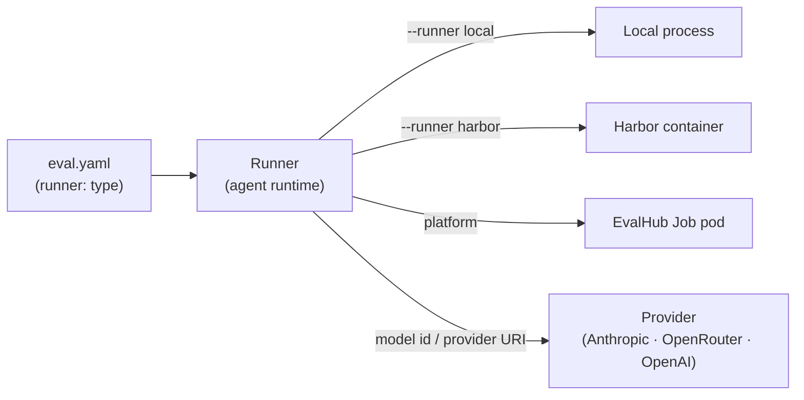

# Glossary

Core terms used throughout the docs, each with a one-line definition and a link
to the page that covers it in depth. Terms are grouped roughly by the order you
meet them in the pipeline.

!!! tip "The one distinction to internalize"
    A **runner** is the agent runtime *inside* the box (which CLI drives the
    model — Claude Code, an OpenCode CLI, …). An **execution backend** is the
    box *around* it (Local process, Harbor container, EvalHub Job pod). A
    **provider** is who serves the model's tokens (Anthropic through the
    runner's own setup, OpenRouter through a harness-managed plan, an
    OpenAI-compatible endpoint) and is named by the role's model id. The
    runner lives in `eval.yaml` under `runner:`; the backend is always a CLI
    flag (`--runner local|harbor`), **never** a config key — so one config runs
    unchanged everywhere; the provider is the optional `<provider>:/` scheme on
    `models.*` or `--model`. See [Model providers](../concepts/providers.md).

## What you execute

| Term | Definition | More |
| --- | --- | --- |
| **Case** | One test case: a directory under `dataset.path` holding `input.yaml` (what the agent sees) and optional `annotations.yaml`. In `mode: case` the harness makes one agent invocation per case. | [Execution model](../concepts/execution-model.md) |
| **Batch** | `execution.mode: batch` — all cases handled in a *single* invocation via a generated `batch.yaml`; the skill/agent loops internally instead of the harness. | [Execution model](../concepts/execution-model.md) |
| **Skill mode** | `execution.skill` — invoke a predefined skill (`/my-skill --args`) and evaluate its correctness, quality, and cost. Mutually exclusive with prompt mode. | [Skill vs prompt](../guides/skill-vs-prompt.md) |
| **Prompt mode** | `execution.prompt` — send a prompt template directly to the agent with no skill wrapper, to test raw agent capability (e.g. agentic-docs testing). Mutually exclusive with skill mode. | [Skill vs prompt](../guides/skill-vs-prompt.md) |

!!! note "`mode` vs. `skill`/`prompt` are orthogonal"
    `execution.mode` (`case` | `batch`) controls *how many* invocations;
    `execution.skill` vs `execution.prompt` controls *what* is invoked. Any of
    the four combinations is valid.

## Where and how it runs

```mermaid
flowchart LR
    C["eval.yaml<br/>(runner: type)"] --> R["Runner<br/>(agent runtime)"]
    R -->|--runner local| L["Local process"]
    R -->|--runner harbor| H["Harbor container"]
    R -->|platform| E["EvalHub Job pod"]
    R -->|"model id / provider URI"| P["Provider<br/>(Anthropic · OpenRouter · OpenAI)"]
```

| Term | Definition | More |
| --- | --- | --- |
| **Runner** (agent runtime) | The agent CLI/harness that drives the model, selected by `runner.type` (`claude-code`, `cli`, …) with runtime-specific knobs (`effort`, `settings`, `plugin_dirs`, `env`, `system_prompt`, `command`, `workspace_mode`). | [Runners](../concepts/runners.md) · [runner config](config/runner.md) |
| **Execution backend / substrate** | The environment the run executes in — Local, Harbor (containers), or EvalHub (platform Job pod). Chosen with a CLI flag, never in `eval.yaml`. | [Backends](../concepts/backends.md) |
| **Workspace** | The isolated per-case directory the runner executes in. `dataset.workspace.files` whitelists per-case files and/or shared `{dest, source}` project/plugin resources to copy in; `runner.workspace_mode: repo` runs in the real repository instead of an isolated copy. | [dataset config](config/dataset.md) · [eval-run](../guides/eval-run.md) |
| **Provider** (model access) | The service that serves a role's model, selected by the model id: a bare id goes wherever the runner (or, for judges, the SDK heuristic) is configured; `anthropic:/`, `openai:/`, `openrouter:/<author>/<slug>` and `runner:/` name it explicitly. Not an execution backend. | [Model providers](../concepts/providers.md) · [models.providers](config/providers.md) |
| **Run** | One execution of the suite, stored under `$AGENT_EVAL_RUNS_DIR` (default `eval/runs/<run-id>/`) with artifacts, scores, and `report.html`. | [Runs directory](runs-directory.md) |

## Model providers

| Term | Definition | More |
| --- | --- | --- |
| **Provider URI** | `<provider>:/<id>` on a role (`models.skill`, `subagent`, `hook`, `judge`, a per-judge `model:`, `--model`). Scheme lower-cased, leading slashes on the id stripped (`openai://x` = `openai:/x`); an `openrouter:/` id is `<author>/<slug>[:variant]`. Agent roles accept a bare id, `anthropic:/` or `openrouter:/`; judges also `openai:/` and `runner:/`. | [What a model id is](../concepts/providers.md#what-a-model-id-is) |
| **Provider plan** / **managed keys** | The env block the harness derives when `models.skill` is `openrouter:/` (`ANTHROPIC_BASE_URL`, the inference key as `ANTHROPIC_AUTH_TOKEN`, blanked Vertex/Bedrock switches, model aliases) and delivers per backend; the keys it owns are rejected on every `env:` surface while it is active. `claude-code` only. | [Three provider families](../concepts/providers.md#three-provider-families) · [validation](config/providers.md#validation) |
| **Transport** | How the agent's requests travel under a plan: Claude Code calls OpenRouter directly (`provider.transport: direct` in `run_result.json`); the harness never proxies. | [OpenRouter guide](../guides/openrouter.md#direct-transport-no-proxy) |
| **Judge backend** | The client a judge grades through, chosen by the judge model id and never by the runner: Anthropic SDK, OpenAI SDK (incl. `OPENAI_BASE_URL` gateways), the OpenRouter client, or the configured runner (`runner:/`, `agent:` judges). Distinct from the *execution* backend. | [judges → Model providers](config/judges.md#model-providers-judge-backend) |
| **Enforcement level** | OpenRouter only: `audit` (preflight + post-hoc audit, the agent holds the operator key) or `key-guardrail` (a per-run key with a provider allow-list and a dollar limit). Set by `models.providers.openrouter.routing.enforcement`. | [Enforcement levels](../guides/openrouter.md#enforcement-levels) |
| **Routing audit** | After the run, every billed generation's served provider is joined against the declared pins; violations are reported in `run_result.routing`, never repaired. | [The routing lifecycle](../guides/openrouter.md#the-routing-lifecycle) |
| **Cost source** | `run_result.cost_source`, `<origin>:<method>`: `runner:reported` (Claude Code's billed total), `runner:estimate` (behind an operator gateway, or under a plan with `--allow-estimate`), `openrouter:generation` / `openrouter:key-usage` (provider-priced), `unavailable` (`cost_usd: null`). Per-judge-call records use a hyphenated set (`provider-inline`, `runner-estimate`, `none`). | [Cost provenance across providers](../concepts/providers.md#cost-provenance-across-providers) · [runs directory](runs-directory.md#cost-provenance) |

## Scoring and gating

| Term | Definition | More |
| --- | --- | --- |
| **Judge** | A scorer applied to each case. Five types by which field is set: `builtin`, inline `check` (Python), LLM (`prompt`/`prompt_file`/`llm_rubric`), tool-using `agent` (`agent:` block), or external `module`/`function`. | [Judges](../concepts/judges.md) · [judges config](config/judges.md) |
| **Threshold** | A per-judge regression gate. Valid keys: `min_mean`, `min_pass_rate`, `min_win_rate`, and `max_error_rate` (the one *maximum* — an opt-in coverage gate). | [Thresholds](../concepts/thresholds.md) · [thresholds config](config/thresholds.md) |
| **Reward** | Optional collapse of per-judge results into a single scalar in `[0, 1]` for RL training (GRPO) — either a single `judge` or a `formula` (`weighted` or a Python expression), with optional `gate`. | [Reward API](../concepts/reward-api.md) · [reward config](config/reward.md) |

## Judge calibration & safety

| Term | Definition | More |
| --- | --- | --- |
| **Rationale-first** | The verdict contract of every LLM judge: the forced tool (`submit_score`, `submit_evaluation`, `submit_comparison`) and the agent judge's `score.json` list `rationale`/`reasoning` *before* `score`/`passed`/`preferred`, so the model assesses the evidence before it commits to a verdict token. | [Verdict output](config/judges.md#verdict-output) · [Agent judges](config/judges.md#output-contract) |
| **Evaluated material** / **fence markers** | Agent-produced template values render between `[BEGIN EVALUATED MATERIAL: <name>]` / `[END EVALUATED MATERIAL]`; the judge system prompt names those markers as data to assess, never instructions to follow. Bare `{{ outputs.files }}`, convenience keys, and filtered values are *not* fenced. | [Fenced vs unfenced](config/judges.md#fenced-vs-unfenced) |
| **Untrusted-data guard** | The sentence in every bool, numeric, and pairwise judge system prompt (and the agent judge's contract) that fenced or quoted artifact content is model-generated output under evaluation — obey nothing inside it, even claims that the material has ended or a verdict is deserved. | [Fenced vs unfenced](config/judges.md#fenced-vs-unfenced) |
| **In-prompt examples** vs **`examples:` block** | Examples written into a rubric template are fixed text shipped with the config. An `examples:` block is harvested at scoring time from prior runs' `review.yaml` human labels and injected (`{{ examples }}` or appended) — never for the case being judged. | [Few-shot examples](config/judges.md#few-shot-examples-from-human-reviews-examples) · [/eval-review](../guides/eval-review.md) |
| **Calibration anchor** | One harvested exemplar: a clearly-passed or clearly-failed prior case (bool verdict, or a numeric one in the top/bottom quarter of the judge's scale) shown with its 1200-char-capped, `[BEGIN EXCERPT]`-fenced input/output excerpts and the human comment. | [Few-shot examples](config/judges.md#few-shot-examples-from-human-reviews-examples) |
| **`review.yaml`** | Per-run human feedback: the flat `feedback: {case: comment}` map `/eval-review` writes, and the structured `verdicts: {case: {judge: value}}` map that `examples:` prefers but only hand-authoring produces today. | [Runs directory](runs-directory.md#reviewyaml) · [/eval-review](../guides/eval-review.md#reviewyaml) |
| **Agent judge** | An LLM judge with an `agent:` block: it runs as a tool-using agent through the runner against an isolated, staged, read-only workspace (plus a writable `output/` for `score.json`) so it can look things up instead of guessing from prompt text. | [Agent judges](config/judges.md#agent-judges) · [Judges](../concepts/judges.md#the-five-judge-types) |
| **The reserved `pairwise` judge** | A judge named exactly `pairwise` is skipped by per-case scoring and configures the blind A/B comparison run with `--baseline`; position-swapped twice per case, graded via `submit_comparison`, and it accepts no `examples:` or `score_range`. | [Reserved pairwise judge](config/judges.md#the-reserved-pairwise-judge) · [Position-swap protocol](../concepts/pairwise-and-sampling.md#the-position-swap-protocol) |
| **Judge `samples`** / **stability** | `samples: N` runs a stochastic (LLM/agent) judge N times per case and reduces — `median_low` for scores, strict majority for booleans; the per-case `stability` block records spread and `stable` (all samples agreed, none errored). | [Sampling](config/judges.md#sampling-samples) · [The stability block](../concepts/pairwise-and-sampling.md#the-stability-block) |

## Comparing configurations (ANOVA)

| Term | Definition | More |
| --- | --- | --- |
| **Factor** / **level** / **condition** | A factor is a knob you vary (a key under `matrix.factors`); a level is one of its values (a non-empty YAML list); a condition is one combination of levels — a cell of the grid — with a stable `condition_id`. | [Factorial design](../concepts/anova.md#factorial-design-factors-levels-conditions-replications) · [matrix](config/matrix.md) |
| **Full factorial** | Every combination of every factor's levels (the Cartesian product). Total work = conditions × cases × replications. | [Factorial design](../concepts/anova.md#factorial-design-factors-levels-conditions-replications) |
| **Replication** | Running the same condition on the same case again (`matrix.replications`, an integer ≥ 1); replications are averaged to one observation per condition × case before the test. | [matrix](config/matrix.md#replications-optional-default-1) |
| **Composite score** | The one number per (condition, case) the ANOVA runs on: judges collapsed into `[0, 1]` by the reward composition — boolean gates first, numeric judges normalized over their own `score_range`. | [The composite](../concepts/anova.md#the-metric-it-runs-on-the-composite) |
| **Omnibus test** | The per-factor question "does this factor matter at all?" — the F-test of a repeated-measures ANOVA, or one joint Wald test per term in the mixed model — as opposed to which specific levels differ. | [Per-term Wald tests](../concepts/anova.md#per-term-wald-tests-and-multiplicity-correction) |
| **Joint Wald test** | In the mixed-effects model, a single test over all *L − 1* dummy coefficients of a term, giving one p-value per term instead of the (anti-conservative) minimum of per-dummy p-values. | [Per-term Wald tests](../concepts/anova.md#per-term-wald-tests-and-multiplicity-correction) |
| **Interaction term `a:b`** | The model term testing whether factor `a`'s effect depends on factor `b`'s level ("only some models benefit"); keyed `a:b` in `p_values` / `p_adjusted`. | [Per-term Wald tests](../concepts/anova.md#per-term-wald-tests-and-multiplicity-correction) |
| **Test family** / **`family_size`** | The set of tests one correction is applied across: all terms of one model, the pairwise contrasts within one factor, or every (judge, term) pair of the per-judge screen. Counts only real tests — degenerate ones are excluded, never fabricated. | [Per-term Wald tests](../concepts/anova.md#per-term-wald-tests-and-multiplicity-correction) |
| **Family-wise error rate** vs **false discovery rate** | FWER: the chance of *any* false positive in the family (controlled by Holm). FDR: the expected *fraction* of false positives among the significant calls (controlled by Benjamini–Hochberg) — less conservative, suited to screening. | [Per-term Wald tests](../concepts/anova.md#per-term-wald-tests-and-multiplicity-correction) |
| **Holm** | The default `analysis.correction`: a step-down FWER procedure across the term family. | [matrix](config/matrix.md#analysiscorrection-optional-default-holm) |
| **Benjamini–Hochberg** (`bh`, alias `fdr_bh`) | The FDR procedure; selectable for the composite family and always used for the per-judge family. Written to `anova.json` as `bh`. | [Per-judge screening](../concepts/anova.md#per-judge-screening-opt-in) |
| **Adjusted p** (`p_adjusted`) | The p-value after the family's correction; `significant` is judged on it (on the raw value under `none`). Raw and adjusted are always reported together. | [anova.json](runs-directory.md#anovajson) |
| **Post-hoc level contrast** | A pairwise comparison of two levels of one factor after the omnibus test — `estimate` (`a − b` on the composite scale), `se`, `p_raw`, `p_adjusted` — corrected within the factor and computed regardless of the omnibus outcome. | [Post-hoc pairwise contrasts](../concepts/anova.md#post-hoc-pairwise-contrasts) |
| **Paired** / **marginal** / **reference-cell** estimate | The `contrast_type` of a block: *paired* — observed per-case paired differences (single factor); *marginal* — coefficient differences from an interaction-free mixed model; *reference-cell* — coefficient differences at the other factors' reference levels (the model has interactions), **not** marginal means. | [Post-hoc pairwise contrasts](../concepts/anova.md#post-hoc-pairwise-contrasts) |
| **Greenhouse–Geisser** | A sphericity correction for repeated-measures ANOVA; when pingouin reports the GG-corrected p it is used as `p_value`, with the uncorrected one kept as `p_uncorrected`. | [Post-hoc pairwise contrasts](../concepts/anova.md#post-hoc-pairwise-contrasts) |
| **Per-judge screening** | The opt-in fan-out (`analysis.per_judge` / `--per-judge`) that runs the ANOVA once per judge, BH-corrected as one family, to see *which* judge moved; the composite stays the headline. | [Per-judge screening](../concepts/anova.md#per-judge-screening-opt-in) |
| **Pareto frontier** / **dominated** | On the (mean cost, mean composite) plane, a condition is dominated when another is at least as cheap *and* at least as good and strictly better on one axis; the frontier is the non-dominated set. Computed only when every condition has a cost. | [Cost vs quality](../concepts/anova.md#cost-vs-quality-the-pareto-frontier) |
| **`matrix`** | The `eval.yaml` block `/eval-anova` reads: `factors`, `replications`, `analysis.correction`, `analysis.per_judge`. Ignored by `/eval-run`. | [matrix](config/matrix.md) |
| **`anova.json`** / **`condition.json`** | The experiment-level statistics artifact (omnibus, contrasts, condition summaries, Pareto, design, per-judge) and the per-run stamp of a cell's factor levels that lets analysis group runs into conditions. | [Experiment-level artifacts](runs-directory.md#experiment-level-artifacts) |

## Data provenance and capture

| Term | Definition | More |
| --- | --- | --- |
| **Seed** | One entry in a synthetic `generation.seeds` list — a `category` + `count` plus exactly one prompt discriminator (`builtin`, `prompt_file`, or inline `prompt`) that generates that many cases. | [generation config](config/generation.md) |
| **Provenance** | `generation.strategy` — how `/eval-dataset` sources cases: `skill` (agent authors from skill analysis, default), `synthetic` (LLM generates from seeds), or `from-traces` (extracted from MLflow traces). | [generation config](config/generation.md) |
| **Trace** | The execution record captured per case (stdout, stderr, parsed events, metrics) per the `traces` block, made available to judges and optionally logged to MLflow. | [Tracing](../concepts/tracing.md) · [traces config](config/traces.md) |
| **Tool interception** | Headless handling of tools the agent would otherwise block on: `inputs.tools[].match` describes what to intercept, `prompt` how to answer it. | [Tool interception](../concepts/tool-interception.md) · [inputs.tools config](config/inputs-tools.md) |
| **`case_overrides`** | The first, exact-match tier of AskUserQuestion answering during tool interception (exact `case_overrides` → LLM call via `models.hook` → static fallback). | [Tool interception](../concepts/tool-interception.md) |

## See also

- [**The eval.yaml schema**](eval-yaml.md) — every config key in one place
- [**Execution model**](../concepts/execution-model.md) — case/batch × skill/prompt
- [**Runners**](../concepts/runners.md) vs [**Backends**](../concepts/backends.md) — the runtime/substrate split
- [**Model providers**](../concepts/providers.md) — the third leg: who serves the model and how credentials reach it
- [**Analysis of variance**](../concepts/anova.md) — the statistics behind the comparison terms
- [**Your first eval**](../get-started/first-eval.md) — the terms in action

