# Runs directory & artifacts

Every `/eval-run` writes a self-contained run directory holding execution metadata,
raw logs, and per-case artifacts. Judges read from this tree, the HTML report renders
from it, and `/eval-review` / `/eval-mlflow` consume it after the fact.

## Where runs live

Runs are written under `AGENT_EVAL_RUNS_DIR` (default `eval/runs`), configured during
[`/eval-setup`](../guides/eval-check.md). Each run gets its own subdirectory keyed by
run ID.

```bash
export AGENT_EVAL_RUNS_DIR=eval/runs   # default
```

!!! note "Scoping by eval name"
    When a config declares a `name`, scripts resolve the base as
    `$AGENT_EVAL_RUNS_DIR/<eval-name>/<run-id>/`. With no name the run sits directly
    under the base. Either way, `report.html`, `run_result.json`, and `cases/` are
    siblings inside the run directory.

## Per-run layout

```text
$AGENT_EVAL_RUNS_DIR/<run-id>/
├── run_result.json     # execution metadata (exit code, duration, tokens, cost)
├── stdout.log          # raw agent output (JSONL stream-json for claude-code)
├── stderr.log          # captured stderr
├── collection.json     # per-case artifact counts
├── events.json         # parsed event stream (batch mode; if traces.events)
├── report.html         # scored HTML report
├── summary.yaml        # judge results (per_case + aggregated)
└── cases/
    └── <case-id>/
        ├── artifacts/          # files collected from outputs[].path
        ├── _modified/          # in-place edits (auto-detected via git diff)
        ├── stdout.log          # per-case agent output (case mode)
        ├── stderr.log          # per-case stderr
        ├── events.json         # parsed event stream (case mode; if traces.events)
        └── subagents/          # captured subagent transcripts (*.jsonl)
```

!!! tip "Case mode vs batch mode"
    In **case mode** (`execution.mode: case`) each case runs in its own workspace, so
    `stdout.log`, `stderr.log`, and `events.json` live under `cases/<case-id>/`. In
    **batch mode** they live at the run root (one invocation for all cases) and judges
    fall back to the run-level files. See the
    [execution model](../concepts/execution-model.md).

### `run_result.json`

Written by `execute.py`. In case mode it carries an aggregate plus a `per_case`
breakdown; judges read it when `traces.metrics` is on.

| Field | Meaning |
| --- | --- |
| `exit_code` | Worst exit code across cases (non-zero on any failure) |
| `duration_s` | Sum of per-case durations |
| `wall_clock_s` | Actual elapsed time (differs from `duration_s` under parallelism) |
| `cost_usd` | Total cost across cases |
| `token_usage` | Aggregated `{input, output, ...}` token counts |
| `num_turns` | Total turns (root + subagent transcripts) |
| `num_cases` | Number of cases executed |
| `model` / `agent` / `agent_version` | Model, runner name, runner version |
| `execution_mode` | `case` or `batch` |
| `per_case` | Per-case dict of the same metrics, keyed by case ID |

### `collection.json`

Written by `collect.py` — a map of case ID to per-output-path artifact counts, e.g.
`{"case-001-simple": {"artifacts": 1, "artifacts/reviews": 1}}`. Use it to confirm the
run produced what you expect before scoring.

## Per-case artifacts: `artifacts/` vs `_modified/`

A case produces outputs in two distinct ways, and the harness collects both:

=== "artifacts/ (declared outputs)"

    Files the skill **writes to an output directory**. For each `outputs[].path` in
    `eval.yaml`, `collect.py` scans the workspace output dir, groups files by case
    (prefix pattern or position), and copies them under
    `cases/<case-id>/<output-path>/`.

    ```yaml title="eval.yaml"
    outputs:
      - path: artifacts
        schema: "One markdown file per case, named NNN-slug.md."
    ```

    Judges see these in `outputs["files"]` (keyed by relative path) and via convenience
    keys like `outputs["artifacts_content"]` — the last path component + `_content`.

=== "_modified/ (in-place edits)"

    Files the skill **edits in place** with the `Edit` tool instead of writing to an
    output dir. No `outputs` config is needed — detection is automatic:

    1. `workspace.py` commits the initial workspace state before execution.
    2. After execution, `collect.py` runs `git diff HEAD` to find changed files.
    3. Each modified file is copied to `cases/<case-id>/_modified/`.

    Judges see them in `outputs["files"]` under `_modified/<path>` keys, and also via
    the convenience map `outputs["modified_files"]` keyed by filename only:

    ```python
    edited = outputs.get("modified_files", {}).get("source.md")
    ```

!!! warning "`_modified/` excludes harness scaffolding"
    Paths under `.work`, `subagents/`, and `hooks/` are skipped when building
    `_modified/`, so a skill's own transcripts and hook files don't leak in as
    "edits".

```mermaid
flowchart LR
    A[Skill execution] --> B{output type}
    B -->|writes to outputs&#91;&#93;.path| C[collect.py copies files]
    C --> D["cases/&lt;id&gt;/artifacts/"]
    B -->|edits input file in place| E["git diff HEAD"]
    E --> F["cases/&lt;id&gt;/_modified/"]
    D --> G[load_case_record → outputs&#91;'files'&#93;]
    F --> G
```



## How `traces.*` gates what is captured

The [`traces`](config/traces.md) block toggles which execution data is written to the
run directory and loaded into each judge's record. Everything below is off-by-default
where noted.

| `traces` key | Captures | On disk | Judge access |
| --- | --- | --- | --- |
| `stdout: true` | Raw agent output | `stdout.log` | `outputs["stdout"]` (debugging; large) |
| `stderr: true` | Captured stderr | `stderr.log` | `outputs["stderr"]` |
| `events: true` | Parsed JSONL event stream | `events.json` | `outputs["events"]` (tool results capped at 50K chars) |
| `metrics: true` | Execution metadata | `run_result.json` | `outputs["exit_code"]`, `["duration_s"]`, `["cost_usd"]`, `["num_turns"]`, `["token_usage"]` |

!!! note "`events.json` is derived, not raw"
    It is generated at collection time by `collect.py`, parsing `stdout.log` and
    merging subagent transcripts from `subagents/*.jsonl`. `outputs["tool_calls"]`
    (for `outputs[].tool` entries) and `outputs["conversation"]` are both derived from
    it. Harbor pods instead write raw `events.jsonl`, which the scorer normalizes on
    load.

!!! tip "Artifacts and annotations are always loaded"
    `artifacts/`, `_modified/`, dataset `annotations.yaml`, and `input.yaml` are read
    regardless of `traces` — those toggles only gate logs, the event stream, and
    execution metrics.

## Related

<div class="grid cards" markdown>

- [**traces config**](config/traces.md) — the stdout / stderr / events / metrics toggles
- [**outputs config**](config/outputs.md) — declaring `path` and `tool` artifacts to collect
- [**judges**](config/judges.md) — how judges read the case record
- [**tracing**](../concepts/tracing.md) — the event stream and MLflow traces
- [**environment variables**](environment-variables.md) — `AGENT_EVAL_RUNS_DIR` and friends

</div>
