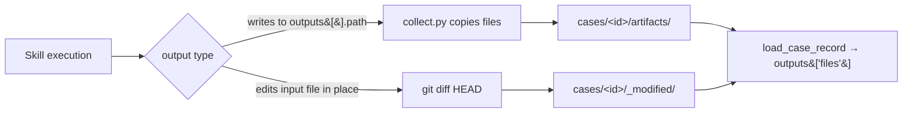

# Runs directory & artifacts

Every `/eval-run` writes a self-contained run directory holding execution metadata,
raw logs, and per-case artifacts. Judges read from this tree, the HTML report renders
from it, and `/eval-review` / `/eval-mlflow` consume it after the fact.

## Where runs live

Runs are written under `AGENT_EVAL_RUNS_DIR` (default `eval/runs`), configured during
[`/eval-setup`](../guides/eval-check.md). Each run gets its own subdirectory keyed by
run ID.

```bash
export AGENT_EVAL_RUNS_DIR=eval/runs   # default
```

!!! note "Scoping by eval name"
    When a config declares a `name`, scripts resolve the base as
    `$AGENT_EVAL_RUNS_DIR/<eval-name>/<run-id>/`. With no name the run sits directly
    under the base. Either way, `report.html`, `run_result.json`, and `cases/` are
    siblings inside the run directory.

!!! warning "Run artifacts are sensitive"
    `stdout.log` / `events.json` hold the verbatim session transcript, and
    `permission_denials` entries preserve each denied call's full `tool_input`
    — deliberately, since the input is what distinguishes an over-strict rule
    from an escape attempt. Anything the agent saw or tried (paths, commands,
    tokens passed on command lines) is in these files: keep the runs directory
    out of version control and scrub before sharing.

## Per-run layout

```text
$AGENT_EVAL_RUNS_DIR/<run-id>/
├── run_result.json     # execution metadata (exit code, duration, tokens, cost, permission denials)
├── stdout.log          # raw agent output (JSONL stream-json for claude-code)
├── stderr.log          # captured stderr
├── collection.json     # per-case artifact counts
├── events.json         # parsed event stream (batch mode; if traces.events)
├── report.html         # scored HTML report
├── summary.yaml        # judge results: judges (mean, pass_rate, scored_cases,
│                       #   errored_cases, stability) + per_case + run_metrics
│                       #   + judge_usage / total_cost_usd (judge spend, see below)
├── analysis.md         # optional: the agent's written analysis + recommendation
├── review.yaml         # optional: human feedback from /eval-review — see below
├── condition.json      # /eval-anova cells only: {condition_id, levels} — see "Experiment-level artifacts"
├── provider/           # OpenRouter runs only (absent otherwise) — see "Cost provenance"
│   ├── ledger.jsonl            # one row per provider generation the harness learned about
│   ├── routing_snapshot.json   # the preflight's frozen catalog view the routing audit joins against:
│   │                           #   ts, routing_sha, enforcement, key_scope, preflight, providers_map_sha,
│   │                           #   keys (per routing key: variant, roles, pinned_set, eligible, excluded), pricing, catalog
│   ├── hook-ids-<case>.jsonl   # generation ids of the harness's own hook calls (tool interception)
│   └── key.json                # enforcement: key-guardrail only — the per-run key's hash, name,
│                               #   limit, providers, created_at / revoked_at (never the key)
└── cases/
    └── <case-id>/
        ├── artifacts/          # files collected from outputs[].path
        ├── _modified/          # in-place edits (auto-detected via git diff)
        ├── stdout.log          # per-case agent output (case mode)
        ├── stderr.log          # per-case stderr
        ├── events.json         # parsed event stream (case mode; if traces.events)
        └── subagents/          # captured subagent transcripts (*.jsonl)
```

!!! tip "Case mode vs batch mode"
    In **case mode** (`execution.mode: case`) each case runs in its own workspace, so
    `stdout.log`, `stderr.log`, and `events.json` live under `cases/<case-id>/`. In
    **batch mode** they live at the run root (one invocation for all cases) and judges
    fall back to the run-level files. See the
    [execution model](../concepts/execution-model.md).

### `summary.yaml`

Written by `score.py judges` (and by the Harbor runner in the same shape). Besides
`judges`, `per_case`, `pairwise` and `run_metrics` it carries the **judge usage side
channel**: what the LLM judges themselves consumed, kept apart from the agent's cost.

| Field | Meaning |
| --- | --- |
| `per_case.<case>.<judge>.usage` | The judge call's usage record: `model`, `provider`, `id`, `prompt_tokens`, `completion_tokens`, `reasoning_tokens`, `cost_usd`, `cost_source` (`provider-inline` when the provider priced the request in its reply, e.g. OpenRouter; `runner-estimate` for a runner/agent judge's CLI estimate; `none` when only tokens are known). Sampled judges (`samples: N`) store the sum over all attempts, failed ones included, with `requests` / `requests_missing_cost`. |
| `per_case.<case>.<judge>.tool_choice_mode` | Present only when an OpenRouter judge had to fall back from a forced tool call (`required` or `auto`). |
| `judge_usage` | Run-level aggregate: `judge_cost_usd` — the sum over the priced calls, `null` only when none was priced; with judges on several providers it is a partial figure, so read `requests_missing_cost` next to it (the report shows `N unpriced`) — plus `requests`, token totals, `cost_sources` (count per source), `by_judge`, `by_model`, and `tool_choice_fallbacks` when any happened. `total_cost_source: complete` means both addends were numeric, not that every judge call was priced. Absent when no judge produced usage (deterministic-only runs). |
| `total_cost_usd` / `total_cost_source` | Agent `cost_usd` + `judge_cost_usd`, written only when at least one addend is known. The sum is computed only when **both** are numeric; otherwise `total_cost_usd` is `null` and `total_cost_source` says which side was numeric (`complete`, `agent-only`, `judge-only`). An estimate is never used to fill a null. |

Judge spend never enters `run_result.json` `cost_usd`, so `run_metrics`
(`cost_per_turn_usd`, `cost_per_mtok_usd`) stay agent-only and comparable with older runs.
The pairwise section carries its own `judge_usage` for the comparison judge's calls.

The judge-level `cost_source` literals are hyphenated, per-call labels
(`provider-inline`, `runner-estimate`, `none`); the run-level `cost_source` in
`run_result.json` uses the colon form `<origin>:<method>` described under
[cost provenance](#cost-provenance). They never mix: `judge_usage` is summed from the
former, `cost_usd` carries the latter.

### `run_result.json`

Written by `execute.py`. In case mode it carries an aggregate plus a `per_case`
breakdown; judges read it when `traces.metrics` is on.

| Field | Meaning |
| --- | --- |
| `exit_code` | Worst exit code across cases (non-zero on any failure) |
| `duration_s` | Sum of per-case durations |
| `wall_clock_s` | Actual elapsed time (differs from `duration_s` under parallelism) |
| `cost_usd` | Total cost across cases |
| `token_usage` | Aggregated `{input, output, ...}` token counts |
| `num_turns` | Total turns (root + subagent transcripts) |
| `num_cases` | Number of cases executed |
| `model` / `agent` / `agent_version` | Model, runner name, runner version |
| `message_ids` | Every assistant message id of the run (root stream + subagent transcripts). On a direct OpenRouter connection these are `gen-…` generation ids: the cost-truth key set the backfill prices. |
| `cost_source`, `cost_usd_estimate`, `cost_confidence`, `cost_coverage`, `cost_warnings`, `hook_cost_usd`, `providers`, `routing`, `provider`, `budget` | Cost provenance — see below. Absent on runs that never touched a provider. |
| `permission_denials` | Tool calls denied by permissions, as `[{tool_name, tool_use_id, tool_input}]` from the CLI result event (`[]` when none). Per case inside `per_case` entries (and per step under a multi-step case's `steps`); the top level carries the concatenation across cases (batch/single-run mode: that run's own list) |
| `execution_mode` | `case` or `batch` |
| `per_case` | Per-case dict of the same metrics plus `permission_denials`, keyed by case ID |

#### Cost provenance

Every `run_result.json` write goes through one reconciling writer
(`agent_eval.providers.reconcile.write_run_result`): it joins the run's
`provider/ledger.jsonl` rows against the transcript's `message_ids` and writes the
fields below. With no provider plan and no ledger file the payload is written
unchanged, so a run without OpenRouter reads exactly as before.

| Field | Meaning |
| --- | --- |
| `cost_usd` | Agent spend from a **truth source**: the sum of priced ledger rows when generation coverage is at least 80 %, else the key-usage delta, else `null`. Never the runner's estimate, never a mix. |
| `cost_usd_estimate` | The runner's own number (Claude Code prices a non-Anthropic model 2 to 60 times high). Set once, never overwritten. |
| `cost_source` | `openrouter:generation` / `openrouter:key-usage` — a truth source landed (plan runs only). `runner:estimate` — the `claude-code` runner labels its own number this way under a plan **and** whenever the effective `ANTHROPIC_BASE_URL` host is not `api.anthropic.com` (an operator gateway, no plan needed); under a plan the reconciler replaces it with a truth source, or writes it instead of `unavailable` only when `--allow-estimate` is passed. `runner:reported` — Claude Code talking to `api.anthropic.com` or Vertex, and what readers assume when the field is absent. `unavailable` — plan run, no truth source. `harness:estimate` is reserved: nothing writes it today — the `codex` runner sets no `cost_source`, so its litellm-priced estimate is read as `runner:reported`. Legacy literals (`openrouter-reconciled`, `runner-reported`, `harness-estimate`) are read as their colon forms. |
| `cost_confidence` | `high` (coverage ≥ 95 % and the key-usage cross-check within 5 %), `medium` (coverage 80 to 95 %, or key-usage only on a dedicated key), `low` (coverage below 80 % on a shared key, or a cross-check deviation above 5 %). |
| `cost_coverage` | `{requests, requests_priced, requests_missing_cost, requests_unattributed, coverage, key_usage_delta_usd, key_usage_settle_s}` — the denominator is the transcript's `gen-…` ids, not the ledger. |
| `cost_warnings` | Human-readable findings: unpriced requests, a cross-check deviation, an unmatched per-model key, routing violations. |
| `hook_cost_usd` | Spend of the harness's own hook calls (tool interception). Excluded from `cost_usd` and from `run_metrics`. |
| `providers` | `{<provider slug>: {requests, cost_usd}}`, with `unknown` for unattributed rows. |
| `per_model_usage[m].cost_usd` / `.cost_usd_estimate` / `.providers` | Per-model cost from the ledger join (bare-slug echo, permaslug via the catalog, single-model fallback); the estimate is preserved next to it. A key with no match keeps `null` and a warning. |
| `routing` | The audit of served providers against the declared pins: `enforcement`, `policy`, `sha`, `declared`, `served`, `audited`, `compliant`, `violations`, `unattributed`, `degraded`, `audit_complete`, `snapshot`. A violation is a billed, kept generation whose provider was outside the declared set; it is reported, never repaired. |
| `provider` | `{name, kind, transport: direct, runner, base_url, key_scope, key_hash, key_exposed_to_agent, background_model}`. `key_scope` is `operator` at `enforcement: audit` and `per-run` at `key-guardrail` — on a per-run key the key-usage delta is the run's own spend by construction. |
| `budget` | `{invocation_usd, cli_cap_usd, run_usd, enforcement: cli-estimate \| key-guardrail, exceeded, exceeded_reason, overshoot_usd}`; `exceeded: run` with `post-hoc` is set when the reconciled sum passes `budget.run_usd`. |

Under a plan the case aggregate follows the same arithmetic: one unpriced case makes
the run's `cost_usd` `null` (`cases_priced` says how many were priced); a partial sum is
not spend. `execute.py --strict-cost` exits 2 on `cost_source: unavailable` or an
exceeded run budget, `--strict-routing` on violations or an incomplete audit.

Downstream, `/eval-compare` pools runs across cost-source classes, routing declarations
and enforcement levels and footnotes them, while `/eval-anova` skips degraded and
mixed-enforcement runs — see
[eval-compare → Mixed providers and cost sources](../guides/eval-compare.md#mixed-providers-and-cost-sources)
and [eval-anova → Rules at a glance](../guides/eval-anova.md#rules-at-a-glance).

`routing.enforcement` reads `none` when the routing table declares nothing — no
`order`, `only`, `ignore`, `allow_fallbacks` or `quantizations` on any key (nothing to
enforce, whatever the configured level). At `key-guardrail` a failed revocation of the
per-run key is logged as a stderr `ERROR` and adds a `cost_warnings` entry naming the hash; `python3 -m
agent_eval.providers.openrouter.keys revoke <run_dir>` retries it, and `python3 -m
agent_eval.providers.openrouter.backfill <run_dir>` re-queries unpriced generations
offline.

A per-case file is usually written **inside** OpenRouter's `/generation` lag (the
record materialises 8 to 13 s after the stream ends), so it may briefly read
`cost_source: unavailable` with pending ids in `cost_coverage`; the progress line shows
`[cost pending: N ids]`. At run end the harness drains the backfill, reads the key
usage after a settle (about 20 s, up to 60 s) and re-reconciles every `run_result.json`
of the run before the strict flags judge it, so the files on disk converge. On Harbor
the trials' ids are backfilled once the job dir is parsed; `trial_costs` lists each
trial's `cost_usd` / `cost_source` / `cost_usd_estimate` (a trial is priced only when
every one of its ids has a row).

`provider/ledger.jsonl` holds one JSON row per generation: `role` (`agent`, `hook`,
`judge`, `key-usage`), `source` (`generation`, `key-usage`, `judge`), `gen_id`,
`message_index`, the requested/echoed/served model ids, `provider`, `quantization`,
`audit`, `status` (`ok`, `backfill_failed`, `partial`), `cost_usd`, native token
counts, latency and `backfill_lag_s`. Never request bodies, headers or keys.

!!! note "Adjusted, not raw, per-case values"
    For the claude-code runner, per-case `exit_code` is `1` (not `0`) when the
    CLI killed background tasks at its bg-wait ceiling — the ERROR note appended
    to `stderr.log` explains why — and `cost_usd` is the billed cost, which can
    exceed the conversation total shown in `stdout.log` when background agents
    burned tokens after the final turn.

### `collection.json`

Written by `collect.py` — a map of case ID to per-output-path artifact counts, e.g.
`{"case-001-simple": {"artifacts": 1, "artifacts/reviews": 1}}`. Use it to confirm the
run produced what you expect before scoring.

### `review.yaml`

Human feedback on a run, written by [`/eval-review`](../guides/eval-review.md) and
read by `/eval-optimize`, `/eval-mlflow --action push-feedback`, the HTML report
(the per-case **Human feedback** row) and any judge that declares
[`examples:`](config/judges.md#few-shot-examples-from-human-reviews-examples). Two
shapes are understood; a file may carry both.

=== "feedback (flat) — what /eval-review writes"

    ```yaml title="$AGENT_EVAL_RUNS_DIR/<eval-name>/<run-id>/review.yaml"
    run_id: "<run-id>"
    reviewed_cases: 3
    feedback_cases: 2
    reviewer: "human"
    feedback:
      case-001-simple: "Too vague — never names the affected component"
      case-002-complex: "Good, but the summary repeats the title"
      case-003-edge: ""      # empty = acceptable
    ```

    One free-text comment per case, keyed by the **exact case directory name**. For
    `examples:` harvesting, a non-empty comment classifies the case as a *fail*
    anchor and an empty one as a *pass* anchor.

=== "verdicts (structured) — hand-authored"

    ```yaml
    verdicts:
      case-001-simple:
        has_content: true          # bool judge → true | false
        completeness: 2            # numeric judge → a value on ITS score_range
      case-002-complex:
        completeness: 5
    ```

    The reviewer's own verdict **per judge**, on that judge's scale. This is the
    shape `examples:` prefers — a per-judge verdict wins over the flat comment when
    both exist — but **no skill writes it today**: add it by hand when you want
    judge-specific calibration anchors. Numeric verdicts only anchor when clear
    (top quarter of the scale = pass, bottom quarter = fail); mid-scale or
    off-scale values are skipped, never clamped.

Case ids become path components when excerpts are loaded, so a key that is not a
plain directory name is ignored. A malformed file is skipped with a warning — a bad
review never fails scoring.

### `analysis.md`

The agent's written interpretation of the run — failure patterns, root causes, a
recommendation — authored by `/eval-run`'s results-analysis step (and refined by
`/eval-review`). Optional: when present, `report.py` renders it as the **Analysis**
section of `report.html`, and `/eval-review` reads it as context before the case
walkthrough. Rebuild the report after editing it by hand (see
[reading the report](../get-started/reading-the-report.md#how-its-built)).

## Per-case artifacts: `artifacts/` vs `_modified/`

A case produces outputs in two distinct ways, and the harness collects both:

=== "artifacts/ (declared outputs)"

    Files the skill **writes to an output directory**. For each `outputs[].path` in
    `eval.yaml`, `collect.py` scans the workspace output dir, groups files by case
    (prefix pattern or position), and copies them under
    `cases/<case-id>/<output-path>/`.

    ```yaml title="eval.yaml"
    outputs:
      - path: artifacts
        schema: "One markdown file per case, named NNN-slug.md."
    ```

    Judges see these in `outputs["files"]` (keyed by relative path) and via convenience
    keys like `outputs["artifacts_content"]` — the last path component + `_content`.

=== "_modified/ (in-place edits)"

    Files the skill **edits in place** with the `Edit` tool instead of writing to an
    output dir. No `outputs` config is needed — detection is automatic:

    1. `workspace.py` commits the initial workspace state before execution.
    2. After execution, `collect.py` runs `git diff HEAD` to find changed files.
    3. Each modified file is copied to `cases/<case-id>/_modified/`.

    Judges see them in `outputs["files"]` under `_modified/<path>` keys, and also via
    the convenience map `outputs["modified_files"]` keyed by filename only:

    ```python
    edited = outputs.get("modified_files", {}).get("source.md")
    ```

!!! warning "`_modified/` excludes harness scaffolding"
    Paths under `.work`, `.staged-plugins/`, `subagents/`, and `hooks/` are
    skipped when building `_modified/`, so a skill's own transcripts, hook
    files, and the harness's staged plugin copies don't leak in as "edits".


```mermaid
flowchart LR
    A[Skill execution] --> B{output type}
    B -->|writes to outputs&#91;&#93;.path| C[collect.py copies files]
    C --> D["cases/&lt;id&gt;/artifacts/"]
    B -->|edits input file in place| E["git diff HEAD"]
    E --> F["cases/&lt;id&gt;/_modified/"]
    D --> G[load_case_record → outputs&#91;'files'&#93;]
    F --> G
```

## How `traces.*` gates what is captured

The [`traces`](config/traces.md) block toggles which execution data is written to the
run directory and loaded into each judge's record. Everything below is off-by-default
where noted.

| `traces` key | Captures | On disk | Judge access |
| --- | --- | --- | --- |
| `stdout: true` | Raw agent output | `stdout.log` | `outputs["stdout"]` (debugging; large) |
| `stderr: true` | Captured stderr | `stderr.log` | `outputs["stderr"]` |

> `stderr.log` may end with harness-appended `ERROR:`/`WARNING:` lines explaining
> why a case was failed (e.g. background tasks killed at the bg-wait ceiling,
> with advice to raise `CLAUDE_CODE_PRINT_BG_WAIT_CEILING_MS`).
| `events: true` | Parsed JSONL event stream | `events.json` | `outputs["events"]` (tool results capped at 50K chars) |
| `metrics: true` | Execution metadata | `run_result.json` | `outputs["exit_code"]`, `["duration_s"]`, `["cost_usd"]`, `["num_turns"]`, `["token_usage"]` |

!!! note "`events.json` is derived, not raw"
    It is generated at collection time by `collect.py`, parsing `stdout.log` and
    merging subagent transcripts from `subagents/*.jsonl`. `outputs["tool_calls"]`
    (for `outputs[].tool` entries) and `outputs["conversation"]` are both derived from
    it. Harbor pods instead write raw `events.jsonl`, which the scorer normalizes on
    load.

!!! tip "Artifacts and annotations are always loaded"
    `artifacts/`, `_modified/`, dataset `annotations.yaml`, and `input.yaml` are read
    regardless of `traces` — those toggles only gate logs, the event stream, and
    execution metrics.

## Experiment-level artifacts

[`/eval-anova`](../guides/eval-anova.md) adds a layer **above** the per-run
directories: each cell of the [`matrix`](config/matrix.md) is a standard run, and the
statistics and comparison live next to them under the eval name.

```text
$AGENT_EVAL_RUNS_DIR/<eval-name>/
├── <date>-<model>[-<factor>-<level>…][-r<n>]/   # one standard run per condition × replication
│   ├── summary.yaml                            # what analyze reads (per_case judge values)
│   ├── run_result.json                         # model + cost_usd (+ cost provenance)
│   ├── condition.json                          # the cell's factor levels
│   └── …
├── anova.json                                  # the statistics artifact (analyze.py)
├── anova-report.html / anova-report.md         # report.py's statistics-forward view (on demand)
└── comparison-report/                          # compare.py generate — the default --output
    ├── index.html                              # leaderboard, heatmap, statistics section
    └── <run-slug>/report.html                  # a copy of each run's own report
```

### `condition.json`

Stamped on every cell by `orchestrate.py` after the run completes:

```json
{"condition_id": "a59751750104", "levels": {"context": "none", "model": "claude-sonnet-4-6"}}
```

`levels` is the condition's factor → level map; `condition_id` is the first 12 hex
digits of a SHA-256 over the sorted levels. The analysis **re-derives the id from
`levels`** (runs sharing identical levels are replications of one condition), so a
hand-written id is harmless. A run directory with no `condition.json` is grouped by
the `model` in its `run_result.json` instead — the path CI fan-outs of plain
`/eval-run` take — and a run with neither is skipped with a warning.

### `anova.json`

Written by `analyze.py` (`analyze_runs`) into the runs directory; `/eval-compare`
and `report.py` render from it without recomputing anything.

| Key | Contents |
| --- | --- |
| `anova` | The omnibus test — shape below. |
| `contrasts` | Post-hoc pairwise level contrasts, one block per factor — shape below. |
| `condition_summaries` | One entry per condition: `condition_id`, `levels`, each factor also flattened to the top level (`model: …`), and the composite's `mean` / `std` / `min` / `max` / `n` over its rows (cases × replications); `cost` — the mean run `cost_usd` — only when every run of the condition reported one. |
| `pareto_frontier` | The non-dominated subset of `condition_summaries` (minimize `cost`, maximize `mean`). Equals the full list when any condition lacks a `cost`. |
| `design` | `{factors: {<name>: [<levels>]}, n_cases, replications}`, plus `excluded_cases` when any. |
| `per_case` | `{<condition key>: {<case_id>: composite}}`, replication-averaged. The key is the bare level for a single factor, else `a=x, b=y`. |
| `excluded_cases` | Cases absent under at least one condition, dropped so the design stays crossed. |
| `n_runs` | Distinct (condition, replication) pairs analysed. |
| `n_conditions` | Number of conditions. |
| `per_judge` | Only with `analysis.per_judge` / `--per-judge` — shape below. |
| `generated_at` | UTC ISO-8601 timestamp. |

**`anova`** — common fields: `method`, `alpha`, `correction` (`holm` \| `bh` \|
`none`), `family_size` (real tests only), `significant`, and, when a term's test was
degenerate, `excluded_terms` plus a `note`. The rest depends on the design:

| Design | Fields |
| --- | --- |
| **Single factor** (repeated-measures) | `factor`, `f_statistic`, `p_value` (the Greenhouse–Geisser-corrected p when pingouin reports one), `p_uncorrected`, `p_adjusted` (a family of one, so equal to `p_value`), scalar `significant`, `details` (pingouin's table rows — `ng2` is the η² the reports show). |
| **Multi-factor** (mixed-effects) | `factors`, and per-term dicts keyed `a`, `b`, `a:b` (every main effect and interaction): `p_values` (raw joint Wald p), `p_adjusted`, `significant`; plus `coefficients` and `all_p_values` per dummy coefficient, `aic`, `bic`. |
| **Skipped** | `method: "ANOVA (skipped)"`, every statistic `null`, `family_size: 0`, and a `note` saying why (no factor with ≥ 2 levels, or fewer than 2 conditions). |

**`contrasts.<factor>`** — `correction`, `family` (a label: the pairs within this
factor), `family_size`, `contrast_type` (`paired` for single-factor designs,
`marginal` for an interaction-free mixed model, `reference-cell` when the model has
interactions), `omnibus_p_adjusted` (the factor's own omnibus result, for context —
contrasts are computed regardless of it), a `note` explaining what `estimate` means
whenever there are pairs, and a block-level `reason` when none could be computed.
`pairs[]` entries carry `a`, `b`, `estimate` (`a − b` on the composite scale), `se`,
`p_raw`, `p_adjusted`, `significant`, and a per-pair `reason` when the pair was
degenerate (its `p_raw` is `null` and it is excluded from the family).

**`per_judge`** — `correction: bh` (always Benjamini–Hochberg, one family across every
(judge, term) test), `family_size`, `alpha`, `judges.<name>` with `method`,
`n_cases`, `n_conditions`, `terms.<term>.{p_raw, p_adjusted, significant}` (and a
`note` when the fit flagged something), `excluded[]` as `{judge, reason}` for judges
with a degenerate design, and a block `note`.

!!! note "Honesty rules baked into the shape"
    A `null` p-value is a degenerate test, never a fabricated one; it is excluded
    from its correction family and from `family_size`. Raw and adjusted values are
    always written side by side, and `significant` is judged on the adjusted value
    (on raw under `correction: none`). See
    [Analysis of variance](../concepts/anova.md#per-term-wald-tests-and-multiplicity-correction).

### `comparison-report/`

The output of `compare.py generate <runs-dir>` (what `orchestrate.py` invokes unless
`--no-report`; `--output` relocates it). `index.html` is the tabbed cross-model
report — leaderboard, model × case heatmap, and the Statistical Significance section
when an `anova.json` sits in the input dir (or exactly one does below it) — and each
run's own `report.html` is copied under a unique `<run-slug>/` so the tabs can embed
them. See [/eval-compare](../guides/eval-compare.md).

## Related

<div class="grid cards" markdown>

- [**traces config**](config/traces.md) — the stdout / stderr / events / metrics toggles
- [**outputs config**](config/outputs.md) — declaring `path` and `tool` artifacts to collect
- [**judges**](config/judges.md) — how judges read the case record
- [**matrix config**](config/matrix.md) — the block behind `condition.json` and `anova.json`
- [**/eval-anova guide**](../guides/eval-anova.md) — producing and re-analysing experiment artifacts
- [**tracing**](../concepts/tracing.md) — the event stream and MLflow traces
- [**environment variables**](environment-variables.md) — `AGENT_EVAL_RUNS_DIR` and friends

</div>
